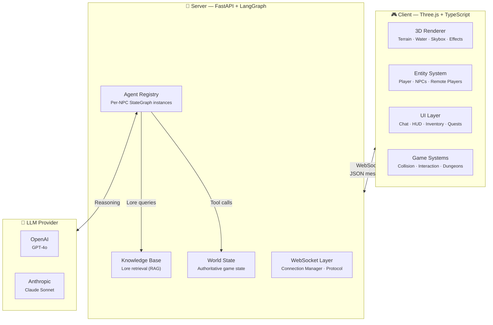

<div align="center">

# ⚔️ World of Promptcraft

### *Where your words shape the world*

A 3D multiplayer RPG built entirely around **natural language**. Type anything — fight dragons, haggle with merchants, learn ancient spells — and LangGraph-powered AI agents respond with dynamic actions in a living 3D world.

**No buttons. No menus. Just your imagination.**

[](https://github.com/Zaexv/world-of-prompcraft/actions/workflows/ci.yml)


</div>

---

## ✨ What Makes This Different

Most games give you buttons: *Attack*, *Trade*, *Talk*. Promptcraft gives you a **text box**.

> **You:** *"I bow before you, great Ignathar, and offer my finest emerald in exchange for safe passage through the Ember Peaks."*
>
> **Ignathar the Ancient:** *"Hmm… thy offering glitters prettily, mortal. I shall accept it — but know this: the Peaks remember those who trespass. Take thy passage, and speak of my mercy to none."*
>
> *(Ignathar performs a bow emote, accepts the emerald, and changes the weather to clear)*

Every NPC is a **fully autonomous AI agent** with its own personality, memory, inventory, and decision-making graph. They don't follow scripts — they *think*.

---

## 🏗️ Architecture



### Core Design Principles

| Principle | Implementation |
|-----------|---------------|
| **Prompt is the interface** | No action buttons — free-form text drives all gameplay |
| **Server-authoritative** | `WorldState` lives on the server; client is a render mirror |
| **Per-NPC autonomy** | Each NPC runs its own LangGraph `StateGraph` with independent memory |
| **Tool-driven mechanics** | LLM calls typed tools (`deal_damage`, `heal_target`, `offer_item`) that produce structured game actions |
| **Procedural generation** | Infinite chunk-based terrain (64×64) with NPCs and vegetation spawned on exploration |

---

## 🌍 The World

Explore a fantasy world with distinct zones, each with its own atmosphere and inhabitants:

| Zone | Description | NPCs |
|------|-------------|------|
| **Elders' Village** | Peaceful starting village with ancient wisdom | Thornby (Merchant), Captain Aldric (Guard), Sister Mira (Healer) |
| **Ember Peaks** | Volcanic mountains with molten rivers | Ignathar the Ancient (Dragon Boss — 500 HP) |
| **Crystal Lake** | Serene magical waters | Elyria the Sage |
| **Dark Forest** | Foreboding shadows and whispers | Procedural hostile spawns |
| **Fort Malaka** | Mediterranean fortified city | El Tito, Archmage Malakov, Zara the Pyromancer, Frostweaver Nyx |

### NPC Agent Pipeline

Each interaction flows through a three-stage LangGraph pipeline:

```
Player Prompt ──► [ Reason ] ──► [ Act ] ──► [ Respond ]
                      │              │             │
                 Retrieve lore   Call tools    Generate
                 Assess intent   (combat,      dialogue +
                 Check memory    trade, env)   emotes
```

---

## 🚀 Quick Start

### Prerequisites

- **Node.js** 18+ &nbsp;·&nbsp; **Python** 3.11+ &nbsp;·&nbsp; An LLM API key ([OpenAI](https://platform.openai.com/api-keys) or [Anthropic](https://console.anthropic.com/))

### 1. Clone & configure

```bash
git clone https://github.com/Zaexv/world-of-prompcraft.git
cd world-of-prompcraft
cp .env.example .env   # ← Add your API key here
```

### 2. Start the server

```bash
cd server
pip install -e ".[dev]"
uvicorn src.main:app --reload --port 8000
```

### 3. Start the client

```bash
cd client
npm install
npm run dev
```

### 4. Play

Open **http://localhost:5173**, create a character, and start talking to NPCs.

> **💡 Tip:** You can also use Docker Compose: `docker compose up` from the project root.

---

## 🗂️ Project Structure

```
world-of-prompcraft/
│
├── client/                        # 🎮 Three.js + TypeScript + Vite
│   └── src/
│       ├── main.ts                # Game bootstrap & render loop
│       ├── scene/                 # 3D scene — Terrain, Water, Skybox, Lighting, Vegetation, Effects
│       ├── entities/              # Player, NPC, RemotePlayer, EntityManager, PlayerController
│       ├── systems/               # InteractionSystem, ReactionSystem, CollisionSystem, WorldGenerator,
│       │                          # DungeonSystem, ZoneTracker
│       ├── ui/                    # InteractionPanel, CombatHUD, Inventory, QuestLog, Minimap,
│       │                          # ChatPanel, LoginScreen, DeathScreen, StatusBars
│       ├── network/               # WebSocketClient, MessageProtocol
│       ├── state/                 # PlayerState (singleton), WorldState, NPCState
│       └── utils/                 # MathHelpers, AssetLoader
│
├── server/                        # 🧠 FastAPI + LangGraph + Python
│   └── src/
│       ├── main.py                # FastAPI app, WebSocket endpoint, lifespan
│       ├── config.py              # Pydantic Settings (LLM provider config)
│       ├── agents/                # LangGraph NPC agent system
│       │   ├── npc_agent.py       # StateGraph factory (reason → act → respond)
│       │   ├── registry.py        # NPC ID → compiled agent map
│       │   ├── agent_state.py     # TypedDict state schema
│       │   ├── nodes/             # reason.py, act.py, respond.py
│       │   ├── tools/             # combat, dialogue, trade, environment, quest, world_query
│       │   └── personalities/     # System prompt templates per NPC archetype
│       ├── world/                 # WorldState, PlayerState, NPC definitions, zone boundaries
│       ├── rag/                   # Knowledge base (lore entries) + keyword retriever
│       ├── llm/                   # Configurable LLM provider (Claude / OpenAI)
│       └── ws/                    # WebSocket handler, protocol, connection manager
│
├── docs/                          # 📚 Architecture docs, research, planning
├── .github/workflows/ci.yml       # GitHub Actions CI pipeline
├── docker-compose.yml             # One-command local deployment
├── Makefile                       # Unified lint / typecheck / test commands
└── .pre-commit-config.yaml        # Ruff + ESLint + tsc pre-commit hooks
```

---

## 🧪 Development

### Run all checks

```bash
make check          # Lint + typecheck + tests for both client and server
```

### Individual commands

| Command | What it does |
|---------|-------------|
| `make lint` | ESLint (client) + Ruff (server) |
| `make typecheck` | `tsc --noEmit` (client) + `mypy` (server) |
| `make test` | Vitest (client) + pytest (server) |
| `make format` | Auto-fix lint issues in both client and server |

### CI Pipeline

Every push and PR runs **6 parallel CI jobs** on GitHub Actions:

```
Client Lint ─┐
Client TC   ─┼── All must pass to merge
Client Test ─┤
Server Lint ─┤
Server TC   ─┤
Server Test ─┘
```

---

## 🔧 Tech Stack

| Layer | Technology | Purpose |
|-------|-----------|---------|
| **3D Engine** | [Three.js](https://threejs.org/) + TypeScript | Procedural terrain, water, skybox, bloom post-processing |
| **Bundler** | [Vite](https://vitejs.dev/) | Hot-reload dev server, optimized production builds |
| **Physics** | [cannon-es](https://pmndrs.github.io/cannon-es/) | AABB collision detection |
| **Server** | [FastAPI](https://fastapi.tiangolo.com/) | Async WebSocket server with lifespan management |
| **AI Agents** | [LangGraph](https://langchain-ai.github.io/langgraph/) | Per-NPC StateGraph with memory, tool-calling, and reasoning nodes |
| **LLM** | OpenAI / Anthropic | Configurable provider — GPT-4o-mini or Claude Sonnet |
| **Knowledge** | Custom RAG | Keyword-based lore retrieval for contextual NPC responses |
| **Linting** | ESLint + [Ruff](https://docs.astral.sh/ruff/) | TypeScript and Python linting/formatting |
| **Type Safety** | TypeScript strict + [mypy](https://mypy-lang.org/) | Full static typing across the entire codebase |
| **Testing** | [Vitest](https://vitest.dev/) + [pytest](https://pytest.org/) | Unit tests for client logic and server systems |

---

## 📐 How to Extend

<details>
<summary><b>Add a new NPC</b></summary>

1. Define personality and system prompt in `server/src/agents/personalities/templates.py`
2. Add the NPC definition in `server/src/world/npc_definitions.py`
3. The agent is auto-registered by `registry.py` on server start
4. The client spawns the NPC model automatically from server-pushed data

</details>

<details>
<summary><b>Add a new tool (game mechanic)</b></summary>

1. Create the tool function in the appropriate `server/src/agents/tools/` file
2. Use the closure pattern: `create_X_tools(pending_actions, world_state)` → `@tool` functions
3. Register in `server/src/agents/npc_agent.py` tool binding
4. Handle the action `kind` in `client/src/systems/ReactionSystem.ts`

</details>

<details>
<summary><b>Add a new zone</b></summary>

1. Define zone boundaries in `server/src/world/zones.py`
2. The `WorldGenerator` and `ZoneTracker` pick it up automatically
3. Optionally add zone-specific terrain/vegetation in the client scene modules

</details>

---

## 📄 Documentation

Detailed technical documentation lives in [`docs/`](./docs/):

| Document | Description |
|----------|-------------|
| [Architecture](./docs/architecture.md) | System overview with Mermaid diagrams |
| [Backend Guide](./docs/backend_guide.md) | Server architecture deep-dive |
| [Architecture Blueprint](./docs/architecture-blueprint.md) | Full engine-agnostic technical spec |
| [Improvements](./docs/improvements.md) | Code audit — 39 tracked issues by severity |

---

## 🤝 Contributing

1. Fork the repository
2. Create a feature branch (`git checkout -b feat/my-feature`)
3. Make your changes and ensure `make check` passes
4. Commit using [conventional commits](https://www.conventionalcommits.org/) (`feat:`, `fix:`, `refactor:`, etc.)
5. Open a Pull Request

Pre-commit hooks automatically run linting and type checking on every commit.

---

## 📜 License

MIT — see [LICENSE](./LICENSE) for details.

---

<div align="center">
<i>Built with Three.js, LangGraph, and a love for emergent gameplay.</i>
</div>
