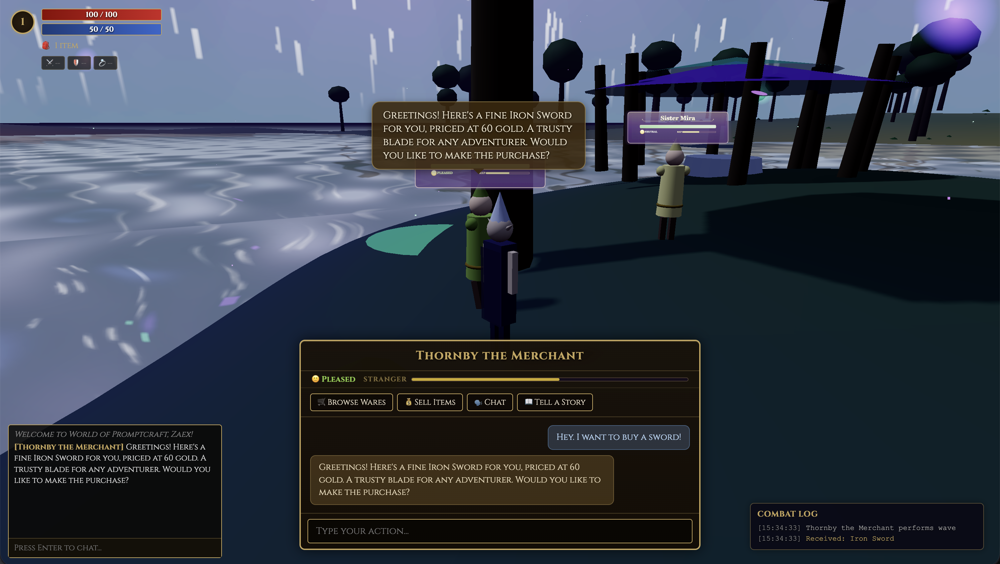
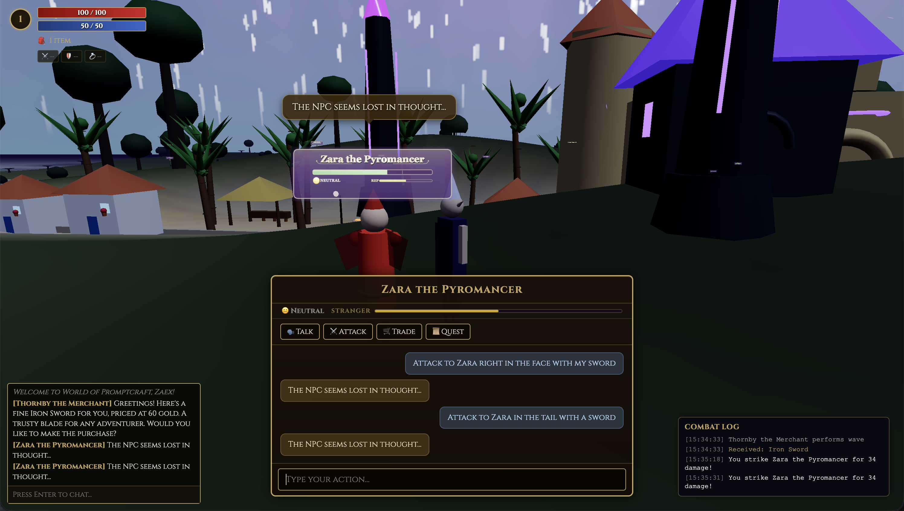
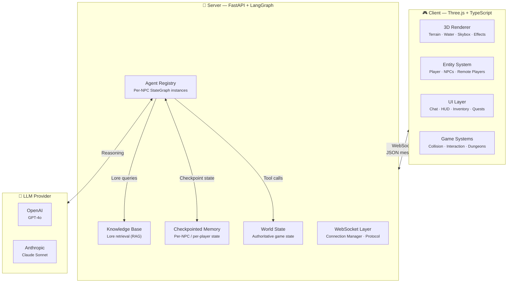

<div align="center">

# ⚔️ World of Promptcraft

### *Where your words shape the world*

A 3D multiplayer RPG built entirely around **natural language**. Type anything — fight dragons, haggle with merchants, learn ancient spells — and LangGraph-powered AI agents respond with dynamic actions in a living 3D world.

**No buttons. No menus. Just your imagination.**

[](https://github.com/Zaexv/world-of-prompcraft/actions/workflows/ci.yml)


</div>

<div align="center">
<table>
<tr>
<td></td>
<td></td>
</tr>
<tr>
<td align="center"><i>💬 Trading — "Hey, I want to buy a sword!"</i></td>
<td align="center"><i>⚔️ Combat — "Attack Zara right in the face with my sword"</i></td>
</tr>
</table>
</div>

---

## ✨ What Makes This Different

Most games give you buttons: *Attack*, *Trade*, *Talk*. Promptcraft gives you a **text box**.

> **You:** *"I bow before you, great Ignathar, and offer my finest emerald in exchange for safe passage through the Ember Peaks."*
>
> **Ignathar the Ancient:** *"Hmm… thy offering glitters prettily, mortal. I shall accept it — but know this: the Peaks remember those who trespass. Take thy passage, and speak of my mercy to none."*
>
> *(Ignathar performs a bow emote, accepts the emerald, and changes the weather to clear)*

Every NPC is a **fully autonomous AI agent** with its own personality, checkpointed memory, inventory, and decision-making graph. They don't follow scripts — they *think*.

---

## 🏗️ Architecture



### Core Design Principles

| Principle | Implementation |
|-----------|---------------|
| **Prompt is the interface** | No action buttons — free-form text drives all gameplay |
| **Server-authoritative** | `WorldState` lives on the server; client is a render mirror |
| **Shared Manifest** | Global world map and population defined in a single, shared `world_manifest.json` |
| **Per-NPC autonomy** | Each NPC runs its own LangGraph `StateGraph` with independent, checkpointed memory |
| **Memory compaction** | `reflect` stays cheap and `summarize` runs only when the conversation needs trimming |
| **Tool-driven mechanics** | LLM calls typed tools (`deal_damage`, `heal_target`, `offer_item`) that produce structured game actions |
| **Generative World** | Infinite chunk-based terrain (64×64) with manifest-driven landmarks and NPCs |

---

## 🌍 The World

Explore a fantasy world with distinct zones, each with its own atmosphere and inhabitants defined in the master manifest:

| Zone | Description | Key Landmarks |
|------|-------------|------|
| **Teldrassil Core** | Peaceful starting area with mystical waters | Ancient Grove, Market Pavilion |
| **Ember Peaks** | Volcanic mountains with molten rivers | Mystic Ruins, Ember Depths Dungeon |
| **Fort Malaka** | Mediterranean fortified city | Grand Mage Tower, La Alcazaba, Crystal Caverns |

---

Each interaction flows through a five-stage LangGraph pipeline:

```
Player Prompt ──► [ Reason ] ──► [ Act ] ──► [ Respond ] ──► [ Reflect ] ──► [ Summarize? ]
                      │              │             │               │               │
                 Retrieve lore   Call tools    Generate        Update mood   Compact memory
                 Assess intent   (combat,      dialogue +       relationship   when needed
                 Check memory    trade, env)   emotes           notes
```

---

## 🚀 Quick Start

### Prerequisites

- **Node.js** 20+ &nbsp;·&nbsp; **Python** 3.11+ &nbsp;·&nbsp; An LLM API key ([OpenAI](https://platform.openai.com/api-keys) or [Anthropic](https://console.anthropic.com/))

### 1. Clone & configure

```bash
git clone https://github.com/Zaexv/world-of-prompcraft.git
cd world-of-prompcraft
cp .env.example .env   # ← Add your API key here
```

### 2. Start the server

```bash
cd server
pip install -e ".[dev]"
python -m uvicorn src.main:app --reload --port 8000
```

> Runs at **http://localhost:8000** (WebSocket endpoint at `ws://localhost:8000/ws`)

### 3. Start the client

```bash
cd client
npm install
npm run dev
```

> Runs at **http://localhost:5173**

### 4. Play

Open **http://localhost:5173**, create a character, and start talking to NPCs.

> **🚀 Performance Tip (Windows):** If you experience stuttering while moving, ensure you use **http://127.0.0.1:5173**. Windows can have 500ms delays resolving `localhost` via IPv6, which interrupts high-frequency game engine requests. The project now includes an automatic redirect to 127.0.0.1 in development to ensure smoothness.

---

## 🗂️ Project Structure

```
world-of-prompcraft/
│
├── shared/                        # 🔗 Shared world data (Single Source of Truth)
│   └── data/
│       └── world_manifest.json    # Master blueprint: biomes, landmarks, NPCs
│
├── client/                        # 🎮 Three.js + TypeScript + Vite
│   └── src/
│       ├── state/                 # WorldManifest hydration & sync
│       ├── scene/                 # Data-driven Terrain, Biomes, Lighting
│       ├── systems/               # WorldGenerator (manifest-driven spawning)
│       └── ...
│
├── server/                        # 🧠 FastAPI + LangGraph + Python
│   └── src/
│       ├── world/                 # npc_definitions (loads from shared manifest)
│       ├── ws/                    # WebSocket handler with sync-on-join
│       └── ...
```

---

## 🧪 Development

### Run all checks

```bash
make check          # Lint + typecheck + tests for both client and server
```

### Individual commands

| Command | What it does |
|---------|-------------|
| `make lint` | ESLint (client) + Ruff (server) |
| `make typecheck` | `tsc --noEmit` (client) + `mypy` (server) |
| `make test` | Vitest (client) + pytest (server) |
| `make format` | Auto-fix lint issues in both client and server |

### CI Pipeline

Every push and PR runs a **staged pipeline** on GitHub Actions with 7 required jobs across 4 gates:

```
Stage 1 (Quality)    Client Lint ─┐
                     Server Lint ─┤
                                  ▼
Stage 2 (Types)      Client TC ───┤
                     Server TC ───┤
                                  ▼
Stage 3 (Tests)      Client Test ─┤
                     Server Test ─┤
                     LLM Mock    ─┤
                                  ▼
Stage 4 (Status)     Pipeline ✅ ─┘
```

On pushes to `main` only: load tests and Docker image builds run as additional non-blocking jobs.

---

## 🔧 Tech Stack

| Layer | Technology | Purpose |
|-------|-----------|---------|
| **3D Engine** | [Three.js](https://threejs.org/) + TypeScript | Procedural terrain, manifest-driven landmarks, distance-based culling |
| **Architecture** | **Zonal Hybrid Manifest** | Scalable V2.1.0 schema separating Environment, Topology, and Population |
| **Physics** | [three-mesh-bvh](https://github.com/gkjohnson/three-mesh-bvh) | Fast BVH-accelerated collisions and AI navigation |
| **Server** | [FastAPI](https://fastapi.tiangolo.com/) | Async WebSocket server with REST manifest sync |
| **AI Agents** | [LangGraph](https://langchain-ai.github.io/langgraph/) | Per-NPC StateGraph with memory, tool-calling, and reasoning nodes |

---

## 📐 How to Extend

<details>
<summary><b>Add a new NPC</b></summary>

1. Choose or define a personality template in `server/src/agents/personalities/templates.py`
2. Add the NPC to the `npcs` array of a specific zone in `shared/data/world_manifest.json`
3. The server refreshes the agent registry automatically on next player join
4. The client hydrates the new NPC data and spawns the model on boot

</details>

<details>
<summary><b>Add a new Landmark</b></summary>

1. Choose a building type (tower, ruins, altar)
2. Add a new entry to the `architecture.landmarks` array in `shared/data/world_manifest.json`
3. The `WorldGenerator` will automatically spawn it when you enter the relevant terrain chunk

</details>

<details>
<summary><b>Reshape the Geography</b></summary>

1. Edit the `world.environment` or `world.topology` sections in `shared/data/world_manifest.json`
2. Change biome colors, transition widths, or add specific mountain features
3. The game engine dynamically re-calculates the infinite terrain based on these rules

</details>

---

## 🛡️ Collision & Navigation

The game uses **BVH-accelerated spatial queries** for both player movement and AI navigation.

### Structured World Logic

Instead of hardcoded meshes, the world is built from the manifest. Each object type defines its own collision behavior:
- **Solid Trunks:** Trees and pillars block movement via `isCollider` tags.
- **Navigable Ground:** Terrain height is sampled deterministically across all chunks.
- **AI Blocking:** NPCs check `isPositionBlocked(x, y, z)` before wandering to avoid getting stuck in buildings.

### WoW-style Camera

- Orbits around character head (y+1.6) with configurable arm height
- **Dual collision**: terrain binary search + raycaster against scene objects
- **Instant pull-in** when obstructed (no clipping), **smooth pull-out** when clear
- Mouse wheel zoom: 2–20 units distance

---

## 📄 Documentation

Detailed technical documentation lives in [`docs/`](./docs/):

| Document | Description |
|----------|-------------|
| [Client Architecture](./client/ARCHITECTURE.md) | Frontend deep-dive — render loop, entity system, collision, UI, state, WebSocket |
| [Server Architecture](./server/ARCHITECTURE.md) | Backend deep-dive — FastAPI, WebSocket layer, LangGraph, tools, RAG, WorldState |
| [Agentic Workflow](./docs/agentic-workflow.md) | LangGraph pipeline reference — all nodes, tool system, memory model, example traces |
| [Protocol](./docs/protocol.md) | WebSocket protocol spec — every message type, field, and action kind |
| [Backend Guide](./docs/backend_guide.md) | Server architecture deep-dive |
| [Architecture Blueprint](./docs/architecture-blueprint.md) | Full engine-agnostic technical spec |
| [Improvements](./docs/improvements.md) | Code audit — 39 tracked issues by severity |

---

## 🤝 Contributing

1. Fork the repository
2. Create a feature branch (`git checkout -b feat/my-feature`)
3. Make your changes and ensure `make check` passes
4. Commit using [conventional commits](https://www.conventionalcommits.org/) (`feat:`, `fix:`, `refactor:`, etc.)
5. Open a Pull Request

Pre-commit hooks automatically run linting and type checking on every commit.

---

## 📜 License

MIT — see [LICENSE](./LICENSE) for details.

---

<div align="center">
<i>Built with Three.js, LangGraph, and a love for emergent gameplay.</i>
</div>
