# World of Promptcraft — Architecture

A Three.js + LangGraph game where players interact with AI-powered NPCs in a 3D fantasy world.

---

## 1. System Overview

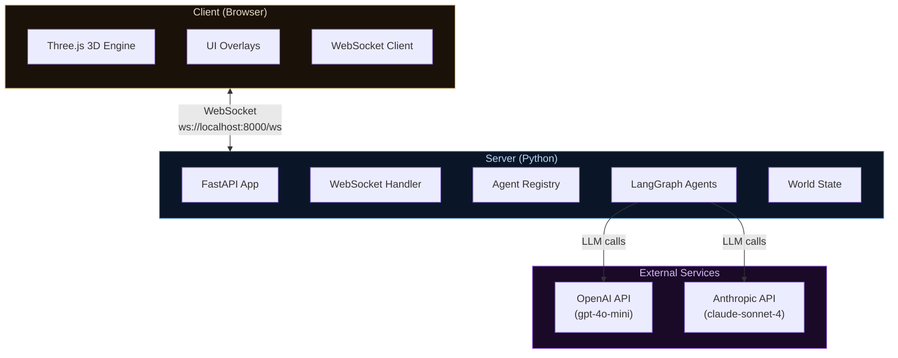

The system follows a client-server architecture connected by a single WebSocket. The client renders the 3D world and manages player input; the server runs LangGraph agent graphs that reason about player prompts, invoke tools, and return structured responses with dialogue and game actions.

---

## 2. Client Architecture

```mermaid
graph TB
    Main["main.ts<br/>Game Init & Loop"]

    Main --> SM["SceneManager<br/>Renderer, Bloom Post-processing"]
    Main --> PC["PlayerController<br/>WASD, Pointer Lock, Jump,<br/>Water + Raycaster Collision"]
    Main --> P["Player<br/>Night Elf Model + Cape"]
    Main --> EM["EntityManager<br/>NPC Registry + Wandering AI"]
    Main --> IS["InteractionSystem<br/>Raycaster + Click"]
    Main --> RS["ReactionSystem<br/>Actions → 3D Effects + Death"]
    Main --> CS["CollisionSystem<br/>Raycaster-based, 3 heights"]
    Main --> WG["WorldGenerator<br/>Chunk-based tree/NPC spawning"]
    Main --> UM["UIManager<br/>All HUD Overlays"]
    Main --> WS["WebSocketClient<br/>Auto-reconnect + Queue"]

    subgraph State ["State Stores"]
        PS["PlayerState (Singleton)<br/>isDead, onDeath, respawn()"]
        NS["NPCStateStore"]
        WState["WorldState"]
    end

    Main --> PS & NS & WState

    SM --> Terrain["Terrain<br/>Infinite chunks (64x64)"]
    SM --> Water["Water<br/>Reflective (Three.js Water)"]
    SM --> Buildings["Buildings<br/>Elven: moonwell, tree-house,<br/>sentinel tower, pavilion"]
    SM --> Vegetation["Vegetation<br/>Massive trees, mushrooms,<br/>ferns, vines"]
    SM --> Skybox["Skybox<br/>CubeTexture: stars, moons, nebula"]
    SM --> Lighting["Lighting<br/>Moonlight + 3 moonbeam spots"]
    SM --> Effects["Effects<br/>Wisps, particles, glow, leaves"]

    subgraph UI ["UI Panels"]
        LS["LoginScreen<br/>Dark Portal + Enter World"]
        IP["InteractionPanel<br/>Chat + Action Buttons per NPC"]
        SB["StatusBars<br/>HP/Mana + Gold frames"]
        INV["InventoryPanel<br/>WoW-style 4x5 grid (I key)"]
        CL["CombatLog<br/>Timestamped, color-coded"]
        CH["CombatHUD<br/>Unit frames + combat log"]
        DP["DamagePopup<br/>Screen-space floating numbers"]
        IUE["ItemUseEffect<br/>Potion glow + particles"]
        DS["DeathScreen<br/>Game Over + Respawn"]
        CTR["ControlsHelp<br/>Keybinding reference (H key)"]
    end

    UM --> UI

    EM --> NPC["NPC Entities<br/>Wander AI + Role accessories"]
    NPC --> NA["NPCAnimator<br/>idle/walk/attack/emote"]
    NPC --> NP["Nameplate<br/>Gold text + HP bar sprite"]
    NPC --> AI["ActionIcon<br/>Floating emoji status"]

    IS -->|"onNPCClick"| UM
    IP -->|"onSendMessage"| WS
    WS -->|"agent_response"| RS & IP & CH & CL
    WS -->|"use_item_result"| RS & IUE & CL
    RS --> PS & NS
    PC --> CS
    Terrain -->|"onChunkLoaded"| WG

    style Main fill:#c5a55a,stroke:#8b6914,color:#1a1108
    style State fill:#1a2808,stroke:#88aa44,color:#c8e8a8
    style UI fill:#1a1108,stroke:#c5a55a,color:#e8dcc8
```

**Game loop** (`animate()`): SceneManager renders (bloom post-processing), PlayerController updates (skip if dead), Player model follows, EntityManager ticks NPCs (wandering AI + terrain following), ReactionSystem processes active effects, Terrain loads/unloads chunks around player.

---

## 3. Server Architecture

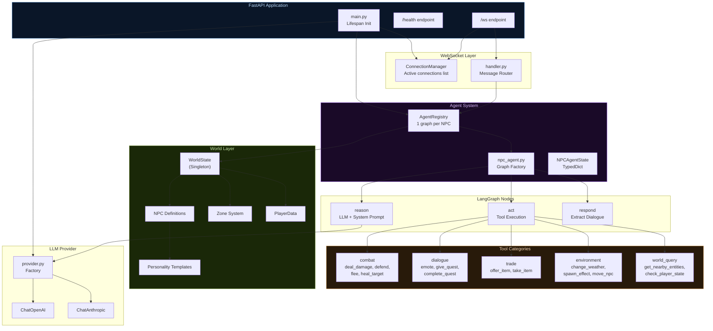

On startup, the `lifespan` handler creates the LLM instance, `WorldState`, and `AgentRegistry`. The registry builds one compiled LangGraph graph per NPC, each with its own tool closures and `MemorySaver` checkpointer for conversation history.

---

## 4. Agent Lifecycle

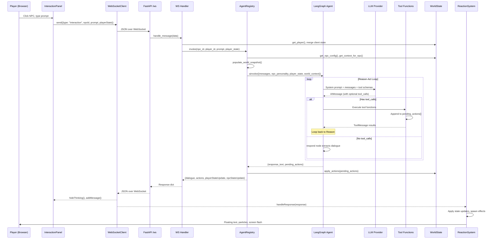

---

## 5. LangGraph Agent Graph

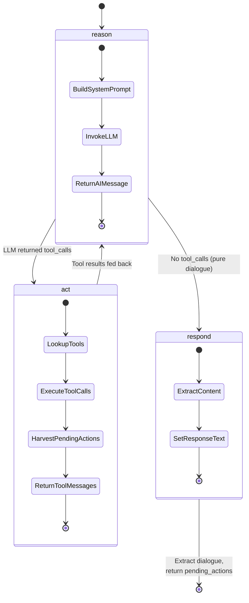

The conditional edge `_should_act_or_respond` checks whether the last AI message contains `tool_calls`. If so, it routes to `act` which executes the tools and loops back to `reason`. This allows multi-step reasoning (e.g., check player state, then decide to heal). When the LLM produces a plain text response, `respond` extracts the dialogue and the graph terminates.

**Agent State Schema (`NPCAgentState`):**

| Field | Type | Purpose |
|-------|------|---------|
| `messages` | `Annotated[list, add_messages]` | Conversation history (accumulates) |
| `npc_id` | `str` | NPC identifier |
| `npc_name` | `str` | Display name |
| `npc_personality` | `str` | System prompt personality text |
| `player_state` | `dict` | HP, inventory, position |
| `world_context` | `dict` | Zone, weather, nearby entities |
| `pending_actions` | `list[dict]` | Accumulated game actions |
| `response_text` | `str` | Final dialogue output |

---

## 6. Tool System

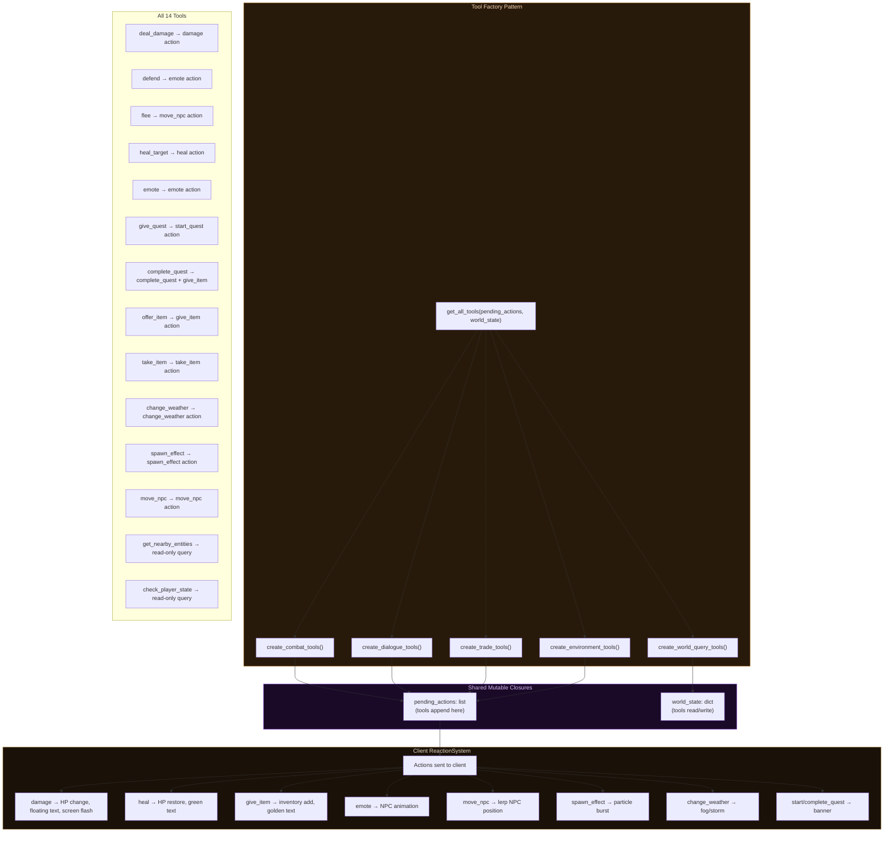

Each tool factory returns `@tool`-decorated functions that close over shared `pending_actions` and `world_state` references. When a tool is invoked by the LLM, it appends an action dict to `pending_actions` and optionally mutates the `world_state` snapshot (e.g., `deal_damage` reduces player HP). The `act` node harvests these after each tool round.

---

## 7. State Management

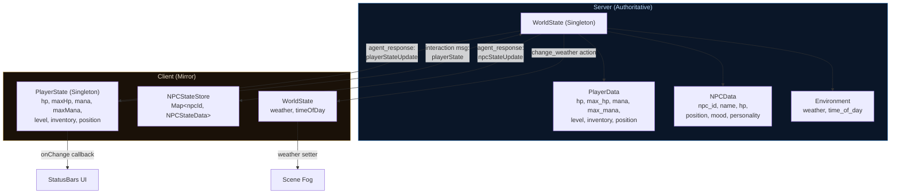

The server's `WorldState` is the single source of truth. After every agent invocation, `apply_actions()` mutates server state, then the full `playerStateUpdate` and `npcStateUpdate` are sent to the client. The client's `PlayerState.merge()` and `NPCStateStore.updateState()` apply the patches and trigger UI updates via callbacks.

Player position is client-authoritative (controlled by `PlayerController`) and sent to the server via `player_move` messages.

---

## 8. 3D Scene Hierarchy

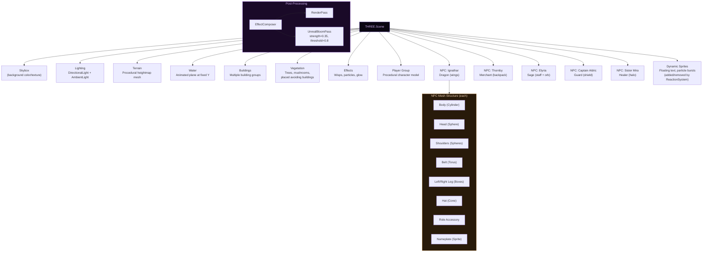

The renderer uses `ACESFilmicToneMapping` with exposure 1.6, `PCFSoftShadowMap`, and capped pixel ratio at 2x. The Bloom pass runs at half resolution for performance.

---

## 9. Message Protocol

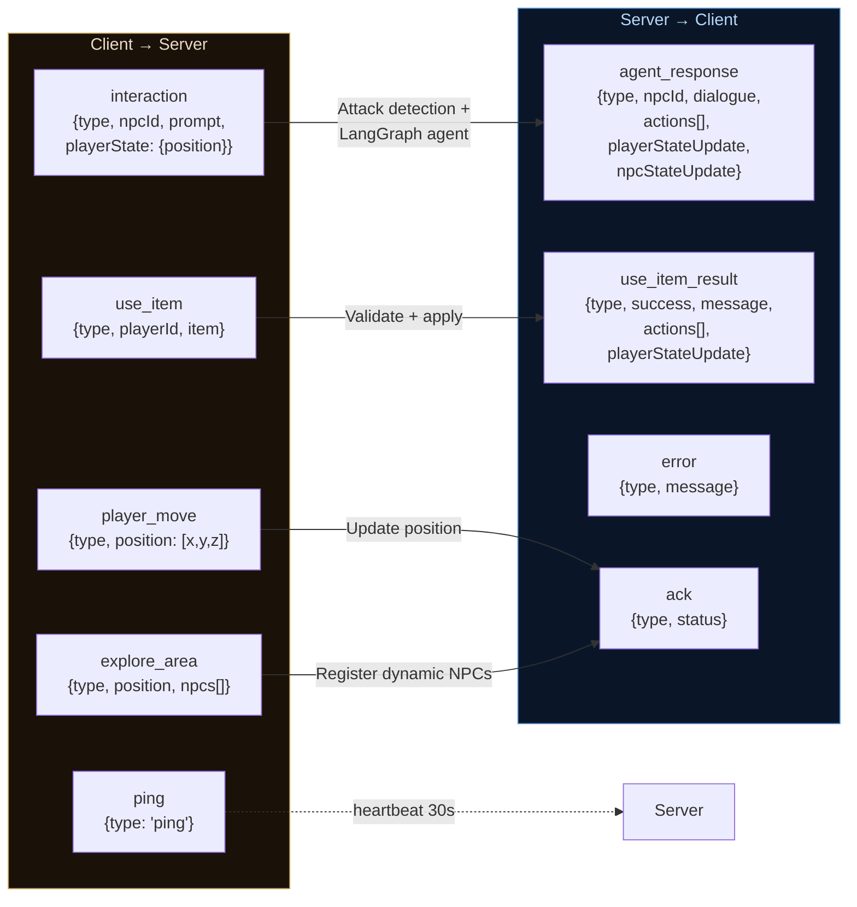

**Security:** Input validation whitelist (only `position` accepted from client). 30s LLM timeout. Rate limiting (max 10 msgs/3s). Tool output clamped (0-100 damage/heal).

**Action kinds** (within `agent_response.actions[]`):

| Kind | Params | Client Effect |
|------|--------|---------------|
| `damage` | `amount`, `target`, `damageType` | HP reduction, red floating text, screen flash |
| `heal` | `amount`, `target` | HP restore, green floating text, green flash |
| `give_item` | `item` | Inventory add, golden floating text |
| `take_item` | `item` | Inventory remove |
| `emote` | `animation` | NPC animation (bow, wave, laugh, etc.) |
| `move_npc` | `position`, `duration` | Smooth lerp of NPC mesh |
| `spawn_effect` | `effectType`, `color`, `count` | Particle burst at position |
| `change_weather` | `weather` | Scene fog adjustment |
| `start_quest` | `questName`, `description` | Quest banner overlay |
| `complete_quest` | `questName`, `reward` | Quest banner overlay |

---

## 10. NPC System

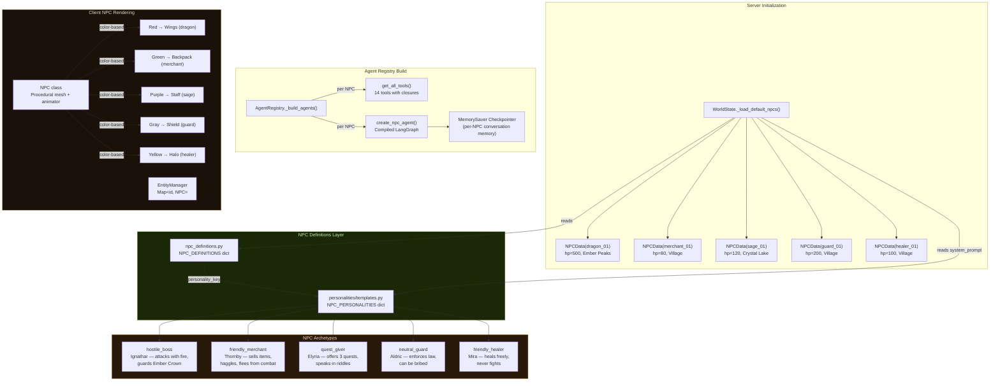

**Static NPCs** are defined in `NPC_PERSONALITIES` → `NPC_DEFINITIONS` → `NPC_CONFIGS`. **Dynamic NPCs** are generated by `WorldGenerator` when new terrain chunks load (20% chance per chunk, >100 units from origin) and registered server-side via `registry.register_dynamic_npc()`.

### RAG Lore System

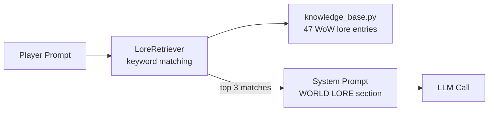

When a player mentions lore topics (Elune, Teldrassil, Night Elves, etc.), the RAG retriever injects relevant WoW lore into the NPC's system prompt so responses reference actual game lore.

---

## 11. CI/CD & Quality Pipeline

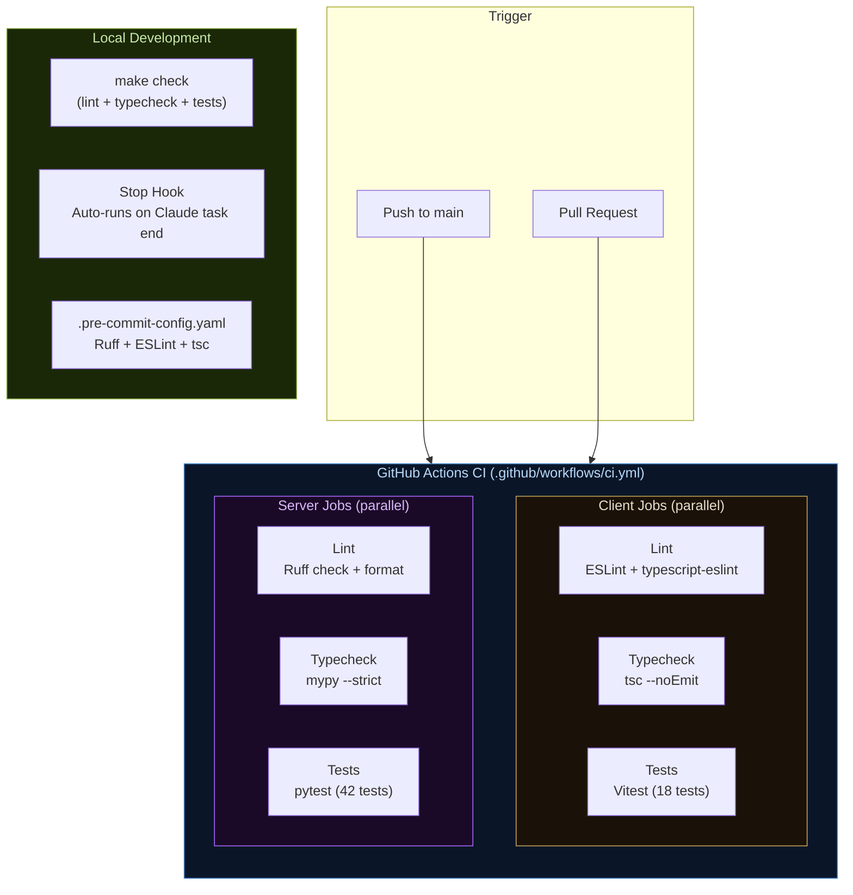

### CI Pipeline (GitHub Actions)

All 6 jobs run **in parallel** with dependency caching:

| Job | Tool | What it checks |
|-----|------|----------------|
| **Client Lint** | ESLint 9 + `typescript-eslint` | No `any`, unused vars, no bare `console.log` |
| **Client Typecheck** | `tsc --noEmit` (strict mode) | Full TypeScript type safety |
| **Client Tests** | Vitest | `MathHelpers`, `PlayerState`, `MessageProtocol` |
| **Server Lint** | Ruff (check + format) | PEP8, isort, bugbear, simplify, pyupgrade |
| **Server Typecheck** | mypy | Strict type annotations |
| **Server Tests** | pytest + pytest-asyncio | WorldState, Combat, Zones, Protocol, RAG, Personalities |

### Local Quality Tools

| Command | Scope | Purpose |
|---------|-------|---------|
| `make check` | All | Lint + typecheck + tests (both sides) |
| `make lint` | All | Lint only |
| `make test` | All | Tests only |
| `make format` | All | Auto-fix formatting |
| `npm run check` | Client | Client lint + typecheck + tests |

### Test Coverage Map

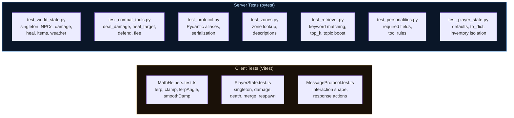

### Linting Configuration

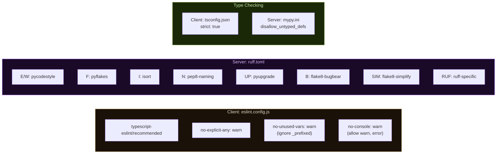

---

## 12. File Structure

```
world-of-prompcraft/
├── CLAUDE.md                        # Project conventions for Claude Code
├── Makefile                         # make check / lint / test / format
├── docker-compose.yml
├── .gitignore
├── .pre-commit-config.yaml          # Pre-commit hooks (ruff, eslint, tsc)
│
├── .github/
│   └── workflows/
│       └── ci.yml                   # GitHub Actions: lint + typecheck + tests
│
├── client/                          # Vite + TypeScript + Three.js
│   ├── index.html                   # Entry HTML
│   ├── package.json                 # Dependencies + lint/test/check scripts
│   ├── tsconfig.json                # TypeScript config (strict mode)
│   ├── vite.config.ts               # Vite build config
│   ├── vitest.config.ts             # Vitest test runner config
│   ├── eslint.config.js             # ESLint + typescript-eslint (flat config)
│   └── src/
│       ├── main.ts                  # Game init, main loop, wiring
│       │
│       ├── __tests__/               # Client unit tests (Vitest)
│       │   ├── MathHelpers.test.ts  # lerp, clamp, lerpAngle, smoothDamp
│       │   ├── PlayerState.test.ts  # Singleton, damage, death, merge
│       │   └── MessageProtocol.test.ts # Message shape validation
│       │
│       ├── scene/                   # 3D world rendering
│       │   ├── SceneManager.ts      # Renderer, camera, post-processing
│       │   ├── Terrain.ts           # Procedural heightmap (infinite chunks)
│       │   ├── Water.ts             # Animated reflective water plane
│       │   ├── Skybox.ts            # CubeTexture: stars, moons, nebula
│       │   ├── Lighting.ts          # Moonlight + 3 moonbeam spots
│       │   ├── Buildings.ts         # Elven village structures
│       │   ├── Vegetation.ts        # Trees, mushrooms, ferns, vines
│       │   ├── Biomes.ts            # Biome generation per chunk
│       │   └── Effects.ts           # Wisps, ambient particles, glow
│       │
│       ├── entities/                # Game entities
│       │   ├── Player.ts            # Night Elf model + cape
│       │   ├── PlayerController.ts  # WASD + mouse, pointer lock, collision
│       │   ├── NPC.ts               # NPC model + role accessories + wander AI
│       │   ├── NPCAnimator.ts       # Procedural NPC animations
│       │   └── EntityManager.ts     # NPC registry + lifecycle
│       │
│       ├── systems/                 # Game systems
│       │   ├── InteractionSystem.ts # Raycaster NPC click/hover
│       │   ├── ReactionSystem.ts    # Agent response → 3D effects + NPC death
│       │   ├── CollisionSystem.ts   # Raycaster-based, 3-height collision
│       │   ├── WorldGenerator.ts    # Chunk-based tree/NPC spawning
│       │   └── AnimationSystem.ts   # Generic tick system
│       │
│       ├── ui/                      # HTML/CSS overlays (all DOM, no framework)
│       │   ├── UIManager.ts         # Root container + all panels
│       │   ├── InteractionPanel.ts  # Chat + per-NPC action buttons
│       │   ├── StatusBars.ts        # HP/Mana with gold frames
│       │   ├── LoginScreen.ts       # Dark Portal + Enter World
│       │   ├── InventoryPanel.ts    # WoW-style 4x5 grid (I key)
│       │   ├── CombatLog.ts         # Timestamped combat entries
│       │   ├── CombatHUD.ts         # Unit frames + combat log
│       │   ├── DamagePopup.ts       # Screen-space floating numbers
│       │   ├── ItemUseEffect.ts     # Potion/buff visual effects
│       │   ├── DeathScreen.ts       # Game Over + Respawn
│       │   ├── Nameplate.ts         # Billboard sprite (name + HP)
│       │   └── ActionIcon.ts        # Floating emoji action status
│       │
│       ├── network/                 # Server communication
│       │   ├── WebSocketClient.ts   # WS with auto-reconnect + heartbeat
│       │   └── MessageProtocol.ts   # TypeScript message type definitions
│       │
│       ├── state/                   # Client state mirrors
│       │   ├── PlayerState.ts       # Singleton player state
│       │   ├── NPCState.ts          # NPC state store (Map)
│       │   └── WorldState.ts        # Weather, time aggregator
│       │
│       └── utils/                   # Helpers
│           ├── MathHelpers.ts       # clamp, lerp, lerpAngle, smoothDamp
│           └── AssetLoader.ts       # Asset loading helpers
│
└── server/                          # FastAPI + LangGraph (Python)
    ├── pyproject.toml               # Dependencies + pytest config
    ├── ruff.toml                    # Ruff linter + formatter config
    ├── mypy.ini                     # mypy strict type checking config
    │
    ├── tests/                       # Server unit tests (pytest)
    │   ├── conftest.py              # Shared fixtures
    │   ├── test_player_state.py     # PlayerData defaults, to_dict
    │   ├── test_world_state.py      # Singleton, NPCs, damage, heal, items
    │   ├── test_zones.py            # Zone lookup, descriptions
    │   ├── test_combat_tools.py     # deal_damage, heal, defend, flee
    │   ├── test_protocol.py         # Pydantic aliases, serialization
    │   ├── test_retriever.py        # Keyword matching, top_k, boost
    │   └── test_personalities.py    # Required fields, tool rules
    │
    └── src/
        ├── main.py                  # FastAPI app, lifespan, /ws endpoint
        ├── config.py                # Pydantic settings (LLM provider, keys)
        │
        ├── ws/                      # WebSocket layer
        │   ├── handler.py           # Message routing + response building
        │   ├── protocol.py          # Pydantic models for messages
        │   └── connection_manager.py # Active connection tracking
        │
        ├── agents/                  # AI agent system
        │   ├── registry.py          # AgentRegistry — 1 graph per NPC
        │   ├── npc_agent.py         # LangGraph graph factory
        │   ├── agent_state.py       # NPCAgentState TypedDict
        │   │
        │   ├── nodes/               # Graph nodes
        │   │   ├── reason.py        # LLM reasoning (system prompt builder)
        │   │   ├── act.py           # Tool execution + action harvesting
        │   │   └── respond.py       # Final dialogue extraction
        │   │
        │   ├── tools/               # NPC tool categories (14 tools)
        │   │   ├── __init__.py      # Tool registry + get_all_tools()
        │   │   ├── combat.py        # deal_damage, defend, flee, heal_target
        │   │   ├── dialogue.py      # emote, give_quest, complete_quest
        │   │   ├── trade.py         # offer_item, take_item
        │   │   ├── environment.py   # change_weather, spawn_effect, move_npc
        │   │   └── world_query.py   # get_nearby_entities, check_player_state
        │   │
        │   └── personalities/       # NPC personality configs
        │       └── templates.py     # System prompts + _TOOL_RULES_PREAMBLE
        │
        ├── world/                   # Game world state
        │   ├── world_state.py       # Authoritative WorldState singleton
        │   ├── player_state.py      # PlayerData dataclass
        │   ├── npc_definitions.py   # Static NPC metadata (6 NPCs)
        │   └── zones.py             # Zone boundaries + descriptions
        │
        ├── rag/                     # RAG lore system
        │   ├── knowledge_base.py    # 47 WoW lore entries
        │   └── retriever.py         # Keyword-based lore retriever
        │
        └── llm/                     # LLM abstraction
            └── provider.py          # Factory: OpenAI or Anthropic
```

---

## 13. Zone Map

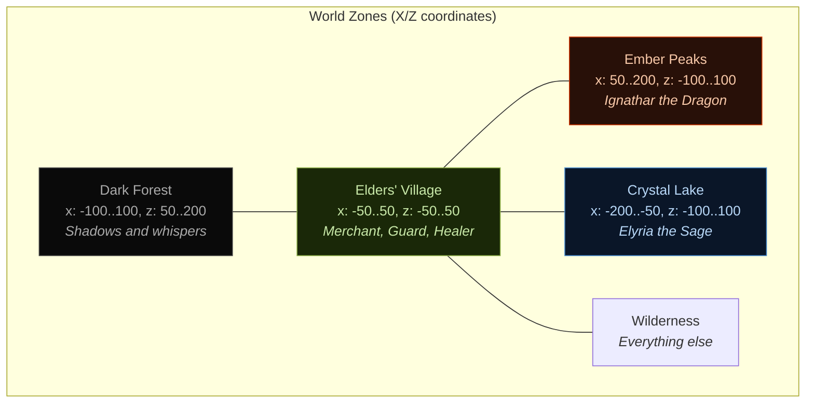
