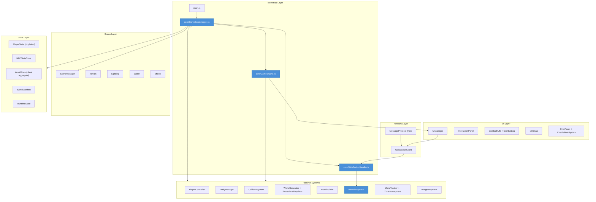
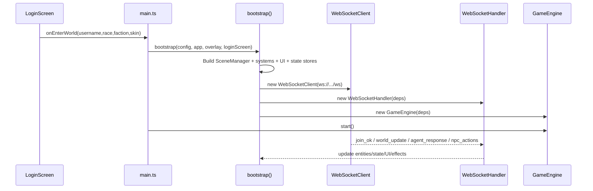
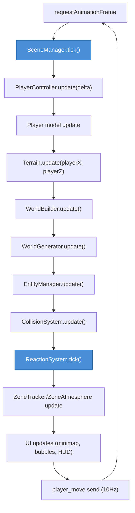
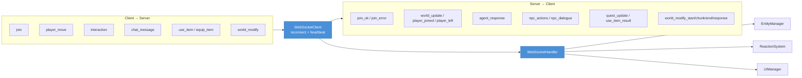
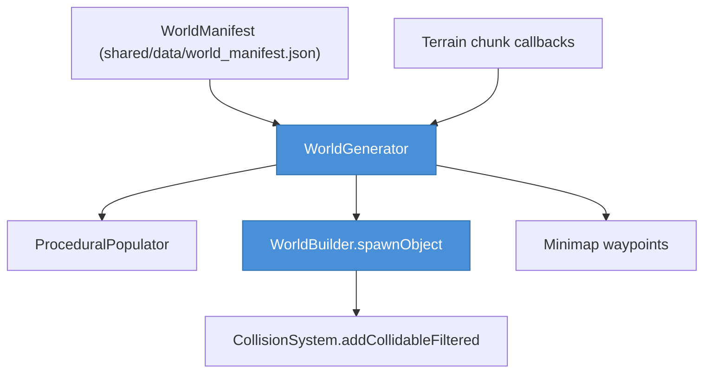
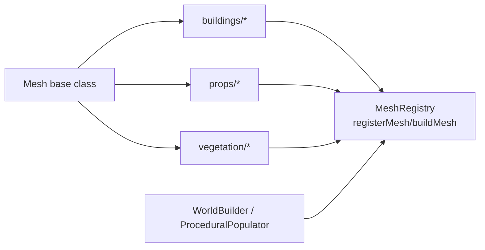
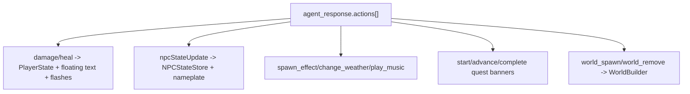

# Client Architecture — World of Promptcraft

Three.js + TypeScript frontend. The client is a render/runtime mirror around server-authoritative state, with local simulation for movement, camera, effects, and UI.

---

## Layer Overview

---

## Bootstrap Flow

---

## Runtime Tick (GameEngine)

---

## Network & Message Handling

---

## Data-Driven World

`WorldManifest` is loaded in bootstrap and injected into terrain/biome/dungeon systems. `WorldGenerator` uses chunk callbacks from `Terrain` and delegates procedural spawn work to `ProceduralPopulator`, while authored objects are built through `WorldBuilder`.

---

## Mesh Catalog & Registry (`client/src/meshes/`)

All reusable buildings/props/vegetation are class-based meshes registered via `registerMesh(...)`, then instantiated by type through the mesh registry.

---

## ReactionSystem — Action Dispatch

`ReactionSystem` maps `actions[]` to visual and state effects (damage/heal/items/quests/weather/move/emotes/world modifications/music), while avoiding double-application against partial `playerStateUpdate`.

