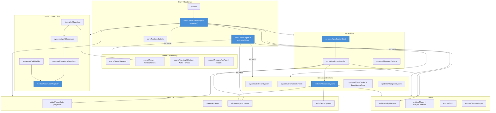
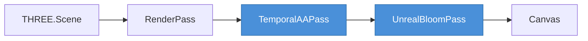
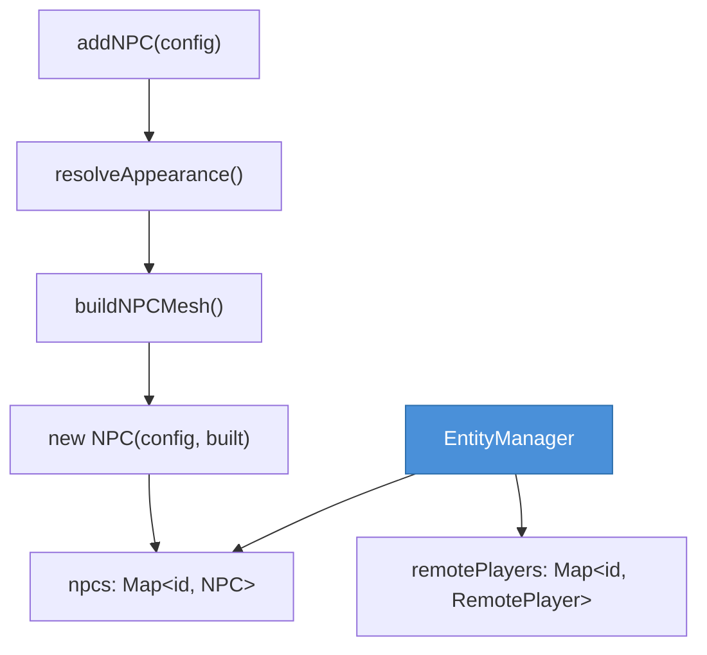
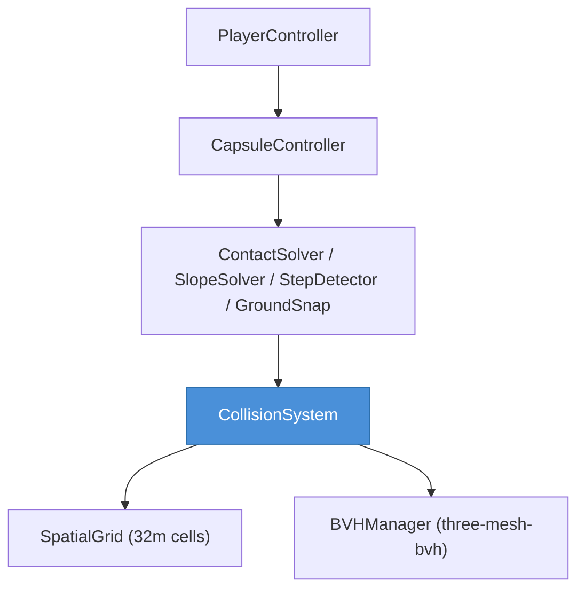
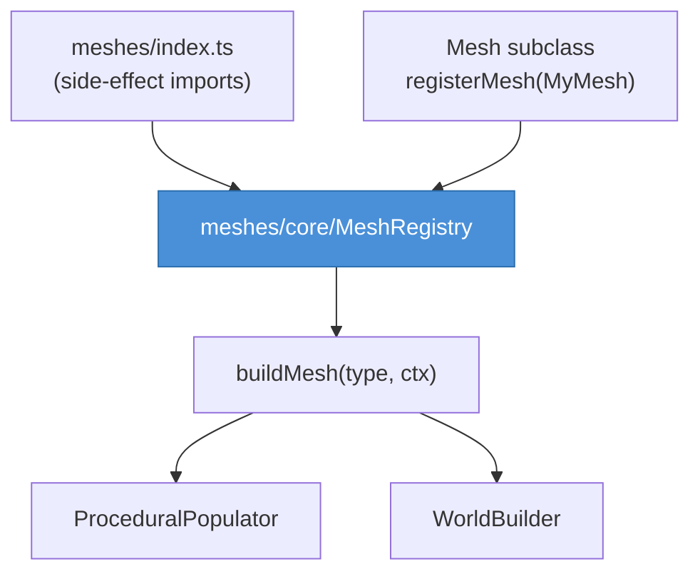
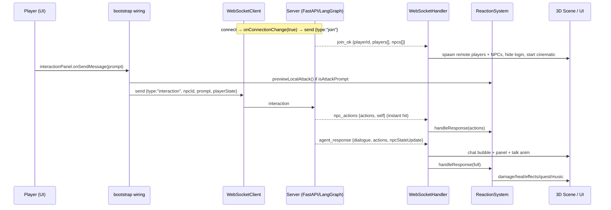

# World of Promptcraft — Client Architecture

The client is a Three.js + TypeScript + Vite single-page application. It is a
**render mirror** of a server-authoritative world: the server owns `WorldState`,
NPC agents, and combat resolution; the client renders the world, captures player
input, and translates server `Action`s into 3D effects.

This document describes the actual code under `client/src/` as it exists today.

---

## Layer Overview



---

## Bootstrap Flow

`main.ts` is the only HTML entry point. It monkey-patches Three.js with
`three-mesh-bvh` accelerated raycasting, loads the Cinzel font, then shows
`LoginScreen`. On **Enter World**, it builds a loading overlay and calls
`bootstrap()` (in `core/GameBootstrapper.ts`), which wires the whole game and
returns a `GameEngine`; `engine.start()` kicks off the render loop.

```mermaid
sequenceDiagram
  participant U as User
  participant Login as LoginScreen
  participant Boot as GameBootstrapper.bootstrap()
  participant SM as SceneManager
  participant WS as WebSocketClient
  participant Eng as GameEngine

  U->>Login: enter username / race / faction
  Login->>Boot: onEnterWorld(config)
  Boot->>Boot: new WorldManifest() + inject into terrain/biomes/dungeon
  Boot->>SM: new SceneManager(app) (renderer, camera, terrain, lighting, post-fx)
  Boot->>SM: terrain.setManifest(manifest.toData())
  Boot->>Boot: PlayerState.getInstance(), NPCStateStore, WorldState
  Boot->>Boot: PlayerController, Player.create(race), EntityManager
  Boot->>Boot: CollisionSystem, InteractionSystem, AudioSystem
  Boot->>Boot: ReactionSystem, WorldBuilder, UIManager, WorldGenerator
  Boot->>Boot: ZoneTracker, ZoneAtmosphere, DungeonSystem
  Boot->>Boot: wire terrain.onChunkLoaded → WorldGenerator
  Boot->>Boot: terrain.init() (preload start area)
  Boot->>WS: new WebSocketClient(ws[s]://host/ws)
  Boot->>Boot: new WebSocketHandler(deps); ws.onMessage = handler.handle
  Boot->>Eng: new GameEngine(deps)
  Boot->>SM: renderer.compile(scene, camera) + warmUpTextures
  Boot-->>U: return engine
  U->>Eng: engine.start() → animate()
  WS->>WS: onConnectionChange(true) → send {type:"join"}
```

**Instantiation order** (from `bootstrap()`): WorldManifest → SceneManager →
ZoneAtmosphere → PlayerState/NPCState/WorldState → RuntimeState →
PlayerController → Player → EntityManager → CollisionSystem → InteractionSystem
→ AudioSystem → ReactionSystem → WorldBuilder → UIManager → WorldGenerator →
ZoneTracker → DungeonSystem → terrain callbacks + `terrain.init()` →
WebSocketClient → WebSocketHandler → WorldBuilderPanel → keyboard shortcuts →
GameEngine → shader/texture warm-up.

Hotkeys wired in `bootstrap()`: **M** minimap, **I** inventory, **L** quest log,
**E** enter dungeon, **B** world builder, **Enter** focus chat. `GameEngine`
adds **F3** debug overlay; the intro cinematic listens for Space/Enter/Escape.

`RuntimeState` is the small mutable runtime bag shared across systems:
`localPlayerId`, `joinedServer`, `activeNpcId`, `inDungeonOverride`.

---

## Scene & Rendering

`scene/SceneManager` owns the renderer, camera, clock, and all environment
sub-systems, and drives the post-processing pipeline.



Key rendering facts (all in `SceneManager`):

- `WebGLRenderer` with `PCFSoftShadowMap`, `ACESFilmicToneMapping`, exposure 1.55.
- Post-processing via `EffectComposer`: `RenderPass` → `TemporalAAPass`
  (custom, `scene/TemporalAAPass.ts`) → `UnrealBloomPass`. Falls back to direct
  `renderer.render()` if the composer fails to construct.
- IBL: a `PMREMGenerator` builds `scene.environment` from the scene ~1s after
  start (`environmentIntensity = 0.15`).
- **Adaptive quality**: `updateAdaptiveQuality()` lerps frame time and scales
  device pixel ratio between `minPixelRatio` (0.9) and a clamped device max.
- **Distance shadow casters**: meshes tagged `userData.distanceShadowCaster`
  toggle `castShadow` based on distance to the player; cached and rebuilt every
  ~120 frames to avoid per-frame scene traversal.
- **LOD**: `THREE.LOD` objects are cached (rebuilt ~120 frames) and updated each
  frame against the camera.
- `tick()` returns delta and updates Water, Skybox, Effects, Lighting celestial
  discs, then renders.

Environment sub-scenes: `Skybox`, `Lighting` (sun / hemisphere / ambient),
`Water`, `Effects`, `Biomes` (biome weights/colours), `Terrain` /
`VerticalTerrain` (height sampling + vertical lift), `DungeonConfig` /
`DungeonInterior`.

---

## Entities

`entities/EntityManager` is the central registry for **NPCs** and
**RemotePlayers**. The local **Player** is created separately in `bootstrap()`.

- **Player / PlayerController**: `Player.create(race)` builds the mesh group;
  `PlayerController` handles WoW-style orbit camera + movement, queries terrain
  height through a callback, and uses the `CollisionSystem` (capsule). It exposes
  `position`, `velocity`, `yaw`, `isMoving`, `isSwimming`, `isGrounded`, and a
  `facingYawOverride` used during dialog focus / intro cinematic.
- **NPC**: built via `npc/NPCAppearanceResolver` (resolves appearance spec) +
  `npc/NPCMeshFactory` (`buildNPCMesh`). Carries `animator`, `nameplate`,
  `actionIcon`, wandering AI (`NPCWander`/`NPCMotion`), and helpers like
  `walkToPlayer`, `playTalk`, `showAction`, `resumeWander`.
- **RemotePlayer**: other players, interpolated toward `setTarget(position, yaw)`.



`EntityManager.update()` is performance-tuned: distance culling and LOD are
**interleaved** across 4 frames; per-frame active updates run under a ~2ms CPU
budget; nameplates/icons hide beyond 60m, full AI/anim within 120m, mesh hidden
beyond 250m. `addNPC` is idempotent by id (disposes the old mesh on re-join).

---

## Systems

| System | File | Responsibility |
|--------|------|----------------|
| Collision | `systems/CollisionSystem.ts` (+ `collision/`) | BVH + spatial grid (32m cells), capsule controller, OBB/AABB, step/slope/ground-snap solvers |
| Interaction | `systems/InteractionSystem.ts` | Raycast NPC click (distinguished from camera drag) + hover highlight; fires `onNPCClick` |
| Reaction | `systems/ReactionSystem.ts` | Translates server `Action[]` into HP changes, particles, popups, weather, quests, music |
| World generation | `systems/WorldGenerator.ts` + `ProceduralPopulator.ts` | Chunk-driven spawning of vegetation / buildings / NPCs on terrain load |
| World building | `systems/WorldBuilder.ts` (+ `worldbuilder/`) | Player-prompted, agent-driven object placement with undo/redo + persistence |
| Zones | `systems/ZoneTracker.ts`, `ZoneAtmosphere.ts` | Detect zone changes; drive lighting/fog atmosphere transitions |
| Dungeon | `systems/DungeonSystem.ts` | Enter/exit interior dungeons; hide overworld; restore position |
| Registries | `BiomeRegistry`, `EncounterRegistry` | Biome and encounter lookup tables |

### Collision



### Reaction (server action → effect)

`ReactionSystem.handleResponse(response)` and `processActions(actions)` switch on
`action.kind`. Handled kinds: `damage`, `heal`, `give_item`, `give_gold`,
`complete_purchase`, `sell_item`, `take_item`, `emote`, `move_npc`,
`spawn_effect`, `change_weather`, `accept_quest` / `start_quest`,
`advance_objective`, `complete_quest`, `world_spawn`, `world_remove`,
`play_music`. `spawn_effect` maps to named `EFFECT_PRESETS` (fire, explosion,
ice, sparkle, smoke, lightning, holy_light). The client also keeps a local
`ATTACK_KEYWORDS` set mirroring the server's combat keywords for optimistic hit
preview (`isAttackPrompt` / `previewLocalAttack`).

---

## World / Terrain / Meshes

### Terrain

`scene/Terrain.ts` is infinite chunk-based (`CHUNK_SIZE = 64`). It samples
biome weights (`scene/Biomes.ts`) and vertical lift (`scene/VerticalTerrain.ts`)
to compute height, supports **flat building pads** (`FOOTPRINT_SPECS`, blended
levelling under structures), and fires `onChunkLoaded` / `onChunkUnloaded`
callbacks that drive `WorldGenerator`. Height queries elsewhere go through
`getWorldHeightAt(terrain, x, z)`.

### Mesh catalog

Every placeable world object is a `Mesh` subclass (`meshes/core/Mesh.ts`) — one
mesh = one subclass = one file. Each declares `static type`, `static category`
(`building | prop | vegetation | npc | player`), optional `aliases`, and a pure
`build(ctx: BuildContext)` that returns a `THREE.Object3D` (no scene insertion).



`meshes/core/MeshRegistry.ts` holds one reusable instance per type (build()
must be stateless). `meshes/index.ts` triggers registration via side-effect
imports of `buildings/`, `props/`, `vegetation/`, `encounters/`, `npcs/`,
`players/`. Catalog sub-trees include themed building kits (`malaka`,
`malaka-broken`, `biome`, `structures`), biome props/vegetation, encounters
(bandit camp, mine entrance, ritual site, …), and per-NPC individual meshes
(low-poly + voxel variants).

### Generation vs building

- **WorldGenerator + ProceduralPopulator**: spawn content automatically as
  chunks load, keyed off the `WorldManifest` spatial indexes (landmarks, NPCs)
  and biome selectors. Drained each frame via `update(playerX, playerZ)`.
- **WorldBuilder**: handles the agentic build flow — player prompt →
  `world_modify` over WebSocket → server returns actions / streamed blueprint →
  `spawnObject` from the mesh catalog, with collision registration and
  undo/redo. (`WorldBuilderPersistence` is purged on start so the manifest is
  the single source of truth.)

---

## Networking

`network/WebSocketClient.ts` connects to `ws[s]://<host>/ws` with exponential
backoff reconnect (1s → 30s) and a 30s ping heartbeat. It JSON-encodes outgoing
messages and parses incoming frames into `onMessage`. `core/WebSocketHandler.ts`
is the single dispatch point (`ws.onMessage = handler.handle`).

`network/MessageProtocol.ts` is the shared typed contract: `ClientMessage` and
`ServerMessage` discriminated unions plus the `Action` union (typed `params` per
`kind`) and shared data shapes (`NPCInitData`, `RemotePlayerData`,
`PlayerStateData`, `NPCStateData`, …).



Other server messages handled in `WebSocketHandler`: `join_error`,
`player_joined`, `player_left`, `world_update` (remote player positions),
`chat_broadcast`, `npc_dialogue`, `error`, `quest_update`, `use_item_result`,
and the WorldBuilder stream (`world_modify_response` / `_start` / `_chunk` /
`_end`). The engine sends throttled `player_move` at 10 Hz.

---

## State

- `state/PlayerState.ts` — **singleton** (`PlayerState.getInstance()`). Holds hp,
  mana, level, gold, inventory, equipped slots, quests, position, `isDead`.
  Reactive callbacks: `onChange`, `onQuestChange`, `onDeath`. The UI subscribes
  to `onChange` to refresh status bars / inventory / combat HUD.
- `state/NPCState.ts` (`NPCStateStore`) — per-NPC hp, mood, archetype,
  personality, relationship score; consumed by the UI and combat feedback.
- `state/WorldState.ts` — composes player + NPC stores (server-authoritative;
  largely a holder for future use).
- `state/WorldManifest.ts` — authored world description (zones, topology
  features, landmarks, NPC definitions); injected into Terrain/Biomes/Dungeon
  and spatially indexed by WorldGenerator.
- Supporting: `QuestDefinitions.ts`, `itemModel.ts`.

---

## UI

`ui/UIManager.ts` is the root overlay (`#game-ui`, pointer-events opt-in per
panel) that constructs and owns every HUD component. Panels are class-based and
share `ui/core/` (`UIComponent`, `UIFactory`, `UITheme`).

Owned components: `InteractionPanel` (NPC prompt dialog), `InventoryPanel`,
`StatusBars`, `CombatHUD`, `CombatLog`, `DamagePopup`, `ItemUseEffect`,
`DeathScreen`, `Minimap`, `QuestLog`, `QuestTracker`, `ZoneDisplay`, `ChatPanel`,
and the world-space `ChatBubbleSystem` (bubble pool/stacker/presets). Screens
live in `ui/screens/` (`CharacterCreation`, `CharacterPreview`, `ToastPanel`);
`LoginScreen` is the pre-game entry. `WorldBuilderPanel` and
`TerrainEditorPanel` are dev/build tools wired in `bootstrap()`.

UI ↔ game wiring (in `bootstrap()` and `GameEngine.wireCallbacks()`):
`interactionPanel.onSendMessage` → WS `interaction`; `chatPanel.onSendMessage` →
WS `chat_message`; `inventoryPanel.onUseItem/onEquipItem` → WS `use_item` /
`equip_item`; `minimap.onWaypointClick` → teleport + `player_move`;
`interactionSystem.onNPCClick` → show panel / combat HUD + camera dialog focus.

---

## Audio

`audio/AudioSystem.ts` is a **singleton** built on Tone.js with master / music /
sfx gain nodes. `audio/effects.ts` defines `SFX`; `audio/music.ts` defines
`ZONE_MUSIC`. The system plays start music on init, zone music on zone change,
SFX (e.g. death/respawn) from `GameEngine`, and can render server `play_music`
note sequences from a `play_music` action via `ReactionSystem`.

---

## Extension Guides

### Add a new mesh

1. Create `meshes/<category>/MyThing.ts`. Extend `Mesh`, set
   `static readonly type = 'my_thing'` and `static readonly category = '...'`,
   implement pure `build(ctx: BuildContext): THREE.Object3D` (no scene insert).
2. Call `registerMesh(MyThing)` at the bottom of the file.
3. Ensure the file is imported (directly or via its category `index.ts`, which is
   chained from `meshes/index.ts`). Registration is import-time side effect.
4. Place it: via `WorldManifest` landmarks / `ProceduralPopulator` biome
   selectors for procedural placement, or via `WorldBuilder.spawnObject` for
   agent/prompt placement. Optionally add a `FOOTPRINT_SPECS` entry in
   `Terrain.ts` for auto building pads.

### Add a new UI panel

1. Create `ui/MyPanel.ts` extending `ui/core/UIComponent` (use `declare field:`
   for fields populated in `render()` — see project conventions). Use
   `UIFactory` / `UITheme` for consistent styling.
2. Construct it in `UIManager` and append `element` to `this.container`.
3. Expose toggle/update methods on `UIManager`; wire callbacks (and any
   hotkey/WebSocket send) in `core/GameBootstrapper.bootstrap()`.

### Add a new reaction action kind

1. Add the typed params interface and a `{ kind: "my_kind"; params: ... }` arm to
   the `Action` union in `network/MessageProtocol.ts` (keep in sync with the
   server contract — both sides share this shape).
2. Add a `case "my_kind":` in `ReactionSystem.processActions` /
   `handleResponse` to produce the 3D/UI effect.
3. If it needs immediate combat-log / damage-number feedback, add a branch in
   `WebSocketHandler.applyCombatFeedback`.
