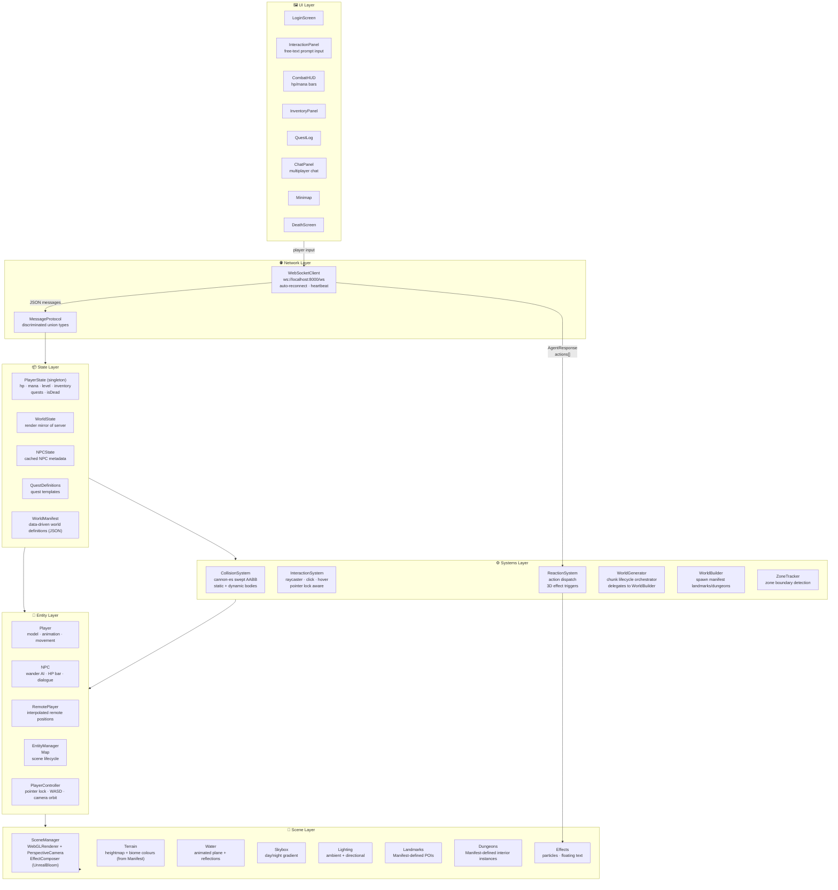
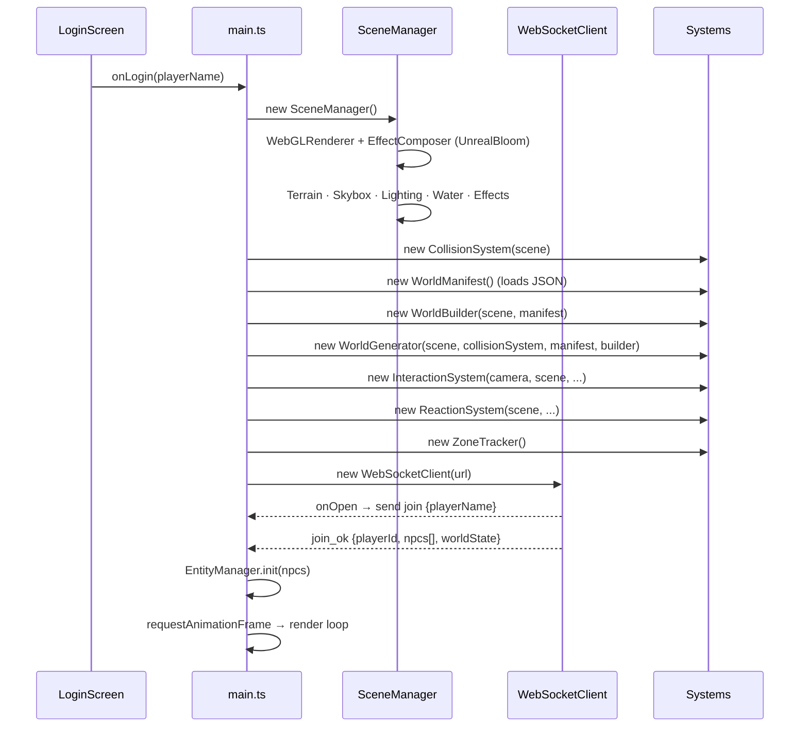
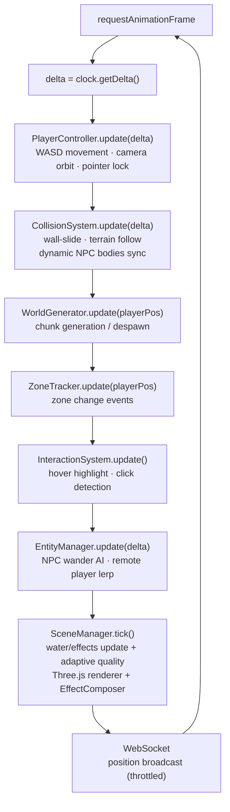
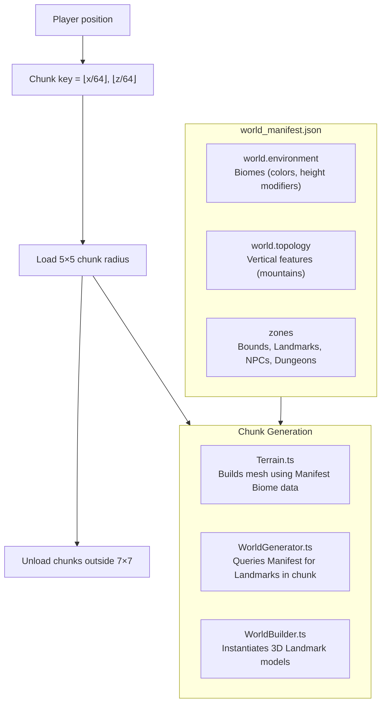
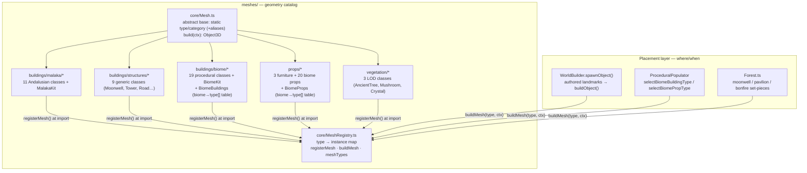
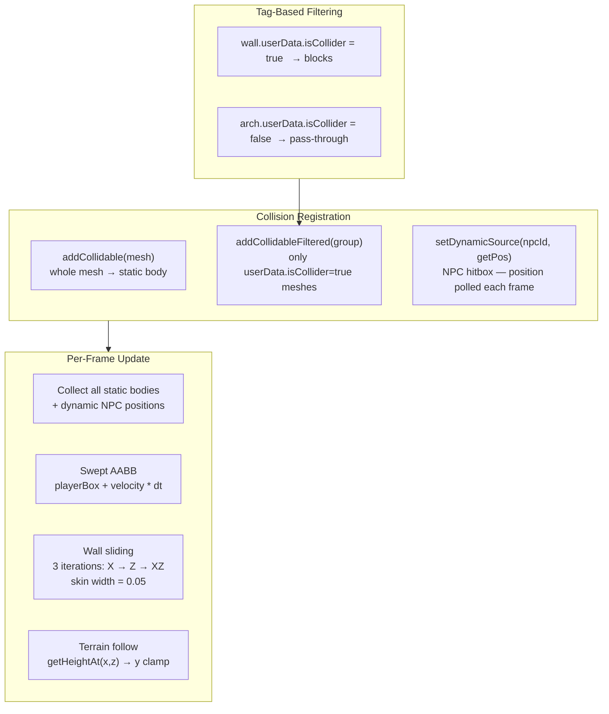
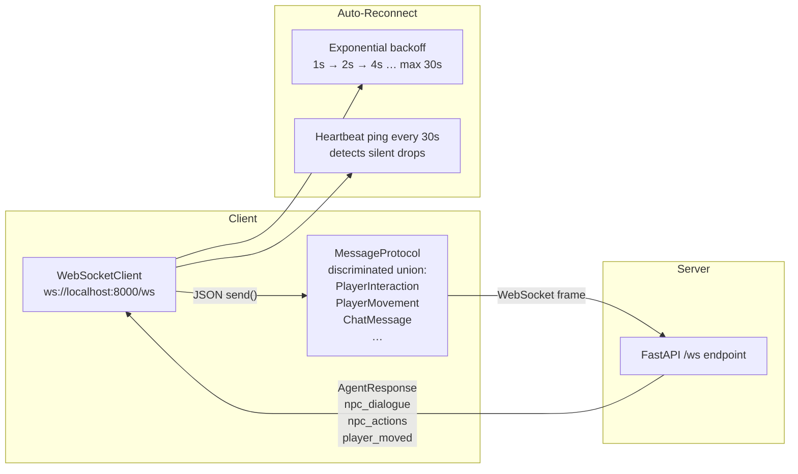
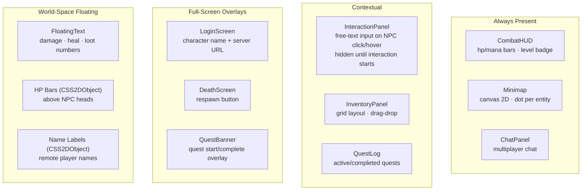
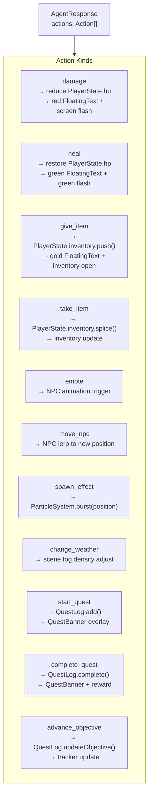

# Client Architecture — World of Promptcraft

Three.js + TypeScript frontend. No buttons — the text prompt is the entire game interface. The client is a **render mirror**: all authoritative game state lives on the server; the client reflects it visually and ships player input over WebSocket. The world itself is defined by a **Zonal Hybrid Manifest** (`shared/data/world_manifest.json`).

---

## Layer Overview

---

## Bootstrap Flow

---

## Render Loop

---

## Data-Driven World (Version 2.1.0 Manifest System)

The game uses a **Zonal Hybrid Manifest** (`shared/data/world_manifest.json`) instead of purely procedural generation. This ensures consistency between client visuals and server authority.

---

## Mesh Catalog & Registry (`client/src/meshes/`)

Every placeable object — buildings, props, and vegetation — is a **class in its own
file** under `client/src/meshes/`, registered in a central catalog. Geometry ("what it
looks like") is fully separated from placement ("where/when it appears"). There are
**no `switch` statements** mapping a type string to a builder — the registry does that
lookup, and `buildObject()` is a thin wrapper over it (unknown types render a marker).

**Key points**
- **One mesh = one class = one file.** Each `extends Mesh`, declares `static readonly type`
  / `static readonly category` (`building` | `prop` | `vegetation`), implements
  `build(ctx: BuildContext): THREE.Object3D`, and calls `registerMesh(...)` at the bottom of its file.
- **Self-registration.** `meshes/index.ts` side-effect-imports `buildings/`, `props/`, and
  `vegetation/`, which import every class file. Importing the catalog registers everything; nothing
  else needs editing.
- **Aliases.** A class may expose `static readonly aliases` to answer to legacy/synonym type
  strings (e.g. `AncientTree` also serves `tree` / `pine` / `ancient_tree_cluster`).
- **`build()` is pure geometry.** No scene insertion, collision registration, or persistence —
  those stay in the placement layer (`WorldBuilder` / `WorldGenerator` / `ProceduralPopulator`).
- **Procedural selection is a data table.** `BiomeBuildings.ts` / `BiomeProps.ts` map each biome to
  its building/prop `type[]`; `selectBiomeBuildingType()` / `selectBiomePropType()` pick one with the
  seeded RNG (preserving deterministic layouts), then `buildMesh()` constructs it.
- **Shared kits.** `MalakaKit` (Andalusian material cache + architectural helpers) and `BiomeKit`
  (`m`/`solid`/`deco` helpers + material cache) are imported by the classes so textures and materials
  are created once and reused. Biome props reuse `BiomeKit` too.

> **Scope:** buildings, props, and vegetation are migrated. The remaining geometry outside the
> catalog is **encounter set-pieces** (`worldbuilder/objects/encounterBuilders.ts` — multi-object
> compositions placed by the encounter system, a different layer) and **NPC body meshes**
> (`entities/`). Both can adopt the same `Mesh` base + registry in a later pass.

---

## Collision System

The game uses **cannon-es swept AABB** with tag-based geometry filtering so decorative mesh parts (canopies, arches) don't block movement.

---

## Network Layer

---

## UI Layer

---

## ReactionSystem — Action Dispatch

When the server returns `agent_response.actions[]`, `ReactionSystem` translates each `kind` into a 3D effect:

