# Client Architecture — World of Promptcraft

Three.js + TypeScript frontend. No buttons — the text prompt is the entire game interface. The client is a **render mirror**: all authoritative game state lives on the server; the client reflects it visually and ships player input over WebSocket.

---

## Layer Overview

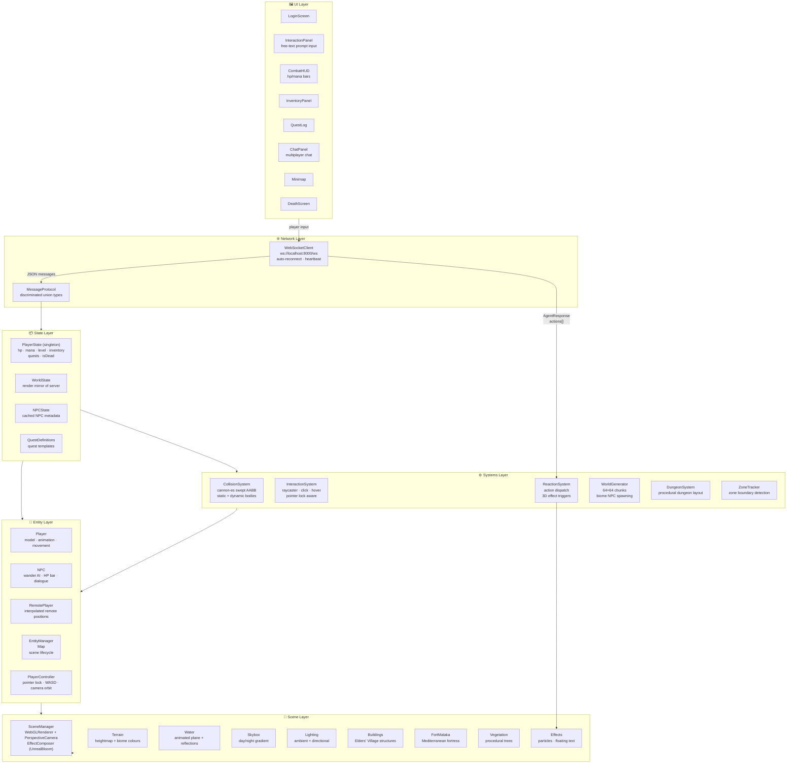

---

## Bootstrap Flow

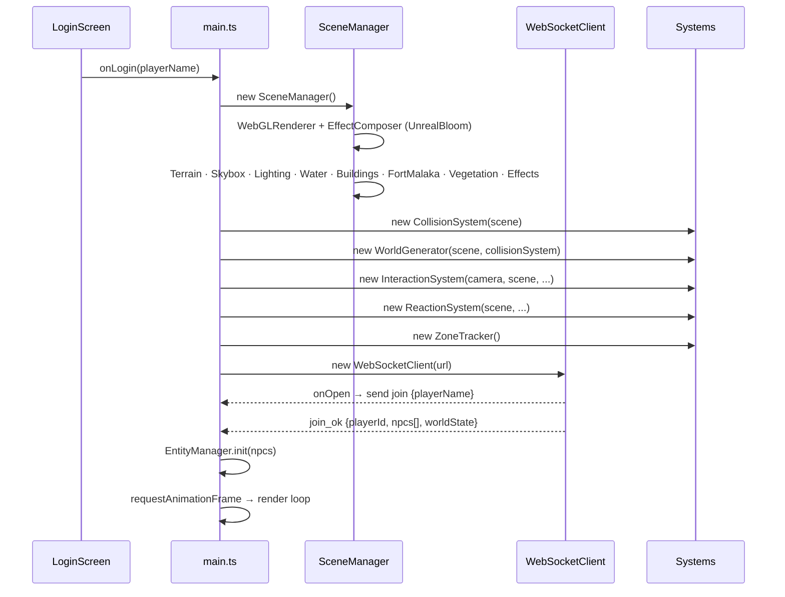

---

## Render Loop

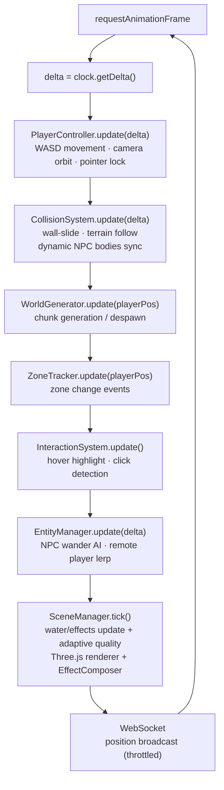

---

## Scene Layer

```mermaid
flowchart LR
    subgraph SceneManager["SceneManager"]
        R["WebGLRenderer\nshadows ON · ACES tonemapping\nadaptive pixel ratio (0.9..1.5)"]
        C["PerspectiveCamera\nfov 60 · near 0.1 · far 1600"]
        EC["EffectComposer\nRenderPass + UnrealBloomPass\nhalf-resolution bloom"]
    end

    subgraph Subscenes["Scene Objects"]
        TR["Terrain\nchunked procedural mesh (64×64)\nheightmap noise · biome vertex colours"]
        WA["Water (ThreeWater)\nplanar reflections · animated normal map\ny=−1 · clipBias 0.003"]
        SB["Skybox\nLargeBoxGeometry · gradient\nclouds procedural"]
        LT["Lighting\nDirectionalLight 1.2\nAmbientLight 0.4\nHemisphereLight"]
        BL["Buildings\nElders' Village huts · well · shrine"]
        FM["FortMalaka\ntowers · walls · gateway · torches"]
        VG["Vegetation\nprocedural trees + instancing\ncollision tags + distance shadow tags"]
        EF["Effects\nParticleSystem · FloatingText"]
    end

    SceneManager --> Subscenes
```

---

## Entity System

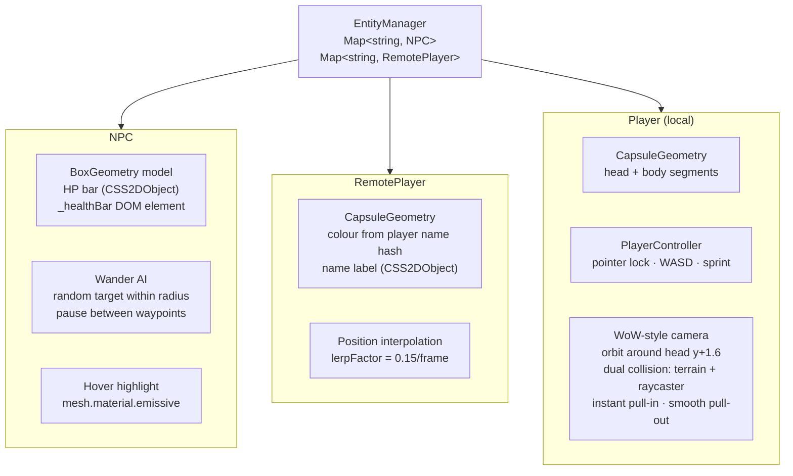

---

## Collision System

The game uses **cannon-es swept AABB** with tag-based geometry filtering so decorative mesh parts (canopies, arches) don't block movement.

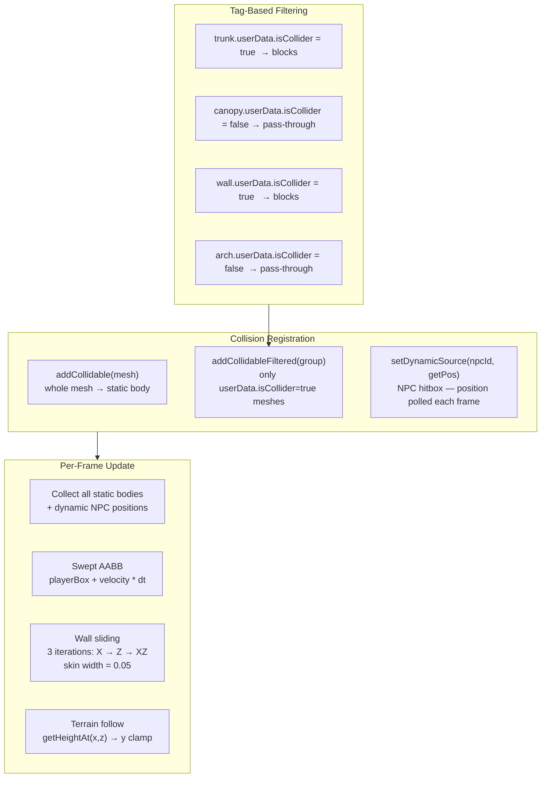

**What has collision:**

| Category | Method | Blocks |
|----------|--------|--------|
| Buildings / Fort walls | `addCollidablesFiltered()` | Pillars, walls, tower bodies |
| Trees (procedural) | `addCollidableFiltered()` | Trunk meshes only |
| Massive trees | `addCollidablesFiltered()` | Trunk + root base |
| Towns (procedural) | `addCollidableFiltered()` | Hut walls, well base |
| Caves | `addCollidable()` | Whole entrance |
| NPCs | `setDynamicSource()` | Body hitbox (synced each frame) |
| Terrain | `getHeightAt()` | Heightmap ground follow |

---

## Procedural World

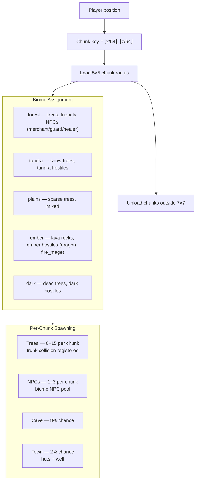

---

## Network Layer

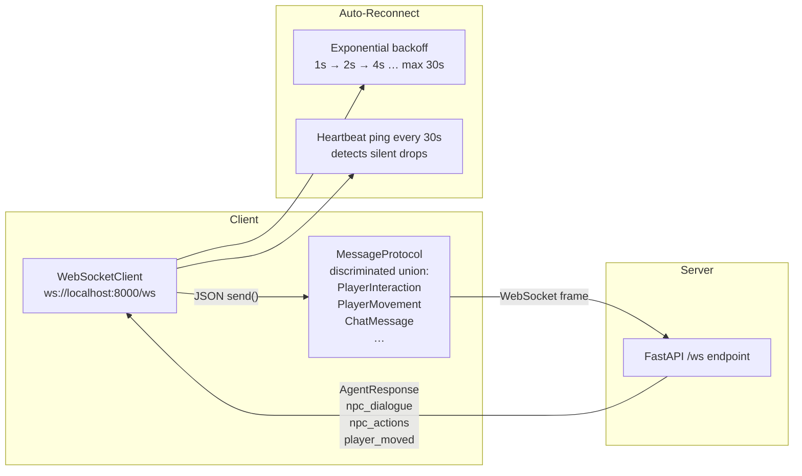

**Outbound message types (client → server):**

| Type | Payload | When |
|------|---------|------|
| `join` | `{playerName}` | On connect |
| `player_interaction` | `{npcId, prompt, playerState}` | NPC text submit |
| `player_movement` | `{position, rotation}` | Every 100 ms |
| `chat_message` | `{message}` | Chat panel submit |
| `player_attack` | `{npcId, damage}` | Direct attack action |

**Inbound message types (server → client):**

| Type | Effect |
|------|--------|
| `join_ok` | Initialises world, spawns NPCs |
| `agent_response` | Shows NPC dialogue, triggers 3D actions |
| `npc_dialogue` | Nearby broadcast — shows chat bubble |
| `npc_actions` | Nearby broadcast — triggers effects |
| `player_moved` | Interpolates remote player position |
| `chat_broadcast` | Shows message in chat panel |
| `world_event` | Zone change, weather update |

---

## UI Layer

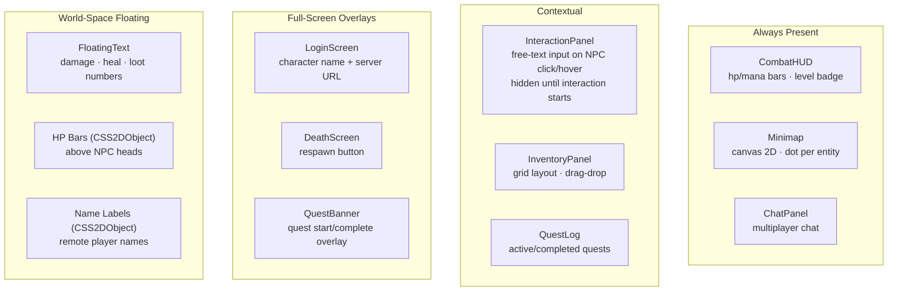

---

## State Management

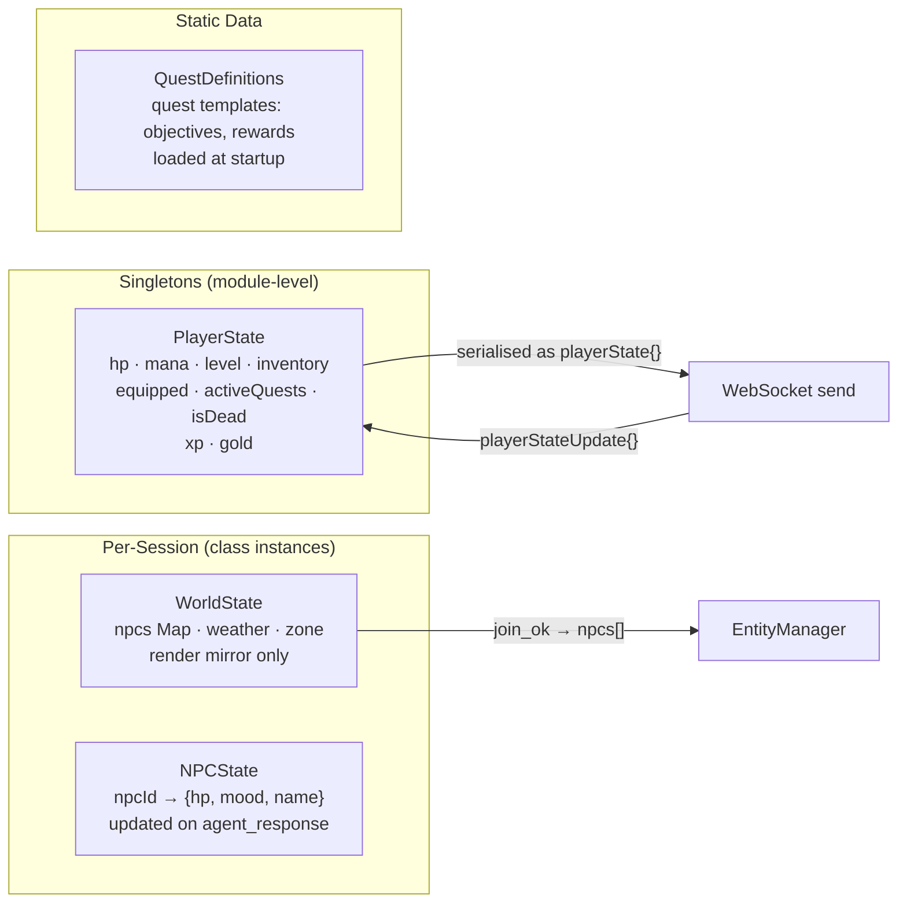

---

## ReactionSystem — Action Dispatch

When the server returns `agent_response.actions[]`, `ReactionSystem` translates each `kind` into a 3D effect:

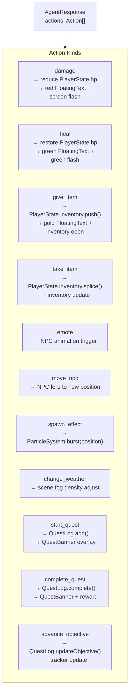
