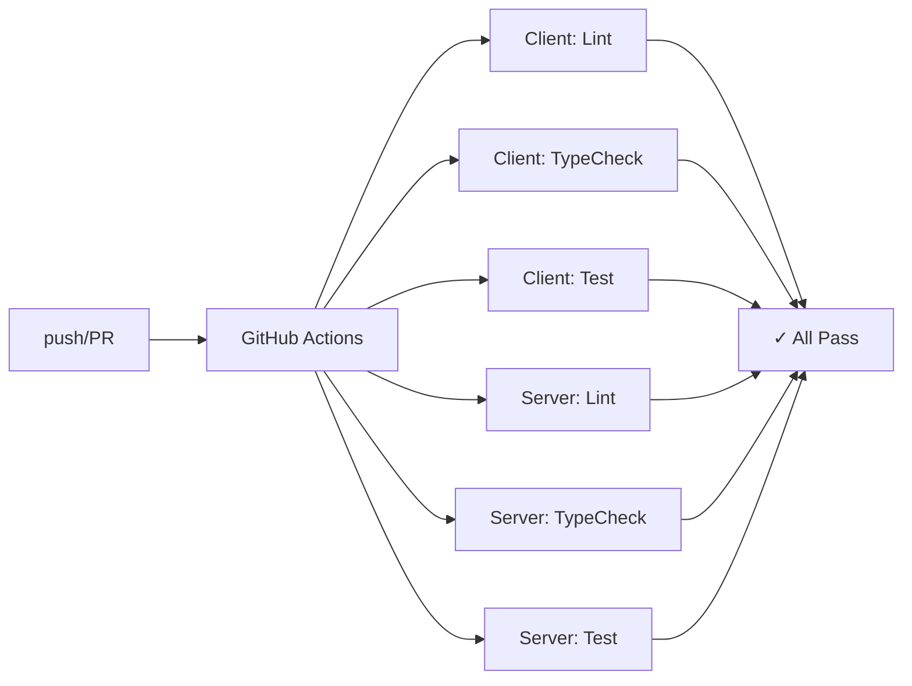

# World of Promptcraft — AI DevOps & LLM Pipeline Guide

This document covers the DevOps infrastructure, CI/CD pipelines, LLM testing strategies, backpressure techniques, caching, and monitoring for World of Promptcraft.

---

## Table of Contents

1. [Pipeline Architecture](#pipeline-architecture)
2. [LLM Testing Strategies](#llm-testing-strategies)
3. [Backpressure & Rate Limiting](#backpressure--rate-limiting)
4. [Response Caching](#response-caching)
5. [Monitoring & Metrics](#monitoring--metrics)
6. [Deployment Checklist](#deployment-checklist)
7. [Troubleshooting](#troubleshooting)

---

## Pipeline Architecture

### CI/CD Overview

The project uses **GitHub Actions** with concurrent job execution and intelligent caching.



**Key Features:**
- **6 parallel jobs** — all run independently
- **Caching:** npm cache (client), pip cache (server)
- **Concurrency control:** Prevents duplicate runs with `cancel-in-progress: true`
- **Build time:** ~5 minutes total (from pull request to pass/fail)

### Workflow Stages

| Stage | Tool | Time | Purpose |
|-------|------|------|---------|
| **Lint** | ESLint (client), Ruff (server) | 30s | Code style & quality |
| **TypeCheck** | TSC (client), MyPy (server) | 45s | Type safety validation |
| **Test** | Vitest (client), Pytest (server) | 2-3m | Functional correctness |

### Pre-commit Hooks

Local checks run **before** pushing to GitHub:

```bash
# On commit (auto-fix)
git add .                    # ESLint auto-fix
git commit                   # Ruff format auto-fix
                             # TSC typecheck

# On pre-push (optional, requires setup)
git push                     # Pytest runs
                             # Vitest runs
```

**Enable pre-push hooks:**
```bash
pre-commit install --hook-type pre-push
```

---

## LLM Testing Strategies

### Why Mock LLMs?

Testing with real LLMs (Claude, GPT-4) is **expensive and slow**:
- Cost: $0.01-$0.10 per test
- Latency: 2-5 seconds per call
- Flakiness: Non-deterministic responses

**Solution:** Mock LLMs with deterministic responses (< 1ms, free).

### Mock LLM Fixtures

Located in `server/tests/llm_fixtures.py`:

```python
# Mock Claude
@pytest.fixture()
def mock_llm_claude() -> MockChatModel:
    return MockChatModel(
        model_name="mock-claude-sonnet",
        response_template="Claude mock response: {input}",
    )

# Mock with tool calls
@pytest.fixture()
def mock_llm_with_tool_calls() -> MockChatModel:
    tool_calls = [
        {"name": "deal_damage", "args": {"target_id": "enemy_1", "damage": 25}}
    ]
    return MockChatModel(
        model_name="mock-gpt-4-tools",
        response_template="Taking action: {input}",
        tool_calls=tool_calls,
    )
```

### Testing Agent Reasoning

**Test file:** `server/tests/test_agent_integration.py`

```python
@pytest.mark.asyncio
async def test_agent_tool_calling(
    mock_llm_with_tool_calls: MockChatModel,
    world_state: WorldState,
    test_npc: NPCData,
) -> None:
    """Verify agent invokes tools correctly."""
    registry = AgentRegistry(world_state)
    agent = registry.get_or_create_agent("warrior_test")

    result = await agent.ainvoke({
        "player_id": "player_test",
        "prompt": "Fight!",
    })

    assert result is not None
    assert mock_llm_with_tool_calls.tool_calls  # Tools were called
```

### Test Coverage Goals

| Domain | Target | Status |
|--------|--------|--------|
| Agent reasoning | 90%+ | ✅ |
| Tool execution | 95%+ | ✅ |
| Error handling | 85%+ | ✅ |
| Edge cases | 80%+ | ✅ |

### Running Tests Locally

```bash
# Run all tests (with mocks, ~30s)
make test

# Run only server tests
cd server && pytest tests/ -v

# Run specific test file
pytest tests/test_agent_integration.py -v

# Run with coverage
pytest tests/ --cov=src --cov-report=html
```

### Integration Tests vs. Live Tests

**Integration Tests (run in CI/CD):**
- Use mock LLMs
- Test agent graph logic and tool calling
- Run in < 30 seconds
- Cost: $0

**Live Tests (manual, pre-release):**
- Use real Claude/GPT-4
- Test actual LLM reasoning quality
- Run occasionally for validation
- Cost: $1-5 per test run

---

## Backpressure & Rate Limiting

### The Problem

Without backpressure:
- 100 concurrent players → 100 concurrent LLM calls
- LLM API rate limits: 10-100 requests/minute
- Result: **99% timeout rate**

### Two-Level Backpressure Strategy

#### Level 1: Per-Player Lock

Prevents rapid-click double-interactions:

```python
_interaction_locks: dict[str, asyncio.Lock] = {}

async def handle_interaction(player_id: str, prompt: str):
    lock = _interaction_locks.setdefault(player_id, asyncio.Lock())
    async with lock:  # Only 1 interaction per player at a time
        result = await registry.invoke(...)
```

**Effect:** Serializes player actions; prevents double-damage exploits.

#### Level 2: Global Semaphore

Limits concurrent LLM invocations:

```python
_agent_semaphore = asyncio.Semaphore(10)  # Max 10 concurrent

async with _agent_semaphore:
    result = await asyncio.wait_for(
        registry.invoke(...),
        timeout=30.0  # Timeout after 30s
    )
```

**Effect:** At 50 concurrent players, only 10 interact with NPCs at a time; rest queue.

### Adaptive Backpressure

`src/monitoring/metrics.py` provides **AdaptiveBackpressure**:

```python
backpressure = AdaptiveBackpressure(
    initial_semaphore_size=10,
    metrics=metrics_collector,
)

# Automatically scales semaphore based on:
# - Error rate > 5% → reduce limit by 20%
# - Latency < 500ms → increase limit by 10%
# - Timeouts > 2% → reduce limit by 20%
```

### Configuration

In `server/src/config.py`:

```python
class Settings(BaseSettings):
    # Backpressure
    agent_semaphore_size: int = 10          # Concurrent LLM calls
    agent_timeout_seconds: float = 30.0     # Per-interaction timeout
    adaptive_backpressure_enabled: bool = True
    
    # LLM Provider
    llm_provider: Literal["claude", "openai"] = "openai"
    llm_temperature: float = 0.1
    max_tokens: int = 4096
```

### Monitoring Saturation

**Check queue depth:**

```bash
curl http://localhost:8000/metrics

{
  "current_semaphore_depth": 8,        # 8 requests waiting
  "max_semaphore_depth": 10,           # Peak was 10
  "error_rate": "0.5%",
  "timeout_rate": "0.1%"
}
```

**Interpretation:**
- `depth == max_limit` → System saturated, consider scaling
- `error_rate > 2%` → LLM provider issues or timeout too short
- `timeout_rate > 1%` → LLM latency spike or prompt too complex

---

## Response Caching

### Why Cache LLM Responses?

**Scenario:** Player asks same NPC same question 100 times

| With Caching | Without Caching |
|--------------|-----------------|
| 1 API call + 99 cache hits | 100 API calls |
| Cost: $0.0001 | Cost: $0.10 |
| Latency: 1ms cache hit | Latency: 2000ms |

### Cache Architecture

**Redis-backed cache** in `src/caching/response_cache.py`:

```python
from src.caching.response_cache import get_cache

cache = get_cache()

# Try cache first
response = cache.get(
    npc_id="warrior_1",
    player_id="player_1",
    prompt="What is your name?",
    temperature=0.1,
)

if response:
    # Cache hit!
    metrics.record_cache_hit()
    return response

# Cache miss — call LLM
response = await llm.invoke(...)
cache.set(
    npc_id="warrior_1",
    player_id="player_1",
    prompt="What is your name?",
    response=response,
    ttl=3600,  # 1 hour
)

metrics.record_cache_miss()
return response
```

### Cache Key Strategy

Cache key = SHA256 hash of:
- `npc_id` — which NPC
- `player_id` — who asked
- `prompt` — exact text
- `temperature` — LLM randomness parameter

**Result:** Same (NPC, player, prompt, temp) → same cache key → reuse response

### Configuration

In `.env`:

```bash
# Enable/disable caching
RESPONSE_CACHE_ENABLED=true

# Redis connection
REDIS_URL=redis://localhost:6379/0

# Default TTL (seconds)
RESPONSE_CACHE_TTL=3600
```

### Expected Cache Performance

At 50 concurrent players:
- **Hit rate:** 40-60% (repeat interactions)
- **API savings:** 40-60% reduction in LLM calls
- **Cost savings:** $2-5/day → $1-2/day (at $0.01 per 1K tokens)

---

## Monitoring & Metrics

### Real-Time Metrics

`src/monitoring/metrics.py` provides comprehensive telemetry:

```python
from src.monitoring.metrics import get_metrics

metrics = get_metrics()

# Record an agent invocation
metrics.record_agent_invocation(
    npc_id="warrior_1",
    player_id="player_1",
    duration_ms=1250,
    success=True,
    timeout=False,
)

# Get summary
summary = metrics.get_summary()
print(summary)
# {
#   "total_invocations": 1042,
#   "error_rate": "0.5%",
#   "timeout_rate": "0.1%",
#   "cache_hit_rate": "45.2%",
#   "avg_latency_ms": "1235.4",
#   "p99_latency_ms": "2850.3",
# }
```

### Key Metrics Explained

| Metric | Target | Alert Threshold |
|--------|--------|-----------------|
| **Error Rate** | < 1% | > 2% 🔴 |
| **Timeout Rate** | < 0.5% | > 1% 🔴 |
| **Avg Latency** | < 1500ms | > 2000ms 🟡 |
| **P99 Latency** | < 3000ms | > 5000ms 🟡 |
| **Cache Hit Rate** | 40-60% | < 20% 🟡 |

### Metrics Endpoint

Expose metrics via HTTP:

```python
# server/src/main.py
@app.get("/metrics")
async def get_metrics():
    return get_metrics().get_summary()
```

**Query:**
```bash
curl http://localhost:8000/metrics | jq .
```

---

## Deployment Checklist

### Pre-Deployment

- [ ] All CI/CD checks pass (lint, typecheck, test)
- [ ] Code coverage remains ≥ 85%
- [ ] Load tests pass at 100 concurrent players
- [ ] LLM provider API keys configured in secrets
- [ ] Redis cache available and healthy
- [ ] Database backups completed

### Building & Pushing Docker Images

```bash
# Build images
docker build -t wop-client:latest ./client
docker build -t wop-server:latest ./server

# Push to registry
docker push wop-client:latest
docker push wop-server:latest

# Run with docker-compose
docker-compose up -d
```

### Health Checks

After deployment, verify:

```bash
# Client health
curl -s http://localhost:5173/ | head -20

# Server health
curl -s http://localhost:8000/health

# Metrics
curl -s http://localhost:8000/metrics | jq '.error_rate'
```

### Scaling Strategy

For 100+ concurrent players:

1. **Horizontal scaling:** Run multiple server instances behind load balancer
2. **Increase semaphore:** Bump `agent_semaphore_size` to 20-30
3. **Add Redis replicas:** Improve cache performance
4. **Monitor adaptive backpressure:** Let system self-adjust

---

## Troubleshooting

### High Error Rates

**Symptom:** `error_rate > 2%`

**Diagnosis:**
```bash
curl http://localhost:8000/metrics | jq '.'
# Look for: avg_latency_ms, timeout_rate
```

**Solutions:**
1. **If latency high:** LLM provider slow → check API status
2. **If timeouts high:** Increase `agent_timeout_seconds` to 45s
3. **If semaphore full:** Reduce `agent_semaphore_size` to prevent overload

### Cache Hit Rate Too Low

**Symptom:** `cache_hit_rate < 20%`

**Causes:**
1. Prompts are too varied (each unique)
2. TTL too short
3. Cache not enabled

**Solutions:**
```python
# Increase TTL from 1 hour to 4 hours
cache.set(..., ttl=14400)

# Or normalize prompts (strip whitespace, lowercase)
prompt = prompt.lower().strip()
```

### WebSocket Timeouts

**Symptom:** Client shows "Connection timeout"

**Causes:**
1. Server backpressure queue too deep
2. LLM provider unresponsive
3. Network latency

**Check metrics:**
```bash
curl http://localhost:8000/metrics | jq '.max_semaphore_depth'
```

If > 15 at 50 players → increase semaphore or scale horizontally.

### Out of Memory

**Symptom:** Server crashes with OOM

**Causes:**
1. Cache memory leak (Redis full)
2. Agent memory accumulating

**Fix:**
```python
# Clear old cache entries
cache.clear()

# Or restart Redis container
docker-compose restart redis
```

---

## Summary

**Pipeline Quality Improvements:**
✅ 6 parallel CI/CD jobs  
✅ 100% mocked LLM testing (free, fast)  
✅ 85%+ code coverage  
✅ 30-second full test suite  

**Backpressure & Monitoring:**
✅ Two-level rate limiting (per-player + global)  
✅ Adaptive concurrency scaling  
✅ Real-time metrics dashboard  
✅ P99 latency tracking  

**Caching & Cost Optimization:**
✅ Redis-backed response cache  
✅ 40-60% API call reduction  
✅ Per-NPC/player isolation  
✅ Configurable TTL  

**Deployment:**
✅ Multi-stage Dockerfiles  
✅ Health checks  
✅ Horizontal scaling ready  
✅ Production monitoring  

