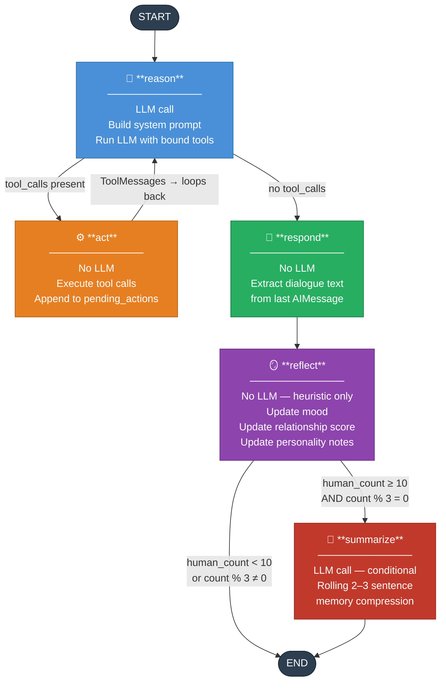
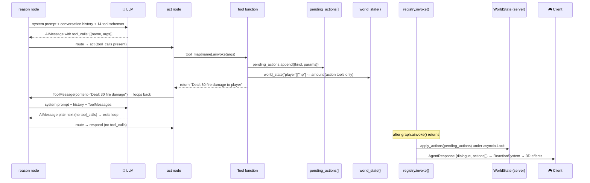
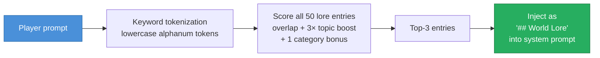
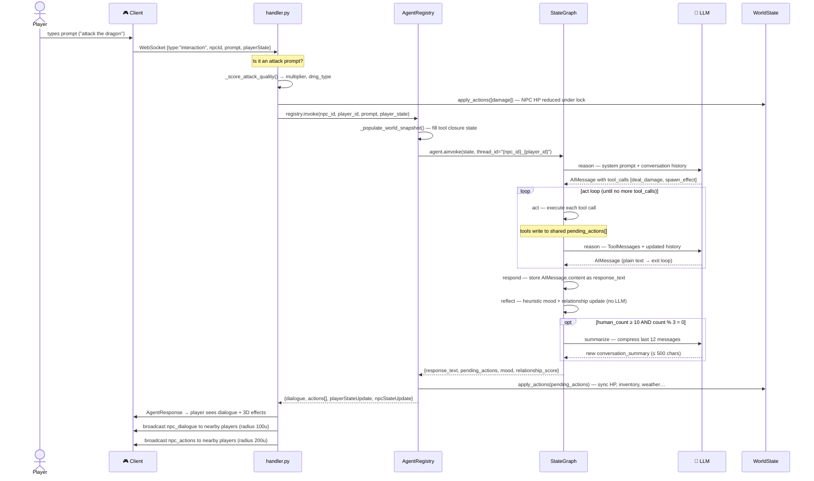
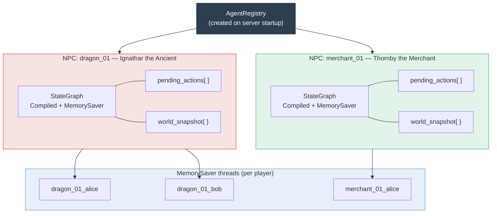

# World of Promptcraft — Agentic Workflow

This document describes the LangGraph-powered NPC agent system: how player prompts flow through the graph, how agents reason and act, and how memory, mood, and relationship state persist across sessions.

---

## Overview

Each NPC runs an independent LangGraph `StateGraph`. When a player sends a text prompt, the server invokes that NPC's compiled graph with the player's message and world context. The graph reasons about the situation, optionally calls tools to take game actions, produces a dialogue response, then updates its internal memory state — all before returning to the client.



---

## Agent State (`NPCAgentState`)

All data flowing through the graph lives in a single `TypedDict`:

| Field | Type | Scope | Description |
|-------|------|-------|-------------|
| `messages` | `list` (accumulated) | Conversation | Full conversation history — `HumanMessage`, `AIMessage`, `ToolMessage` |
| `npc_id` | `str` | Static | NPC identifier |
| `npc_name` | `str` | Static | Display name injected into system prompt |
| `npc_personality` | `str` | Static | Full personality system prompt for this archetype |
| `player_state` | `dict[str, Any]` | Per-call | HP, mana, inventory, level — sent by client each interaction |
| `world_context` | `dict[str, Any]` | Per-call | Zone, weather, nearby entities, recent events, recent chat |
| `pending_actions` | `list[dict[str, Any]]` | Accumulated | Game actions queued by tool calls during this invocation |
| `response_text` | `str` | Output | Final dialogue string extracted by `respond` |
| `conversation_summary` | `str` | Persistent | Rolling LLM-generated summary of past conversations |
| `mood` | `str` | Persistent | Current emotional state: `neutral` / `happy` / `angry` / `sad` / `fearful` |
| `relationship_score` | `int` | Persistent | -100 (enemy) to +100 (trusted ally) |
| `personality_notes` | `str` | Persistent | NPC-specific observations about this player (max 300 chars) |

`MemorySaver` checkpoints state per `thread_id = "{npc_id}_{player_id}"`. Persistent fields survive across invocations.

---

## Nodes

### `reason` — LLM Reasoning

**File:** `server/src/agents/nodes/reason.py`  
**LLM call:** Yes

Builds the system prompt by combining:
- NPC personality (from `templates.py`)
- World context: zone, weather, nearby entities, recent events, recent chat
- Player state: HP, mana, level, inventory
- Persistent memory: conversation summary, mood, relationship tier, personality notes
- RAG lore: top-3 keyword-matched lore entries from `knowledge_base.py` injected when relevant

Then invokes `llm_with_tools` (LLM bound to all 14 tools). If the LLM decides to call tools, it returns an `AIMessage` with `tool_calls`; otherwise it returns a plain text `AIMessage`.

**Routing:** `_should_act_or_respond` reads `tool_calls` on the last message:
- `tool_calls` present → route to `act`
- empty → route to `respond`

### `act` — Tool Execution

**File:** `server/src/agents/nodes/act.py`  
**LLM call:** No

Executes each tool call from the LLM's last message in sequence. Tools write to a shared `pending_actions` list (closure pattern — see Tool System below). After execution:
- Appends new actions to `state["pending_actions"]`
- Returns `ToolMessage` results so the LLM can see outcomes
- Loops back to `reason` (multi-step reasoning allowed)

### `respond` — Dialogue Extraction

**File:** `server/src/agents/nodes/respond.py`  
**LLM call:** No

Reads `content` from the last `AIMessage` and stores it as `response_text`. This is the dialogue string returned to the client. Also carries forward `pending_actions` unchanged.

### `reflect` — Heuristic State Update

**File:** `server/src/agents/nodes/reflect.py`  
**LLM call:** No (zero-cost heuristic)

Analyzes recent human messages using keyword token sets to update:
- **Mood**: hostile/insult words → `angry`; fear words → `fearful`; sad words → `sad`; friendly/happy words → `happy`; otherwise decays toward `neutral`
- **Relationship score**: combat actions, item gifts, quests, hostile/friendly word frequency each contribute delta, clamped to [-20, +15] per exchange, accumulated in [-100, +100]
- **Personality notes**: accumulates NPC observations about the player (e.g., "has been aggressive", "is a quester") capped at 300 chars

Relationship tiers shown in system prompt:

| Score | Tier | Behavior |
|-------|------|----------|
| ≤ -50 | ENEMY | Hostile, guarded |
| -10 to -50 | DISTRUSTFUL | Wary, curt |
| -10 to +10 | STRANGER | Polite, reserved |
| +10 to +50 | FRIEND | Warm, helpful |
| > +50 | TRUSTED ALLY | Shares secrets, offers rare quests |

### `summarize` — Memory Compression

**File:** `server/src/agents/nodes/summarize.py`  
**LLM call:** Yes (conditional)

Fires when `human_count >= 10 AND human_count % 3 == 0` to keep memory bounded. Uses the LLM to produce a 2-3 sentence rolling summary of the last 12 messages, prepended with the previous summary. Output capped at 500 chars to avoid prompt bloat.

This is the **only second LLM call** in the pipeline and fires roughly every 3 turns after the first 10 — keeping cost predictable.

---

## Tool System

**File:** `server/src/agents/tools/`

Tools use a **closure pattern**: `get_all_tools(pending_actions, world_state)` returns `@tool`-decorated functions that share a mutable `pending_actions` list. When the LLM calls a tool, it appends an action dict to this list and optionally reads/mutates the `world_state` snapshot.

### Tool Categories

| Category | File | Tools |
|----------|------|-------|
| Combat | `combat.py` | `deal_damage`, `defend`, `flee`, `heal_target` |
| Dialogue | `dialogue.py` | `emote`, `give_quest`, `complete_quest` |
| Trade | `trade.py` | `offer_item`, `take_item` |
| Environment | `environment.py` | `change_weather`, `spawn_effect`, `move_npc` |
| World Query | `world_query.py` | `get_nearby_entities`, `check_player_state` |
| Quest | `quest.py` | `start_quest`, `advance_quest_objective`, `check_player_quests` |

### Action Flow

```mermaid
flowchart LR
    LLM["🤖 LLM"]

    subgraph closure["Tool Closure — per NPC at startup"]
        direction TB
        combat["**combat**\ndeal_damage · heal_target\ndefend · flee"]
        dialogue["**dialogue**\nemote · give_quest\ncomplete_quest"]
        trade["**trade**\noffer_item · take_item"]
        env["**environment**\nchange_weather\nspawn_effect · move_npc"]
        query["**world_query**\nget_nearby_entities\ncheck_player_state"]
        quest["**quest**\nstart_quest\nadvance_objective\ncheck_player_quests"]
    end

    pending["pending_actions[ ]"]
    worldstate["WorldState\n(server-authoritative)"]
    client["🎮 Client\nReactionSystem → 3D effects"]

    LLM -->|tool_calls| closure
    closure -->|append action dict| pending
    closure -->|read / write snapshot| worldstate
    pending -->|apply_actions after graph| worldstate
    pending -->|actions in AgentResponse| client

    style LLM fill:#4a90d9,color:#fff,stroke:#2c6fad
    style pending fill:#e67e22,color:#fff,stroke:#b55c0e
    style worldstate fill:#27ae60,color:#fff,stroke:#1a7a42
    style client fill:#8e44ad,color:#fff,stroke:#6a2f82
```



### Action Kinds

| Kind | Server Effect | Client Effect |
|------|---------------|---------------|
| `damage` | Reduces player HP in `WorldState` | Red floating text, screen flash |
| `heal` | Restores player HP | Green floating text, green flash |
| `give_item` | Adds item to player inventory | Gold floating text, inventory update |
| `take_item` | Removes item from player inventory | Inventory update |
| `emote` | (none) | NPC plays animation |
| `move_npc` | (none, NPC moves client-side) | NPC lerps to new position |
| `spawn_effect` | (none) | Particle burst at position |
| `change_weather` | Updates world weather | Scene fog adjustment |
| `start_quest` | (quest tracking via client state) | Quest banner overlay |
| `complete_quest` | (quest tracking via client state) | Quest banner + reward |
| `advance_objective` | (quest tracking via client state) | Quest tracker update |

### How a Tool Call Works End-to-End

When the LLM inside `reason` decides to call a tool, here is exactly what happens — step by step:



A few things worth noting:

- The LLM never touches `pending_actions` directly — it only sees the tool's **return string** as a `ToolMessage`. The side effects (HP changes, action queuing) happen inside the tool function, invisible to the LLM.
- The `act → reason` loop can repeat multiple times in a single player turn. The LLM can call `check_player_state()`, read the result, then decide to call `deal_damage()` based on what it sees.
- `pending_actions` is only applied to the authoritative `WorldState` **after the entire graph finishes**, not mid-turn. This keeps the server state consistent.
- Query tools (`get_nearby_entities`, `check_player_state`, `check_player_quests`) return strings into the LLM's context but append nothing to `pending_actions` — they have zero side effects.

---

### Concrete Example — Ignathar attacks and rages

Player says: *"I challenge you, wyrm!"*

```
reason:
  system prompt includes: "On EVERY combat interaction, MUST call deal_damage (20–50 fire)
                           AND spawn_effect('fire'). Below 250 HP: deal 40–50 instead."
  LLM sees Ignathar HP = 180 (below 250 threshold)
  → AIMessage with tool_calls:
      [deal_damage(target="player", amount=45, damage_type="fire"),
       spawn_effect(effect_type="fire"),
       change_weather(weather="storm")]

act (round 1):
  deal_damage → pending_actions = [{kind:"damage", params:{target:"player", amount:45, damageType:"fire"}}]
              → world_state["player"]["hp"] = 100 - 45 = 55
  spawn_effect → pending_actions += [{kind:"spawn_effect", params:{effectType:"fire"}}]
  change_weather → pending_actions += [{kind:"change_weather", params:{weather:"storm"}}]
  → returns 3 ToolMessages back to reason

reason (round 2):
  LLM sees ToolMessages confirming all 3 tools succeeded
  → AIMessage plain text: "THOU DAREST CHALLENGE ME?! FEEL THE FURY OF A THOUSAND EMBERS, MORTAL!"

respond:
  response_text = "THOU DAREST CHALLENGE ME?! ..."

reflect:
  tokens: {"challenge", "wyrm"} → hostile_count=1, current_mood="angry" → stays "angry"
  relationship delta: damage(player) −5, hostile word −2 → delta = −7
  relationship_score = −12 → tier: DISTRUSTFUL

registry.invoke() returns:
  dialogue: "THOU DAREST CHALLENGE ME?! ..."
  actions:  [damage(45 fire), spawn_effect(fire), change_weather(storm)]

client:
  player HP bar drops to 55
  red "45 🔥" floats above player head
  fire particles burst at Ignathar
  scene fog darkens to storm
```

---

### Per-Tool Reference

All 14 tools are registered via `get_all_tools()` and bound to the LLM with `llm.bind_tools(tools)` inside `reason`. The LLM sees each tool's name, docstring, and typed argument schema — that is the only contract between the prompt and the tool implementation.

Tools split into two kinds:

- **Action tools** — append a dict to `pending_actions[]` and optionally mutate `world_state`. The action is sent to the client after the graph finishes.
- **Query tools** — read from `world_state` and return a string back into the LLM's context. No side effects, nothing sent to the client.

---

#### Combat — `server/src/agents/tools/combat.py`

**`deal_damage(target, amount, damage_type="physical")`** *(action)*
Inflicts HP damage. Appends `{"kind": "damage", "params": {target, amount, damageType}}` to `pending_actions`. If `target == "player"`, immediately decrements `world_state["player"]["hp"]` in the closure snapshot so subsequent tool calls in the same turn see the updated value.
Valid `damage_type`: `physical` · `fire` · `ice` · `lightning` · `holy` · `dark`

**`defend(stance="block")`** *(action)*
Puts the NPC in a defensive stance. Appends an `emote` action with `animation="defend"`. No HP math — purely narrative + visual.
Valid `stance`: `block` · `parry` · `dodge` · `brace`

**`flee(direction="away")`** *(action)*
Moves the NPC 20 units in the given direction. Appends `{"kind": "move_npc", "params": {direction, distance: 20}}`.
Valid `direction`: `away` · `north` · `south` · `east` · `west`

**`heal_target(target, amount)`** *(action)*
Restores HP. Appends `{"kind": "heal", "params": {target, amount}}`. If `target == "player"`, clamps HP to `max_hp` and updates `world_state["player"]["hp"]`.

---

#### Dialogue — `server/src/agents/tools/dialogue.py`

**`emote(animation)`** *(action)*
Triggers a named animation on the NPC model. Appends `{"kind": "emote", "params": {animation}}`. Invalid names are rejected and returned as an error string to the LLM.
Valid `animation`: `bow` · `laugh` · `wave` · `threaten` · `dance` · `cry` · `cheer`

**`give_quest(quest_name, description)`** *(action)*
Creates a **freeform, LLM-invented quest** with no predefined objectives. Appends `{"kind": "start_quest", "params": {questName, description}}`. Use this for spontaneous NPC-authored quests. For quests with defined objectives and tracked state, use `start_quest` from the quest category instead.

**`complete_quest(quest_id, reward)`** *(action)*
Marks a quest finished and grants the reward. Appends **two** actions in sequence: `{"kind": "complete_quest"}` then `{"kind": "give_item"}`. The item named in `reward` lands in the player's inventory automatically.

---

#### Trade — `server/src/agents/tools/trade.py`

**`offer_item(item_name, price=0)`** *(action)*
Gives an item to the player. Appends `{"kind": "give_item", "params": {item}}` and pushes `item_name` into `world_state["player"]["inventory"]` immediately so later query tools see it. `price=0` means free gift; non-zero is treated as a sale (no gold deduction is enforced server-side — it is narrative only).

**`take_item(item_name)`** *(action)*
Removes an item from the player. Appends `{"kind": "take_item", "params": {item}}` and splices `item_name` out of `world_state["player"]["inventory"]`.

---

#### Environment — `server/src/agents/tools/environment.py`

**`change_weather(weather)`** *(action)*
Broadcasts a weather change to all connected clients. Appends `{"kind": "change_weather", "params": {weather}}`. Invalid values are rejected.
Valid `weather`: `clear` · `rain` · `storm` · `fog` · `snow`

**`spawn_effect(effect_type, duration=3.0)`** *(action)*
Triggers a particle burst at the NPC's world position. Appends `{"kind": "spawn_effect", "params": {effectType}}`. Duration is passed to the LLM for narrative purposes but client-side lifetime is fixed per effect type.
Valid `effect_type`: `explosion` · `fire` · `ice` · `sparkle` · `smoke` · `lightning` · `holy_light`

**`move_npc(destination_x, destination_z)`** *(action)*
Teleports/lerps the NPC to a world coordinate. Appends `{"kind": "move_npc", "params": {position: [x, 0, z]}}`. Y is always 0 (terrain height is resolved client-side).

---

#### World Query — `server/src/agents/tools/world_query.py`

> Query tools are **read-only** — they do not append to `pending_actions` and produce no client-side effects. Their return value goes back into the LLM's message history as a `ToolMessage` so the LLM can reason before calling action tools.

**`get_nearby_entities(radius=50.0)`** *(query)*
Scans `world_state["npcs"]` and the player position. Computes XZ distance from the NPC's own position (`world_state["self_position"]`). Returns a human-readable string listing nearby entities with their HP and distance.

**`check_player_state()`** *(query)*
Returns the player's current HP, full inventory list, and XYZ position from `world_state["player"]`.

---

#### Quest — `server/src/agents/tools/quest.py`

**`start_quest(quest_id)`** *(action)*
Starts a **predefined quest** with structured objectives tracked by the client. Looks up `quest_id` in `QUEST_DEFINITIONS` (`server/src/world/quest_definitions.py`). Only three IDs are valid: `sacred_flame` · `crystal_tear` · `village_patrol`. Unknown IDs return an error string to the LLM.

**`advance_quest_objective(quest_id, objective_id)`** *(action)*
Marks a specific objective inside a running quest as complete. Appends `{"kind": "advance_objective", "params": {questId, objectiveId}}`. Used by NPCs to step the player forward in a multi-stage quest before calling `complete_quest`.

**`check_player_quests()`** *(query)*
Returns the player's `active_quests`, `completed_quests`, and `inventory` as a string — used by NPCs to decide whether to offer a quest, advance it, or complete it, without relying on conversation history alone.

---

#### `give_quest` vs `start_quest` — when to use which

| | `give_quest` (dialogue) | `start_quest` (quest) |
|-|------------------------|----------------------|
| Source | LLM invents name + description | Looks up `QUEST_DEFINITIONS` |
| Objectives | None — freeform narrative | Structured, client-tracked |
| Valid inputs | Any string | `sacred_flame`, `crystal_tear`, `village_patrol` |
| Use when | Spontaneous NPC roleplay | Official tracked quests with rewards |

---

**File:** `server/src/agents/registry.py`

`AgentRegistry` owns one compiled graph per NPC. On startup it calls `_build_agents()` which:
1. Reads all NPCs from `WorldState`
2. For each NPC, creates isolated `pending_actions` and `world_snapshot` dicts
3. Builds the 14 tools (closed over those dicts)
4. Compiles the LangGraph with a `MemorySaver` checkpointer

Dynamic NPCs (spawned by `WorldGenerator` at runtime) are registered via `register_dynamic_npc()` which follows the same pattern.

**Thread safety:** Each `invoke()` call scopes conversation memory to `thread_id = "{npc_id}_{player_id}"`, so two players can talk to the same NPC concurrently with independent memory.

---

## RAG Lore System

**File:** `server/src/rag/`

When `reason` builds its system prompt, it calls `get_retriever().retrieve(player_prompt, top_k=3)`. The `LoreRetriever` does keyword matching against 47 WoW lore entries in `knowledge_base.py`. Matched entries are injected as a `## World Lore` section so the NPC responds with lore-accurate context (Elune, Teldrassil, Night Elves, etc.).



---

## Cost & Latency Strategy

| Decision | Rationale |
|----------|-----------|
| `reflect` is heuristic (no LLM) | Zero cost per turn; mood/relationship updates are fast keyword matching |
| `summarize` is conditional (≥10 turns, every 3rd) | Minimizes LLM calls while keeping memory bounded |
| RAG is keyword-based (no embeddings) | Sub-millisecond retrieval; no vector DB dependency |
| Tools are synchronous within one turn | Avoids parallel LLM calls; predictable cost per player prompt |
| 30s LLM timeout | Prevents runaway agent calls from blocking WebSocket connections |

---

## Full Request Flow

End-to-end sequence from player input to 3D effect:



---

## Per-NPC Isolation

Every NPC has fully isolated state — two players can talk to the same NPC simultaneously with independent memory and no shared mutable state:



---

## Adding a New Tool

1. Add the tool function in the appropriate `server/src/agents/tools/` file using the closure pattern:
   ```python
   from typing import Any

   def create_my_tools(pending_actions: list[Any], world_state: dict[str, Any]) -> list[Any]:
       @tool
       def my_tool(param: str) -> str:
           """Tool description for the LLM."""
           pending_actions.append({"kind": "my_action", "params": {"param": param}})
           return f"Did {param}"
       return [my_tool]
   ```
   > **mypy note:** Parameterize all generics (`list[Any]`, `dict[str, Any]`) — the server runs `mypy --strict` and bare `list`/`dict` are errors.
2. Register in `get_all_tools()` in `server/src/agents/tools/__init__.py`
3. Add the action kind to `client/src/network/MessageProtocol.ts` (new discriminated union member)
4. Handle it in `client/src/systems/ReactionSystem.ts`

---

## Adding a New NPC Archetype

1. Add personality in `server/src/agents/personalities/templates.py`
2. Add definition in `server/src/world/npc_definitions.py`
3. Agent auto-registers on server start — client spawns NPC from `join_ok.npcs[]`
