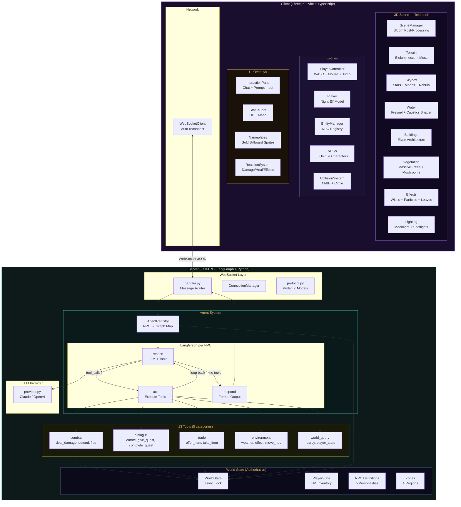
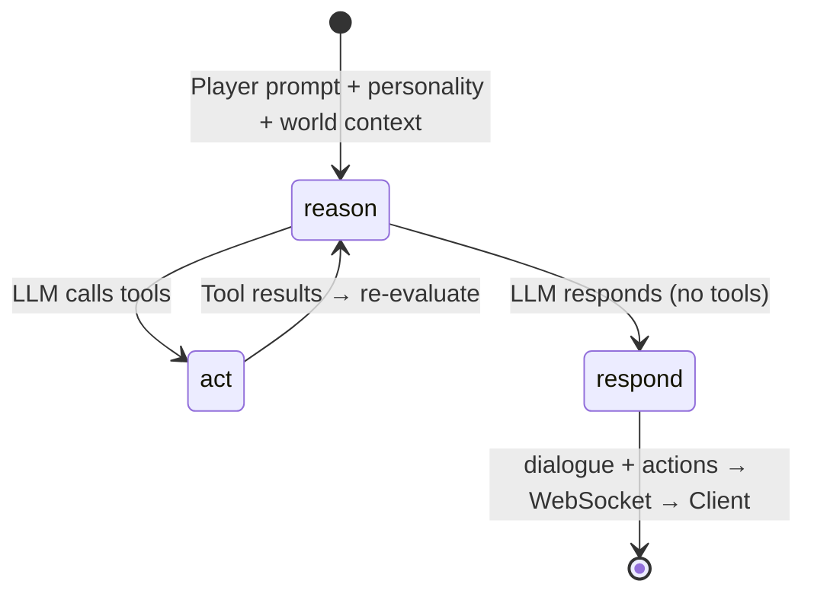
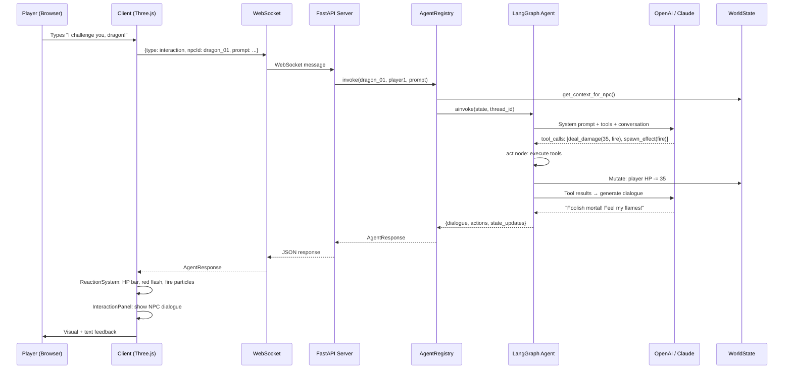

# World of Promptcraft — Implementation Plan

## Context

Build a 3D WoW-inspired browser game where the core mechanic is **prompting**: the player types free-form text and LangGraph-powered NPC agents react dynamically — fighting, talking, trading, or changing the environment based on what the player says. No hardcoded game mechanics; everything emerges from prompt ↔ agent interaction.

**Theme**: Teldrassil (Night Elf starting zone) — ancient mystical forest, purple/teal moonlit atmosphere, massive trees, bioluminescent flora, elven architecture.

**Stack**: Three.js (TypeScript/Vite) frontend + Python (FastAPI/LangGraph) backend, connected via WebSocket.

---

## Architecture Overview

### System Architecture



### Agent Graph Flow (per NPC)



### Data Flow Sequence



---

## Project Structure

```
world-of-promptcraft/
├── .env.example                    # LLM provider config template
├── .env                            # Active config (OpenAI via MaibornWolff proxy)
├── .gitignore
├── docker-compose.yml
├── promptcraft_plan.md             # This file
├── combat_plan.md                  # Combat mechanics plan (in progress)
├── backend_guide.md                # Backend developer guide (in progress)
│
├── client/
│   ├── package.json                # three, vite, typescript
│   ├── tsconfig.json
│   ├── vite.config.ts              # Dev proxy for WebSocket
│   ├── index.html
│   ├── public/
│   │   ├── models/
│   │   └── textures/
│   └── src/
│       ├── main.ts                 # Entry: wires all systems together
│       ├── scene/
│       │   ├── SceneManager.ts     # Renderer + bloom post-processing, render loop
│       │   ├── Terrain.ts          # Procedural heightmap, bioluminescent moss
│       │   ├── Water.ts            # Teal mystical water + Fresnel shader
│       │   ├── Skybox.ts           # Night sky: stars, nebula, two moons
│       │   ├── Lighting.ts         # Moonlight, purple ambient, moonbeam spots
│       │   ├── Buildings.ts        # Elven: moonwell, tree-house, sentinel tower, pavilion
│       │   ├── Vegetation.ts       # Massive trees, mushrooms, ferns, vines
│       │   └── Effects.ts          # Wisps, particles, ground glow, falling leaves
│       ├── entities/
│       │   ├── EntityManager.ts    # NPC registry + tick
│       │   ├── PlayerController.ts # WASD + mouse, water/mesh collision
│       │   ├── Player.ts           # Night Elf model with cape + ears
│       │   ├── NPC.ts              # NPC model + nameplate + unique details
│       │   └── NPCAnimator.ts      # Procedural idle/walk/attack/emote
│       ├── ui/
│       │   ├── UIManager.ts        # DOM overlay management
│       │   ├── InteractionPanel.ts # WoW-themed chat panel
│       │   ├── StatusBars.ts       # HP/mana bars with gold frames
│       │   └── Nameplate.ts        # Billboard sprite: gold name + HP bar
│       ├── network/
│       │   ├── WebSocketClient.ts  # Auto-reconnect, heartbeat
│       │   └── MessageProtocol.ts  # Typed message interfaces
│       ├── state/
│       │   ├── WorldState.ts       # Client state cache
│       │   ├── PlayerState.ts      # Singleton HP, inventory
│       │   └── NPCState.ts         # Per-NPC state cache
│       ├── systems/
│       │   ├── InteractionSystem.ts # Raycaster click → NPC interaction
│       │   ├── ReactionSystem.ts    # Agent actions → 3D effects
│       │   ├── CollisionSystem.ts   # AABB + circle collision with sliding
│       │   └── AnimationSystem.ts   # Generic tick system
│       └── utils/
│           ├── AssetLoader.ts       # GLTF + texture loader wrappers
│           └── MathHelpers.ts       # Lerp, clamp, lerpAngle, smoothDamp
│
└── server/
    ├── pyproject.toml
    ├── Dockerfile
    ├── src/
    │   ├── main.py                  # FastAPI + lifespan init
    │   ├── config.py                # Pydantic Settings (provider, base_url, keys)
    │   ├── ws/
    │   │   ├── handler.py           # Route interactions → agent registry
    │   │   ├── connection_manager.py
    │   │   └── protocol.py          # Pydantic models with camelCase aliases
    │   ├── agents/
    │   │   ├── registry.py          # NPC ID → compiled graph, tool closures
    │   │   ├── npc_agent.py         # StateGraph: reason → act → respond
    │   │   ├── agent_state.py       # NPCAgentState TypedDict
    │   │   ├── nodes/
    │   │   │   ├── reason.py        # LLM call with tools + personality prompt
    │   │   │   ├── act.py           # Tool execution + pending_actions harvest
    │   │   │   └── respond.py       # Extract dialogue text
    │   │   ├── tools/
    │   │   │   ├── __init__.py      # get_all_tools(), get_tools_by_category()
    │   │   │   ├── combat.py        # deal_damage, defend, flee
    │   │   │   ├── dialogue.py      # emote, give_quest, complete_quest
    │   │   │   ├── trade.py         # offer_item, take_item
    │   │   │   ├── environment.py   # change_weather, spawn_effect, move_npc
    │   │   │   └── world_query.py   # get_nearby_entities, check_player_state
    │   │   └── personalities/
    │   │       └── templates.py     # 5 NPC system prompts
    │   ├── world/
    │   │   ├── world_state.py       # Authoritative state + async lock
    │   │   ├── player_state.py      # PlayerData dataclass
    │   │   ├── npc_definitions.py   # NPC metadata from personalities
    │   │   └── zones.py             # 4 zones with boundaries
    │   └── llm/
    │       └── provider.py          # get_llm() factory (Claude/OpenAI + base_url)
    └── tests/

---

## Implementation Status

### Completed Stories

| # | Story | Status | Description |
|---|-------|--------|-------------|
| 1 | Project Scaffolding | ✅ Done | Vite+TS client, FastAPI+LangGraph server, .env, docker-compose |
| 2 | 3D World Scene | ✅ Done | Terrain, skybox, lighting, water, buildings, vegetation |
| 3 | Character Controller | ✅ Done | WASD + mouse, third-person camera, jump, terrain following |
| 4 | NPC Entities | ✅ Done | NPC class, EntityManager, raycaster click, hover highlight |
| 5 | WebSocket Layer | ✅ Done | Auto-reconnect client, FastAPI handler, Pydantic protocols |
| 6 | LangGraph Agents | ✅ Done | StateGraph (reason→act→respond), registry, MemorySaver, per-player threads |
| 7 | Agent Tools | ✅ Done | 13 tools across 5 categories with factory/closure pattern |
| 8 | UI Overlay | ✅ Done | WoW-themed chat panel, HP/mana bars, quest banners |
| 9 | Reaction System | ✅ Done | Damage/heal effects, particles, weather, floating text, NPC movement |
| 10 | NPC Personalities | ✅ Done | 5 NPCs: Dragon, Merchant, Sage, Guard, Healer with rich prompts |
| 11 | Integration | ✅ Done | main.ts wires all systems, TypeScript compiles clean, servers run |
| 12 | Teldrassil Theme | ✅ Done | Night sky + stars + moons, moonlight, purple fog, dark mossy terrain |
| 13 | Elven Architecture | ✅ Done | Moonwell, tree-house, sentinel tower, market pavilion with rune glow |
| 14 | Teldrassil Forest | ✅ Done | 4 massive ancient trees, 80 medium, 100 glowing mushrooms, ferns, vines |
| 15 | Mystical Water | ✅ Done | Teal shader: Fresnel, caustics, bioluminescent glow, shimmer |
| 16 | Water Collision | ✅ Done | Player blocked from water, edge sliding, proximity slowdown |
| 17 | Magical Effects | ✅ Done | Floating wisps, 200 ambient particles, ground glow, falling leaves |
| 18 | Collision Detection | ✅ Done | Circle-based for NPCs, building footprints, sliding response |
| 19 | Duplicate Prompt Fix | ✅ Done | Fixed double player message in chat panel |
| 20 | OpenAI Config | ✅ Done | MaibornWolff proxy, configurable base_url, gpt-4o-mini |
| 21 | Agent E2E Test | ✅ Done | Verified: Merchant offers items, Dragon attacks with fire, Healer heals |

### In Progress

| # | Story | Status | Description |
|---|-------|--------|-------------|
| 22 | Mesh-Based Collision | 🔄 In Progress | AABB collision from actual 3D mesh bounding boxes |
| 23 | NPC Floating Names | 🔄 In Progress | Billboard sprite nameplates: gold text + HP bar |
| 24 | Scene Quality Polish | 🔄 In Progress | Bloom post-processing, moonbeam spotlights, Night Elf player model, unique NPC details |
| 25 | Combat Plan | 🔄 In Progress | Detailed plan for turn-based combat, enemy AI, loot, status effects |
| 26 | Backend Guide | 🔄 In Progress | Comprehensive developer guide for the backend architecture |

### Backlog

| # | Story | Priority | Description |
|---|-------|----------|-------------|
| 27 | Combat Mechanics | High | Turn-based combat flow, NPC HP tracking, death/defeat |
| 28 | Enemy AI Improvements | High | Better tool-calling reliability, constrained outputs, fallbacks |
| 29 | Roaming Enemies | Medium | NPCs that patrol and initiate combat on proximity |
| 30 | Loot System | Medium | Items dropped on enemy defeat |
| 31 | Player Abilities | Medium | Special typed moves ("fireball", "shield") interpreted by agents |
| 32 | Status Effects | Medium | Poison, burn, freeze persisting across turns |
| 33 | Respawn Mechanics | Medium | Death screen, respawn at village |
| 34 | Quest Tracker UI | Low | Persistent quest list with progress |
| 35 | LLM Response Streaming | Low | Stream tokens via LangGraph `.astream()` |
| 36 | Sound Effects | Low | Ambient music, combat sounds, UI clicks |
| 37 | GLTF Model Upgrade | Low | Replace procedural geometry with real 3D models |
| 38 | Minimap | Low | Top-down minimap canvas showing player + NPC positions |

---

## Key Design Decisions

1. **Server-authoritative state**: world_state lives on the server. Client is a render mirror. Prevents cheating and keeps NPC agents in sync with reality.
2. **Per-NPC compiled graphs**: each NPC gets its own LangGraph StateGraph. Thread IDs scoped per player×NPC for independent conversation memory.
3. **Tool-driven mechanics**: the LLM calls typed tools (deal_damage, spawn_effect, etc.) that produce structured actions. This gives the LLM clear affordances while keeping output predictable.
4. **Prompt as the only input**: no "attack button" or "trade button". The text prompt IS the game interface. What happens is entirely determined by what you type and how the agent interprets it.
5. **Factory/closure tool pattern**: tools close over shared `pending_actions` list and `world_state` dict, allowing them to accumulate side-effects during agent invocation.
6. **Teldrassil theme**: Deep purple/teal color palette, moonlit atmosphere, ancient elven architecture, bioluminescent flora.

---

## Data Flow

Player types "I challenge you to a duel, dragon!" →

1. **Client** `InteractionPanel` fires `onSendMessage` → WebSocket sends `{ type: "interaction", npcId: "dragon_01", prompt: "..." }`
2. **Server** `handler.py` routes to `AgentRegistry.invoke("dragon_01", "player1", prompt, state)`
3. **Registry** populates tool-closure world snapshot, builds `NPCAgentState` input
4. **LangGraph** `reason` node: LLM (with Ignathar personality + tools) decides to call `deal_damage("player", 35, "fire")` + `spawn_effect("fire", 3.0)`
5. **LangGraph** `act` node: executes tools → appends to `pending_actions`, mutates world state
6. **LangGraph** loops back to `reason` → LLM generates dialogue (no more tools) → `respond` node
7. **Server** returns `AgentResponse`:
   ```json
   {
     "type": "agent_response",
     "npcId": "dragon_01",
     "dialogue": "Foolish mortal! Feel the wrath of my fiery breath!",
     "actions": [
       {"kind": "damage", "params": {"target": "player", "amount": 35, "damageType": "fire"}},
       {"kind": "spawn_effect", "params": {"effectType": "fire", "duration": 3.0}},
       {"kind": "emote", "params": {"animation": "threaten"}}
     ],
     "playerStateUpdate": {"hp": 65}
   }
   ```
8. **Client** `ReactionSystem` processes: HP drops to 65, red flash, floating "-35" text, fire particles spawn, NPC plays threaten animation, dialogue appears in chat

---

## NPCs

| ID | Name | Zone | Archetype | Behavior |
|----|------|------|-----------|----------|
| `dragon_01` | Ignathar the Ancient | Ember Peaks (120, -80) | Hostile Boss | Attacks if challenged (20-50 fire dmg), respects wisdom/flattery, guards Ember Crown |
| `merchant_01` | Thornby the Merchant | Village Center (5, 8) | Friendly Merchant | Sells potions/weapons/scrolls, negotiates, trades for stories |
| `sage_01` | Elyria the Sage | Crystal Lake (-40, -30) | Quest Giver | Speaks in riddles, gives quests, rewards patience, can heal the worthy |
| `guard_01` | Captain Aldric | Village Entrance (15, 2) | Neutral Guard | Can be befriended or fought (15-30 dmg), warns of dangers, can be bribed |
| `healer_01` | Sister Mira | Village Temple (-5, 12) | Friendly Healer | Heals 20-50 HP, offers blessings, refuses to help those who harm innocents |

---

## Running the Project

```bash
# Terminal 1 — Backend
cd server && source .venv/bin/activate
uvicorn src.main:app --host 0.0.0.0 --port 8000 --reload

# Terminal 2 — Frontend
cd client && npm run dev
```

Open http://localhost:5173 — click canvas for pointer lock, WASD to move, right-click NPCs to interact.
