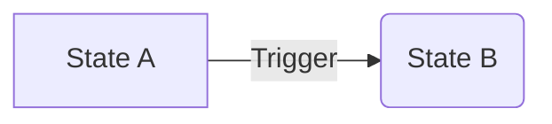

# 🤖 AI Documentation Writing Guidelines

Standardized documentation format for **World of Promptcraft** to ensure maximum efficiency, readability, and context-retention for both humans and AI agents.

---

## 1. Metadata Block (Mandatory)
Every plan, research report, or architecture doc must start with this header:

```markdown
# Title of the Document

- **Date**: YYYY-MM-DD
- **Status**: [DRAFT | ACTIVE | DONE | DEPRECATED]
- **Context**: Brief 1-2 sentence overview of what this covers.
- **Related Files**: List of primary files affected/referenced.
```

---

## 2. Structural Principles

### A. Focus on "Why", then "How"
AI agents can read the code to see "What" is happening. Docs should explain the **intent**, **trade-offs**, and **unobvious constraints**.

### B. Precision Pathing
Always use absolute-from-root paths (e.g., `server/src/main.py`) and include line numbers when referencing specific logic to minimize "grep" turns.

### C. Mermaid for Logic
Use Mermaid diagrams for state machines, graph flows, or complex class relations. They are tokens-efficient and easier for LLMs to visualize.



---

## 3. Plan-Specific Requirements
When writing a **Implementation Plan**:
1. **Success Criteria**: Bulleted list of what defines "Done".
2. **Breakdown**: Group tasks by logical boundary (e.g., "Part 1: Backend", "Part 2: UI").
3. **Verification**: Explicitly state how each part should be tested.

---

## 4. Archiving Policy
To keep the workspace clean and maintain high signal-to-noise:
1. **Move to Archive**: Once a plan is implemented or a research report is no longer "living," move it to `docs/plans/`.
2. **Naming Convention**: `YYYY-MM-DD_DONE_original-name.md`.
3. **Release Summaries**: Move to `docs/release/` using `YYYY-MM-DD_PR_SUMMARY.md`.

---

## 5. Signal over Noise
- Avoid conversational filler ("In this document we will explore...").
- Use bullet points and tables for structured data.
- Keep "Quick Start" sections at the top of active docs.
