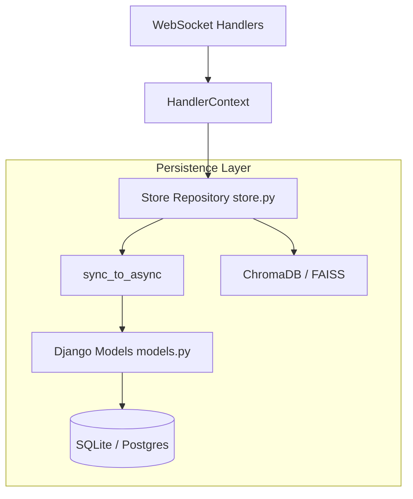

# Django ORM & World Persistence Architecture Plan

## Overview

Migrate the current raw SQLite persistence layer in `store.py` to use **Django ORM** running standalone inside the FastAPI app. Then, expand the schema to support the full persistence vision: Global World State, Player State, Player-NPC Relationships (with Vector DB), and Lore (Vector DB). We will keep `store.py` as the Repository pattern boundary, isolating the Django ORM details from the rest of the game loop.

## Current State Analysis

- The game currently uses raw `sqlite3` inside `server/src/persistence/store.py` to persist player data and chat history as JSON blobs.
- The websocket loop is asynchronous, but currently blocks the event loop with synchronous SQLite calls on disconnect.
- The world state (dead NPCs, completed quests, custom creations) is currently lost on server restart.
- NPC relationships and Lore exist purely in ephemeral prompts or are hardcoded; they do not have long-term semantic search capability.

## Desired End State

A robust Django-powered relational database (SQLite for now, but easily migrateable to Postgres) paired with a Vector Database (like ChromaDB or FAISS) for semantic search.

1. **Standalone Django Setup**: `django.setup()` runs on FastAPI startup.
2. **Relational Data**: Django Models for `Player`, `NPCState`, `QuestProgress`, and `PlayerNPC_Relationship`.
3. **Vector Data**: A dedicated Vector DB handling Lore embeddings and NPC relationship summaries to inject into the LLM context.
4. **Repository Pattern**: `store.py` will wrap all `sync_to_async` Django ORM queries and Vector DB lookups so the FastAPI/WebSocket handlers never see Django models directly.

### Key Discoveries:
- Django's ORM throws `SynchronousOnlyOperation` if called from an async event loop (like FastAPI's websocket handler). We MUST wrap all ORM queries in `store.py` using `asgiref.sync.sync_to_async` to prevent blocking the async game loop and avoid Django's safety exceptions.
- The `Store` class is passed down via `HandlerContext`. This allows us to cleanly substitute the inner workings without touching the game systems.

## What We're NOT Doing

- We are **not** migrating the FastAPI server to a Django Web Framework server. Django is purely acting as an ORM package.
- We are **not** exposing Django Models directly to the game logic (`world_state.py` will continue using `PlayerData` dataclasses/pydantic models).

## Implementation Approach

We will approach this in two major stages: first, replacing the existing SQLite code with Django ORM to ensure parity and stability. Second, adding the new schema tables and Vector DB integrations.

## Architecture and Code Reuse

## Phase 1: Django ORM Standalone Setup & Parity

### Overview
Install Django, configure a standalone settings module, define the existing `Player` and `Chat` models, and refactor `store.py` to use them while maintaining the exact same public API.

### Changes Required:

#### [ ] 1. Django Configuration & Models
**Files**: `server/src/persistence/django_settings.py`, `server/src/persistence/models.py`
**Changes**:
- Create a minimal Django settings file pointing to `data/world.db`.
- Create `models.py` with a `PlayerModel` (storing JSON data) and `ChatModel` to mirror the existing schema.
- Add a script to run `django-admin makemigrations` and `migrate`.

#### [ ] 2. Refactor `store.py`
**File**: `server/src/persistence/store.py`
**Changes**:
- Add `import django` and `django.setup()` in the module initialization.
- Rewrite `load_player`, `save_player`, and `record_chat` to use Django ORM.
- Wrap all database calls with `@sync_to_async` to ensure they run safely in threadpools without triggering Django's async-safety exceptions.

### Success Criteria:

#### Automated Verification:
- [ ] Tests pass: `cd server && python -m pytest tests/`
- [ ] Database migrations generate successfully.
- [ ] Type checking passes: `cd server && python -m mypy src`

---

## Phase 2: Expanding the Relational Schema

### Overview
Implement the relational database schema for the new persistence features: Global State, Player State (expanding from JSON blob to columns if needed), Relationships, and Quests.

### Changes Required:

#### [ ] 1. New Django Models
**File**: `server/src/persistence/models.py`
**Changes**:
- `GlobalWorldState`: Store dead NPCs, spawned buildings, global events.
- `PlayerQuest`: Track quest IDs and progress status per player.
- `PlayerNPCRelationship`: Status (`friendly`, `hostile`, `hero`) per player-NPC pair.

#### [ ] 2. Expose in `store.py`
**File**: `server/src/persistence/store.py`
**Changes**:
- Add `get_npc_relationship(player_id, npc_id)`, `update_npc_relationship()`.
- Add `get_global_state()`, `save_global_state()`.
- Add `get_completed_quests(player_id)`.

### Success Criteria:

#### Automated Verification:
- [ ] Migrations apply cleanly.
- [ ] New unit tests in `tests/domains/persistence/` pass for relationship and global state saving.

---

## Phase 3: Vector Database for Lore and Relationship Summaries

### Overview
Integrate a Vector Database (e.g., ChromaDB or LangChain's FAISS wrapper) to store semantic data that the LLM needs to query contextually.

### Changes Required:

#### [ ] 1. Vector Store Initialization
**File**: `server/src/persistence/vector_store.py`
**Changes**:
- Set up a local Vector DB instance (persisted to disk in `data/vector_db/`).
- Define collections: `lore` and `relationships`.

#### [ ] 2. Repository Integration
**File**: `server/src/persistence/store.py`
**Changes**:
- Add `search_lore(query: str, limit: int)`.
- Add `save_relationship_summary(player_id: str, npc_id: str, summary: str)` and `get_relationship_context(player_id: str, npc_id: str, query: str)`.

### Success Criteria:

#### Automated Verification:
- [ ] Unit tests for vector insertion and similarity search.
- [ ] `store.py` correctly routes relational queries to Django and semantic queries to the Vector DB.

---

## Testing Strategy

### Unit Tests:
- `test_store_django.py`: Verify that saving and loading a player through `store.py` actually uses the Django DB under the hood and triggers no `SynchronousOnlyOperation` errors.
- `test_vector_store.py`: Verify that adding a piece of lore and querying it returns the correct document.

### Integration Tests:
- Run the WebSocket loop and verify that a player disconnects, `save_player` runs, and no asyncio blocking errors occur.
