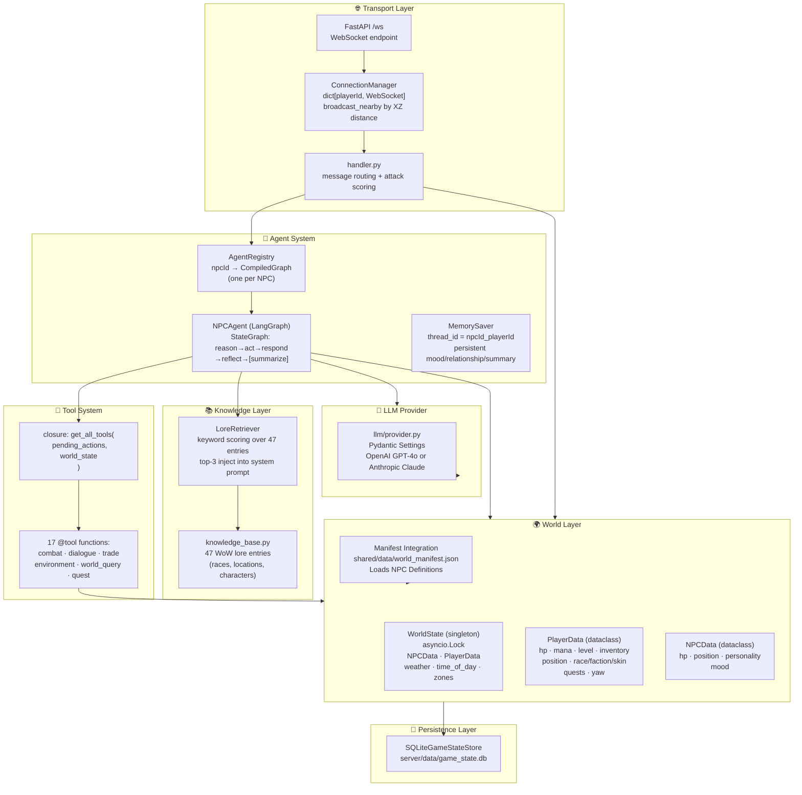
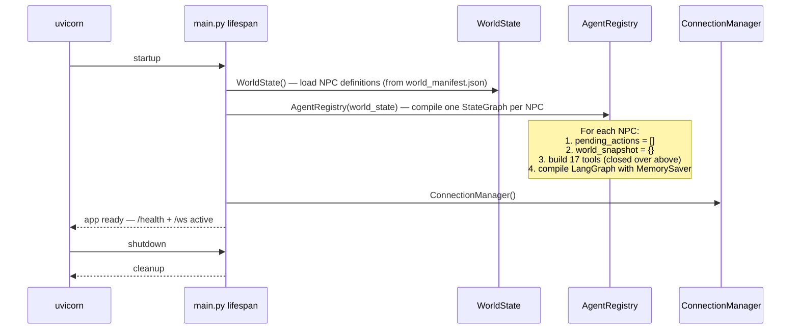
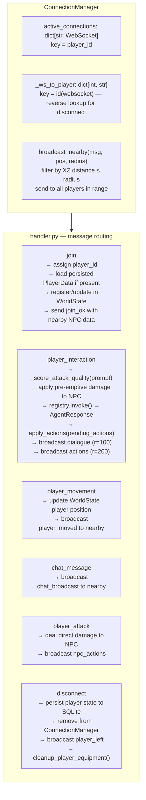
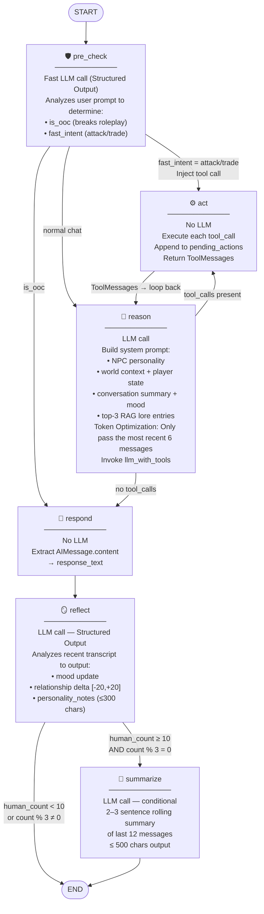
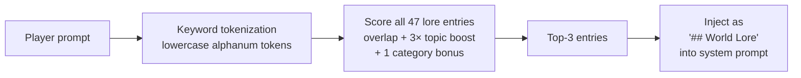
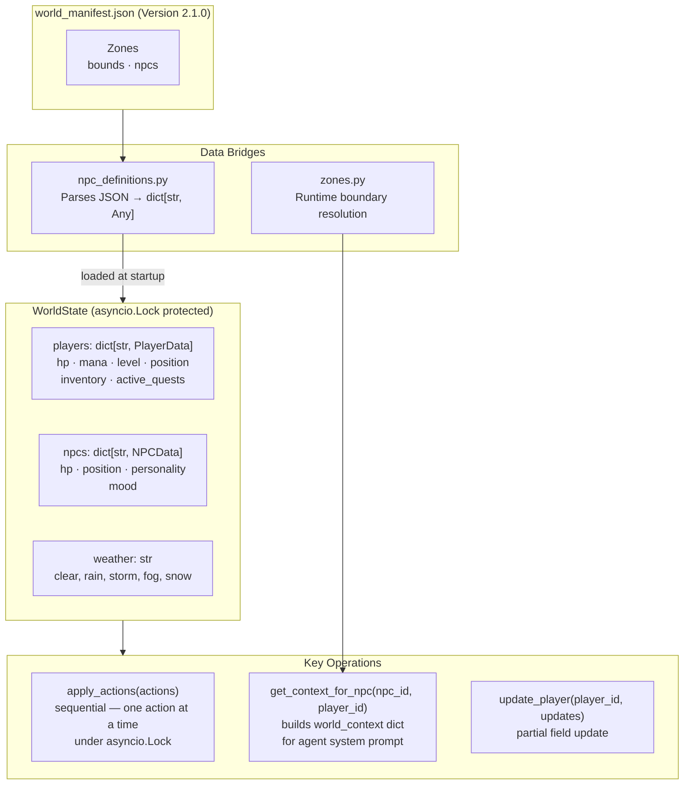
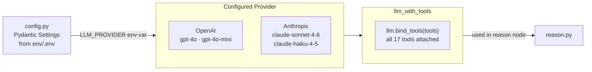

# Server Architecture — World of Promptcraft

FastAPI + LangGraph + Python 3.11+ backend. **Server-authoritative**: `WorldState` is the single source of truth; every HP change, weather event, and inventory mutation happens here before being reflected to clients. Runtime game state is durably persisted in SQLite (`server/data/game_state.db`) for NPC personalities, NPC state, world snapshot, and per-player progress. The world itself uses a **Version 2.1.0 Zonal Hybrid Manifest system** sourced from `shared/data/world_manifest.json`.

---

## Layer Overview

---

## Startup & Lifespan

---

## WebSocket Layer

---

## Agent System — LangGraph StateGraph

Each NPC runs an independent compiled `StateGraph`. The graph is invoked once per player interaction.

---

## Agent State Schema

All data flowing through the graph lives in a single `TypedDict` (`NPCAgentState`):

| Field | Type | Scope | Description |
|-------|------|-------|-------------|
| `messages` | `list` (accumulated) | Conversation | Full history — HumanMessage, AIMessage, ToolMessage |
| `npc_id` | `str` | Static | NPC identifier |
| `npc_name` | `str` | Static | Display name |
| `npc_personality` | `str` | Static | Full personality system prompt |
| `player_state` | `dict[str, Any]` | Per-call | HP, mana, inventory, level |
| `world_context` | `dict[str, Any]` | Per-call | Zone, weather, nearby entities |
| `pending_actions` | `list[dict[str, Any]]` | Accumulated | Tool-queued game actions |
| `response_text` | `str` | Output | Final dialogue string |
| `conversation_summary` | `str` | **Persistent** | Rolling LLM-generated memory |
| `mood` | `str` | **Persistent** | neutral / happy / angry / sad / fearful |
| `relationship_score` | `int` | **Persistent** | -100 (enemy) to +100 (trusted ally) |
| `personality_notes` | `str` | **Persistent** | NPC observations about this player |

---

## Tool System

Tools use a **closure pattern** — `get_all_tools(pending_actions, world_state)` returns `@tool`-decorated functions that share a mutable `pending_actions` list.

```mermaid
flowchart LR
    LLM["🤖 LLM"]

    subgraph closure["Tool Closure — per NPC at startup"]
        direction TB
        combat["combat\ndeal_damage · heal_target\ndefend · flee"]
        dialogue["dialogue\nemote · give_quest\ncomplete_quest"]
        trade["trade\noffer_item · take_item"]
        env["environment\nchange_weather · spawn_effect\nmove_npc"]
        query["world_query\nget_nearby_entities\ncheck_player_state"]
        quest["quest\nstart_quest · advance_objective\ncheck_player_quests"]
    end

    pending["pending_actions[ ]"]
    worldstate["WorldState"]
    client["🎮 Client\nReactionSystem → 3D effects"]

    LLM -->|"tool_calls"| closure
    closure -->|"append action dict"| pending
    closure -->|"read / write snapshot"| worldstate
    pending -->|"apply_actions after graph"| worldstate
    pending -->|"actions in AgentResponse"| client
```

---

## RAG Lore System

---

## World State & Manifest Integration

The server's WorldState operates on a single truth, heavily influenced by the `shared/data/world_manifest.json`.

---

## Cost & Latency Strategy

| Decision | Rationale |
|----------|-----------|
| `reason` token optimization | Prunes the context window to the most recent 6 messages; older context is summarized. Reduces token consumption significantly during long conversations. |
| `reflect` uses Structured Output | Provides high emotional intelligence (accurate mood, relationship tracking, notes) while keeping the output deterministic and tiny. |
| `summarize` conditional (≥10 turns, every 3rd) | Minimises LLM calls while keeping memory bounded |
| RAG is keyword-based (no embeddings) | Sub-millisecond — no vector DB dependency |
| Tools synchronous within one turn | Predictable cost; no parallel LLM calls |
| 30s LLM timeout | Prevents runaway agent calls blocking WebSocket connections |

---

## LLM Provider

