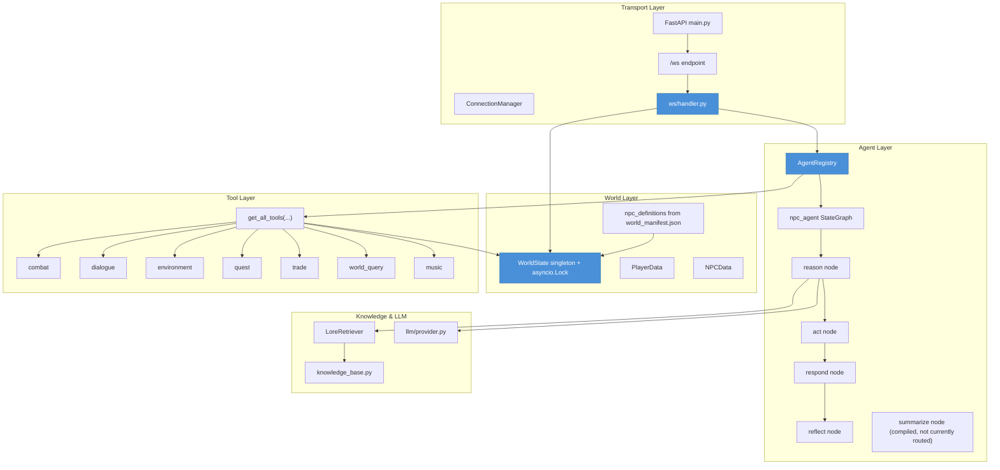
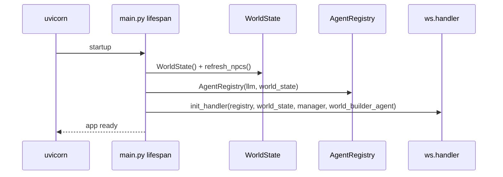
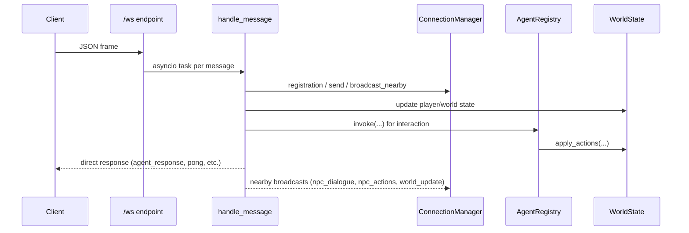
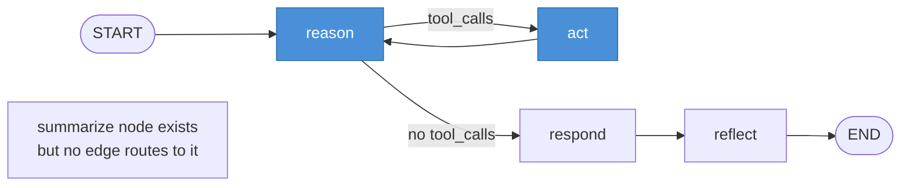
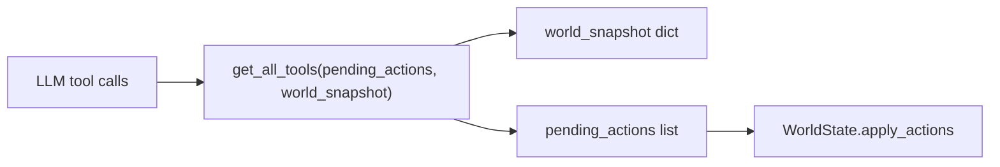
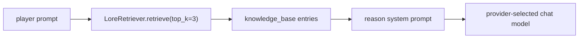
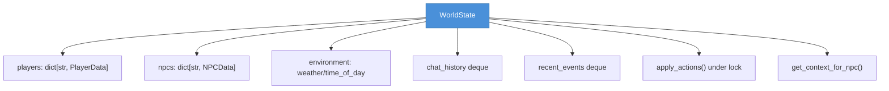

# Server Architecture — World of Promptcraft

FastAPI + LangGraph backend with server-authoritative `WorldState`. NPC reasoning is per-NPC/per-player through compiled LangGraph agents managed by `AgentRegistry`.

---

## Layer Overview

---

## Startup & Lifespan

---

## WebSocket Message Flow

**Concurrency controls currently in place**
1. Per-message task spawning in websocket receive loop (slow interactions don't block reads).
2. Per-player interaction lock (`_interaction_locks`) in interaction handler.
3. Global semaphore (`_agent_semaphore`) for capped concurrent LLM calls.

---

## Agent Pipeline (LangGraph)

### Node responsibilities
- **reason**: builds compact/full system prompt, injects world context + player state + memory fields, retrieves lore (RAG), binds tools (except short-social path), handles inline tool-call fallback.
- **act**: executes tool calls and harvests shared `pending_actions`.
- **respond**: extracts dialogue text.
- **reflect**: heuristic mood/relationship/personality-notes update (no LLM call).
- **summarize**: implemented but currently not connected in graph routing.

---

## Agent State Schema (`NPCAgentState`)

| Field | Type | Purpose |
|---|---|---|
| `messages` | `list[Any]` | Conversation history for LangGraph |
| `npc_id` / `npc_name` / `npc_personality` | `str` | NPC identity and persona |
| `player_state` | `dict[str, Any]` | HP/inventory/etc for current interaction |
| `world_context` | `dict[str, Any]` | zone/weather/nearby/chat/events |
| `pending_actions` | `list[dict[str, Any]]` | queued gameplay actions |
| `response_text` | `str` | final dialogue |
| `conversation_summary` | `str` | rolling memory summary |
| `mood` | `str` | current emotional state |
| `relationship_score` | `int` | player relationship score |
| `personality_notes` | `str` | compact persistent observations |

---

## Tool Closure Pattern

Tool groups currently loaded: `combat`, `dialogue`, `environment`, `quest`, `trade`, `world_query`, `music`.

---

## RAG & LLM Path

`llm/provider.py` supports `claude`, `openai`, and `ollama`, each with provider-specific timeout/retry settings.

---

## World State Model

---

## Extension Guides

1. **Add a tool**: implement in `server/src/agents/tools/*.py`, include in `get_all_tools`, ensure action shape is handled client-side in `ReactionSystem`.
2. **Add NPC behavior/personality**: update manifest NPC entry and personality templates; refresh/register agents.
3. **Adjust latency behavior**: tune `settings.agent_invoke_timeout_seconds`, `_agent_semaphore`, short-social routing in `reason`, and interaction/chat radii in `handler`.
