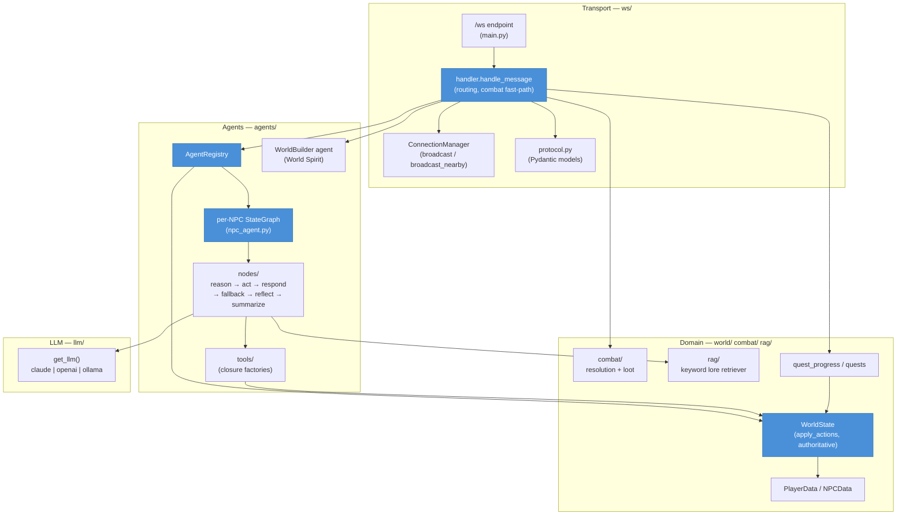
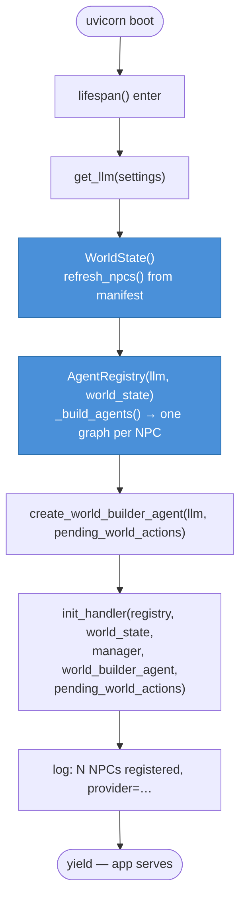
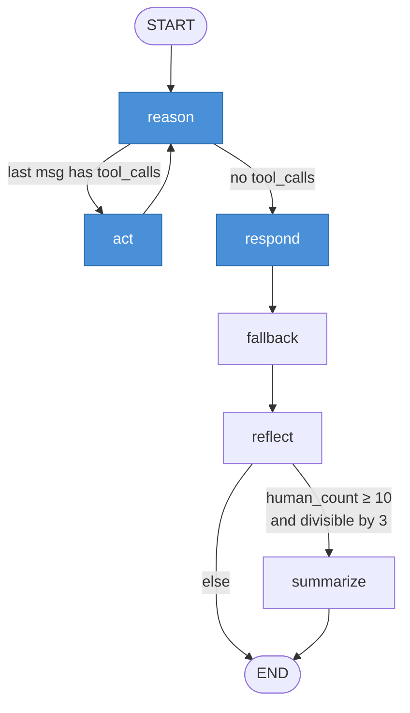
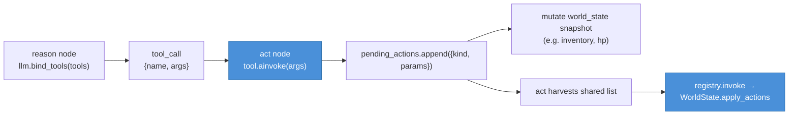
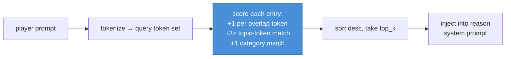
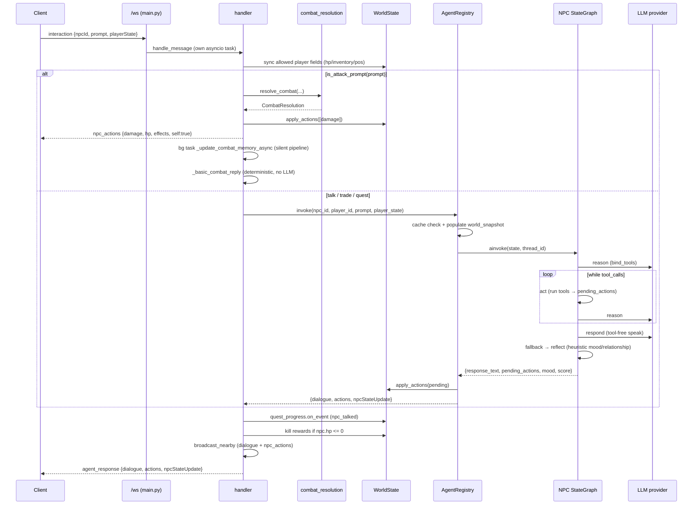

# World of Promptcraft — Server Architecture

FastAPI + LangGraph backend for a prompt-driven 3D multiplayer RPG. The server is
**authoritative**: it owns `WorldState`, runs one LangGraph agent per NPC, scores
free-form combat prompts, and streams structured *actions* back to the Three.js
client over a single WebSocket.

Conventions throughout: `from __future__ import annotations`, parameterized
generics (`dict[str, Any]`, `list[Any]`), mypy `strict = True`. LangGraph's
`CompiledStateGraph` is imported under `TYPE_CHECKING` and annotated with
`# type: ignore[type-arg]` (its stubs ship no type params). All NPC tools use the
**factory/closure pattern** — `create_X_tools(pending_actions, world_state)`
returns `@tool` functions closed over shared mutable containers.

---

## Layer Overview

---

## Startup / Lifespan Flow

`main.py` builds the singletons in a FastAPI `lifespan` async context manager, then
wires the handler module's module-level references via `init_handler(...)`.

HTTP routes alongside the WebSocket:
- `GET /health` → `{status, llm_provider}`
- `GET /world/manifest` → serves the saved `shared/data/world_manifest.json`
- `POST`-equivalent over WS: `world_manifest_update` writes that same file

NPCs are **data-driven**: `npc_definitions.py` loads `world_manifest.json`
(identity + `ai.personality_key` + position); `WorldState.refresh_npcs()` maps each
`personality_key` to a system prompt + archetype in
`agents/personalities/templates.py` (`NPC_PERSONALITIES`).

---

## WebSocket Layer

Each connection's receive loop spawns **one asyncio task per message**
(`websocket_endpoint` in `main.py`) so a slow LLM interaction never blocks frequent
`player_move` frames (which would otherwise trigger keepalive ping timeouts).

`handle_message` routes by `type`. `join`/`ping` are allowed pre-registration;
everything else is silently dropped until the socket is registered.

| Message `type`            | Handler                          | Effect |
|---------------------------|----------------------------------|--------|
| `join`                    | `_handle_join`                   | Validate username/race/faction, reject duplicates, return `join_ok` (players + NPCs) |
| `ping`                    | inline                           | `pong` |
| `interaction`             | `_handle_interaction`            | Combat fast-path + agent invoke (the core flow) |
| `player_move`             | `_handle_player_move`            | Clamp pos, `world_update` to nearby + broadcast |
| `chat` / `chat_message`   | `_handle_chat_message`           | `broadcast_nearby` + fire-and-forget NPC chat reactions (40% chance) |
| `explore_area`            | `_handle_explore_area`           | Register procedurally generated NPCs |
| `use_item`                | `_handle_use_item`               | Resolve item effects deterministically (`world/items.py`) |
| `equip_item`              | `_handle_equip_item`             | Store equipment server-side |
| `dungeon_enter` / `_exit` | `_handle_dungeon_*`              | Advance quest objectives, add loot |
| `quest_update`            | `_handle_quest_update`           | Route typed event through `quest_progress.on_event` |
| `world_modify`            | `_handle_world_modify`           | Invoke WorldBuilder (World Spirit) agent |
| `world_manifest_update`   | `_handle_world_manifest_update`  | Persist manifest to disk |

### ConnectionManager

Maps `player_id ↔ WebSocket` (keyed on `id(websocket)`). Key methods:
- `register` — handles **session takeover** (closes the old socket if the same id reconnects)
- `send_to(player_id, data)` — direct send
- `broadcast(data, exclude)` — all connected players
- `broadcast_nearby(data, origin, radius, world_state, exclude)` — only players
  within XZ distance `radius` of `origin` (Y ignored). Used for chat (200u),
  dialogue (100u), and combat/NPC action sync (200u).

### Protocol

`protocol.py` holds Pydantic `BaseModel`s with camelCase aliases
(`populate_by_name=True`, `ser_json_by_alias=True`): `PlayerInteraction`,
`PlayerMove`, `UseItem`, `EquipItem`, `ExploreArea`, `DungeonEnter/Exit`,
`QuestUpdate`, plus the shared `Action {kind, params}` and outbound
`AgentResponse`, `UseItemResult`, `AckMessage`. (Note: `handle_message` reads raw
dicts directly and tolerates both camel/snake keys, so the models mostly document
the wire shape rather than gate every path.)

### Attack scoring (handler-side)

`is_attack_prompt` (combat module) decides whether a prompt is an attack via
`ATTACK_KEYWORDS`. The handler then has two scoring paths:
- `_score_attack_quality(prompt, inventory, equipped)` — local quality multiplier
  (≤ 3.5) factoring equipped weapon/shield/trinket, length, weapon/inventory
  mentions, style + magic keywords (also selecting damage/effect type).
- `resolve_combat(...)` from `combat/combat_resolution.py` — the authoritative path
  actually used for `interaction`, producing a `CombatResolution`.

---

## Agent Pipeline

Each NPC is a compiled `StateGraph(NPCAgentState)` with a `MemorySaver`
checkpointer (thread id = `"{npc_id}_{player_id}"`, so memory is per NPC × player).

Node responsibilities (all in `agents/nodes/`):

- **reason** (`make_reason_node`) — builds the system prompt (persona, world
  context, player state, memory/mood/relationship, RAG lore) and calls
  `llm.bind_tools(tools)`. A *short_social* fast path uses a compact prompt + the
  tool-free LLM for tiny non-action greetings (gated off for hostile archetypes).
  History is bounded (8 messages, or 3 for short_social). Handles **inline tool
  calls**: local models that emit calls as plain text are parsed by
  `inline_tools.extract_inline_tool_calls` and executed directly.
- **act** (`make_act_node`) — executes each structured `tool_call`, appends
  `ToolMessage` results, and harvests actions the tools appended to the shared
  `pending_actions` list. Loops back to `reason`.
- **respond** (`make_respond_node`) — the **speaking channel**, a dedicated
  tool-free LLM call producing one in-character line. Fast path reuses reason's
  prose when it is clean (no leaked chain-of-thought, survives stripping);
  otherwise pays for a separate speak call. Strips leaked tool syntax/reasoning.
- **fallback** (`fallback_node`) — if dialogue is empty/`"..."`, substitutes an
  action-derived line via `dialogue_fallback.fallback_line`.
- **reflect** (`reflect_node`) — **no LLM**, pure heuristics: re-derives `mood`
  (`_analyze_mood`), `relationship_score` delta (`_compute_relationship_delta`,
  clamped −100..100; `[COMBAT:` prefix forces anger / −15), and appends
  `personality_notes`.
- **summarize** (`make_summarize_node`) — runs only when `route_after_reflect`
  fires (≥ 10 human turns, every 3rd). Folds older turns into a rolling
  `conversation_summary` (≤ 500 chars) and prunes the message channel via
  `RemoveMessage` to the last 6 messages.

---

## Agent State

`NPCAgentState` (`agent_state.py`) is a `TypedDict`; `messages` uses the
`add_messages` reducer.

| Field                  | Type               | Purpose |
|------------------------|--------------------|---------|
| `messages`             | `list[Any]` (reduced) | Conversation history |
| `npc_id`, `npc_name`   | `str`              | Identity |
| `npc_personality`      | `str`              | System-prompt persona |
| `player_state`         | `dict[str, Any]`   | HP, inventory, level, quests |
| `world_context`        | `dict[str, Any]`   | Zone, time, weather, nearby, recent chat/events, `npc_archetype` |
| `pending_actions`      | `list[dict]`       | Actions accumulated by tools this turn |
| `response_text`        | `str`              | Final dialogue |
| `conversation_summary` | `str`              | Rolling long-term memory |
| `mood`                 | `str`              | Current emotional state |
| `relationship_score`   | `int`             | −100 (enemy) … 100 (ally) |
| `personality_notes`    | `str`              | NPC's evolving notes about this player |

---

## Registry

`AgentRegistry` builds one compiled graph per NPC. Each NPC gets its **own**
`pending_actions` list and `world_snapshot` dict; tools are closed over those
containers (`get_all_tools(pending_actions, world_snapshot)`).

- `_build_agents()` — one graph per NPC at startup.
- `register_dynamic_npc(npc_data)` — runtime registration (procedural / explored
  NPCs). Idempotent on `npc_id`.
- `refresh_agents()` — diff against `world_state.npcs`: drop removed, add new.
- `invoke(npc_id, player_id, prompt, player_state)` — the entry point:
  1. Look up the agent (missing → polite refusal).
  2. Build `world_context` (`get_context_for_npc`) + inject `npc_archetype`.
  3. **Response cache**: SHA-256 of `npc|player|prompt|hp|zone`; pure-dialogue
     (no actions) replies are cached (capped at 512 entries).
  4. `_populate_world_snapshot` — fills the tool-closure dict (player dict, self
     position, all NPCs) so tools read live state.
  5. `agent.ainvoke(input_state, config={thread_id})`.
  6. `world_state.apply_actions(pending)` — apply to authoritative state.
  7. Return `{dialogue, actions, playerStateUpdate, npcStateUpdate}`.

The handler wraps every `invoke` in a per-player `asyncio.Lock` (serialize rapid
clicks) **and** a global `Semaphore(10)` (cap concurrent LLM calls) plus a
`agent_invoke_timeout_seconds` timeout.

---

## Tools

Closure factories registered in `tools/__init__.py` (`get_all_tools` /
`get_tools_by_category` via `_CATEGORY_FACTORIES`). Every tool appends an
`{kind, params}` dict to the shared `pending_actions` and may sync the
`world_state` snapshot so later tools in the same turn see the effect.

| Module        | Tools | Notable action kinds |
|---------------|-------|----------------------|
| `combat.py`   | `deal_damage`, `defend`, `flee`, `heal_target` | `damage`, `emote`, `move_npc`, `heal` |
| `dialogue.py` | `emote` (validated animation set) | `emote` |
| `trade.py`    | `offer_item`, `complete_purchase`, `take_item`, `buy_item_from_player` | `give_item`, `complete_purchase`, `take_item`, `sell_item` |
| `environment.py` | `change_weather`, `spawn_effect`, `move_npc` | `change_weather`, `spawn_effect`, `move_npc` |
| `quest.py`    | `offer_quest`, `offer_custom_quest`, `advance_quest_objective`, `complete_quest`, `check_player_quests` | `accept_quest`, `advance_objective`, `complete_quest` |
| `music.py`    | `compose_music` | `play_music` |
| `world_query.py` | `get_nearby_entities`, `check_player_state` | (read-only) |
| `world_builder.py` | `spawn_structure`, `remove_structure`, `place_vegetation_cluster` | `world_spawn`, `world_remove` (WorldBuilder agent only) |

Trade tools enforce real economy rules: `offer_item` only *proposes* a sale
(`price > 0`); `complete_purchase` authoritatively checks/deducts gold;
`buy_item_from_player` validates the player actually holds the item.
`offer_custom_quest` proposals are clamped server-side by
`agents/quests/generator.clamp_proposal` (level-scaled gold/XP caps, item cap).

---

## Personalities

`agents/personalities/templates.py` defines `NPC_PERSONALITIES: dict[str, dict]`,
keyed by `personality_key`. Each entry carries an `archetype` and a `system_prompt`
(assembled from shared `_TOOL_RULES_PREAMBLE` + `_COMBAT_NARRATION_RULES`).
Archetypes include named characters (`hostile_boss`, `friendly_merchant`,
`quest_giver`, `neutral_guard`, `friendly_healer`, `friendly_stoner`,
`eccentric_archmage`, `volatile_pyromancer`, `mysterious_cryomancer`,
`friendly_guide`) and wild encounters (`forest_wraith`, `moon_spider`,
`ancient_treant`, `dire_wolf`, `lava_hound`, `obsidian_golem`, `frost_wraith`,
`glacial_golem`, …). The archetype also drives the handler's deterministic
instant-combat profiles (`_COMBAT_PROFILES`, `_GOLD_TIER`).

---

## World State

`WorldState` (`world/world_state.py`) is a singleton-style class guarded by an
`asyncio.Lock`. It holds `players: dict[str, PlayerData]`,
`npcs: dict[str, NPCData]`, `environment`, bounded `chat_history` (deque 50), and
`recent_events` (deque 20).

`apply_actions(actions)` is the **single authoritative mutation point** — it
translates action dicts into state changes under the lock:

| `kind`                          | Effect |
|---------------------------------|--------|
| `damage` / `damage_player`      | Subtract HP from NPC (if target is a known npc id) else player; records defeat event |
| `heal` / `heal_player`          | Restore player HP (capped at max) |
| `give_item`                     | Append to player inventory |
| `give_gold`                     | Add gold |
| `complete_purchase`             | Deduct gold (if affordable) + grant item |
| `sell_item`                     | Remove item + add gold |
| `remove_item` / `take_item`     | Remove item |
| `update_npc_mood`               | Set NPC mood |
| `damage_npc`                    | Subtract NPC HP |
| `change_weather`                | Set environment + event |
| `accept_quest` / `start_quest`  | Store full quest instance (or legacy template id) |
| `advance_objective`             | Advance objective, auto-complete + reward if all done |
| `complete_quest`                | Pay reward, record completion |
| `move_npc`                      | Sync NPC position |

`spawn_effect` / `emote` are purely visual — client-only, no server mutation.

`get_context_for_npc` assembles `world_context` (zone via `world/zones.py`,
nearby entities, recent chat/events). `refresh_npcs` re-syncs NPCs from the
manifest while preserving live state (e.g. current HP).

### PlayerData

`world/player_state.py` — `@dataclass` with hp/mana/level/gold/inventory/position,
quests (`active_quests` full instances, `completed_quests` ids), `kill_count`,
identity (username/race/faction). `to_public_dict` (broadcast-safe) vs `to_dict`
(full, dual camel+snake quest keys). Quest API is instance-based and
server-authoritative (`accept_quest`, `advance_objective`, `complete_quest`).
Quest events flow through `world/quest_progress.on_event` (kill/collect/talk/
reach/enter_dungeon matchers) and `complete_and_reward`.

---

## RAG

`rag/retriever.py` — a dependency-free **keyword** retriever (no ML). The
`KNOWLEDGE_BASE` (lore entries with `topic` / `category` / `content`) is
pre-tokenized at init. `reason` calls `get_retriever().retrieve(prompt, top_k=3)`
to enrich the system prompt; lore presence also widens the response length budget.

---

## Combat

`combat/` is consulted before the agent in `_handle_interaction`, giving combat an
**instant, deterministic** feel (no LLM wait for the hit itself).

- `combat_resolution.py` — keyword sets (`ATTACK_/WEAPON_/STYLE_/MAGIC_KEYWORDS`),
  `is_attack_prompt`, `score_attack` (quality ≤ 3.5 + damage/effect type), and
  `resolve_combat(...)` → `CombatResolution` (base `15 + level*2`, scaled by
  quality; outcome tiers glancing → devastating → defeated; crit + visual tags).
- `loot.py` — `generate_loot(llm, name, archetype)` makes one structured LLM call
  (`with_structured_output(LootItem)`) for a bespoke drop, with a deterministic
  `_fallback_loot`.

On a hit the handler: applies the damage action, sends an immediate `npc_actions`
message (so the client logs "You strike…"), broadcasts to nearby players, and —
if the NPC survives — fires a **background** task `_update_combat_memory_async`
that runs the full agent pipeline silently (persists relationship/mood penalty)
without sending a second player-facing response. On death,
`_build_kill_rewards` awards scaled gold (`_GOLD_TIER`) + LLM loot, once per
corpse (`NPCData.loot_dropped` guard), and advances kill objectives.

(There is **no `persistence/` directory** — durable state is the
`shared/data/world_manifest.json` file managed by `main.py` /
`_handle_world_manifest_update`; runtime world state is in-memory.)

---

## LLM Provider Config

`config.py` is a pydantic-settings `Settings` (env-driven, reads `../.env`/`.env`).
`llm/provider.py` uses a small **strategy registry** (`PROVIDERS`) keyed by name;
`get_llm(settings)` dispatches on `settings.llm_provider`.

| Provider | Adapter | Notes |
|----------|---------|-------|
| `claude` | `ChatOpenAI` against Anthropic's OpenAI-compatible endpoint | optional extended thinking via `anthropic_reasoning_effort` |
| `openai` | native `ChatOpenAI` | optional `reasoning_effort` (o-series) |
| `ollama` (default) | native `ChatOllama` (falls back to OpenAI `/v1` shim) | local; `reasoning="none"` by default so the short token budget yields dialogue, not hidden thinking |

Shared knobs: `response_max_tokens=180` (dialogue budget),
`agent_invoke_timeout_seconds=60`, `npc_global_directive` (mirror player's
language; injected into every NPC prompt). `claude`/`openai` raise if their API
key is missing (unless under pytest).

---

## End-to-end Request Flow

The common interaction path (talk vs. attack):

---

## Extension Guides

### Add an NPC
1. Add a persona to `NPC_PERSONALITIES` in
   `agents/personalities/templates.py` (set `archetype` + `system_prompt`).
2. Add the NPC to `shared/data/world_manifest.json` (`identity.name`, position,
   `ai.personality_key` pointing at step 1).
3. On the next `join`, `WorldState.refresh_npcs()` + `AgentRegistry.refresh_agents()`
   pick it up; the client spawns it from `join_ok`/`world_update` data. For runtime
   spawns use `register_dynamic_npc` (procedural `proc_`/`enc_` ids auto-register on
   first interaction).

### Add a tool
1. Create `agents/tools/<name>.py` with
   `create_<name>_tools(pending_actions, world_state)` returning `@tool` functions
   that append `{kind, params}` to `pending_actions`.
2. Register the factory in `tools/__init__.py` (`_CATEGORY_FACTORIES` +
   `get_all_tools`).
3. Handle the new action `kind` in `WorldState.apply_actions` (server effect) and
   in the client's `ReactionSystem` (visual effect).

### Add a personality archetype
1. Add an `NPC_PERSONALITIES` entry with the new `archetype` string.
2. If it should fight back instantly, add matching profiles in `ws/handler.py`
   (`_COMBAT_PROFILES`, `_GOLD_TIER`); friendly archetypes fall back to
   `_PACIFIST_PROFILE`.
3. Hostile archetypes are also recognized in `reason.py` (they bypass the
   `short_social` fast path).
