# Server Architecture — World of Promptcraft

FastAPI + LangGraph + Python 3.11+ backend. **Server-authoritative**: `WorldState` is the single source of truth; every HP change, weather event, and inventory mutation happens here before being reflected to clients.

---

## Layer Overview

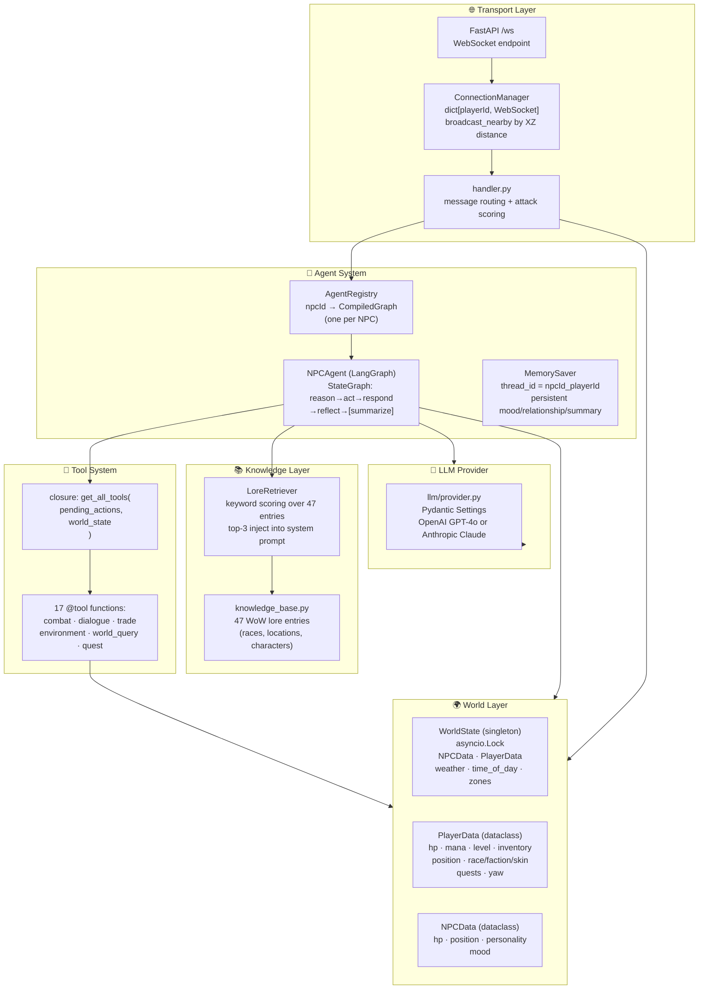

---

## Startup & Lifespan

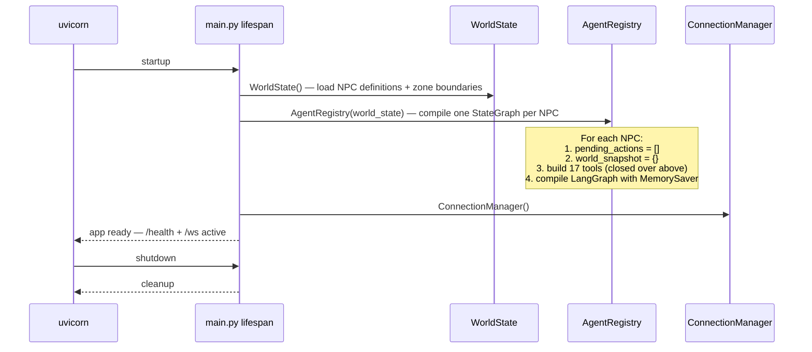

---

## WebSocket Layer

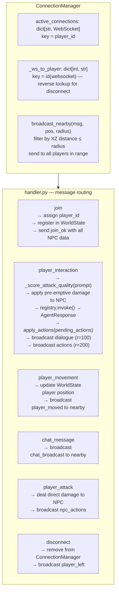

---

## Agent System — LangGraph StateGraph

Each NPC runs an independent compiled `StateGraph`. The graph is invoked once per player interaction.

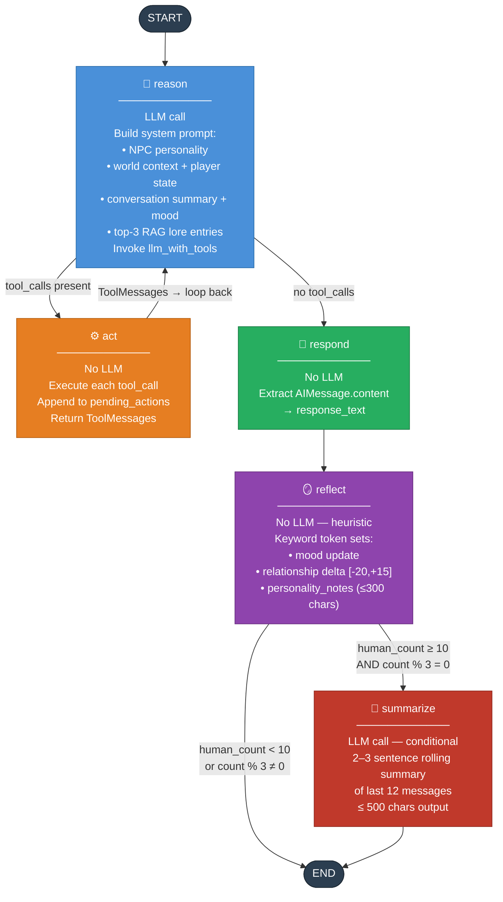

---

## Agent State Schema

All data flowing through the graph lives in a single `TypedDict` (`NPCAgentState`):

| Field | Type | Scope | Description |
|-------|------|-------|-------------|
| `messages` | `list` (accumulated) | Conversation | Full history — HumanMessage, AIMessage, ToolMessage |
| `npc_id` | `str` | Static | NPC identifier |
| `npc_name` | `str` | Static | Display name |
| `npc_personality` | `str` | Static | Full personality system prompt |
| `player_state` | `dict[str, Any]` | Per-call | HP, mana, inventory, level |
| `world_context` | `dict[str, Any]` | Per-call | Zone, weather, nearby entities |
| `pending_actions` | `list[dict[str, Any]]` | Accumulated | Tool-queued game actions |
| `response_text` | `str` | Output | Final dialogue string |
| `conversation_summary` | `str` | **Persistent** | Rolling LLM-generated memory |
| `mood` | `str` | **Persistent** | neutral / happy / angry / sad / fearful |
| `relationship_score` | `int` | **Persistent** | -100 (enemy) to +100 (trusted ally) |
| `personality_notes` | `str` | **Persistent** | NPC observations about this player |

`MemorySaver` checkpoints per `thread_id = "{npc_id}_{player_id}"`. Persistent fields survive across calls.

---

## Tool System

Tools use a **closure pattern** — `get_all_tools(pending_actions, world_state)` returns `@tool`-decorated functions that share a mutable `pending_actions` list.

```mermaid
flowchart LR
    LLM["🤖 LLM"]

    subgraph closure["Tool Closure — per NPC at startup"]
        direction TB
        combat["combat\ndeal_damage · heal_target\ndefend · flee"]
        dialogue["dialogue\nemote · give_quest\ncomplete_quest"]
        trade["trade\noffer_item · take_item"]
        env["environment\nchange_weather · spawn_effect\nmove_npc"]
        query["world_query\nget_nearby_entities\ncheck_player_state"]
        quest["quest\nstart_quest · advance_objective\ncheck_player_quests"]
    end

    pending["pending_actions[ ]"]
    worldstate["WorldState"]
    client["🎮 Client\nReactionSystem → 3D effects"]

    LLM -->|"tool_calls"| closure
    closure -->|"append action dict"| pending
    closure -->|"read / write snapshot"| worldstate
    pending -->|"apply_actions after graph"| worldstate
    pending -->|"actions in AgentResponse"| client

    style LLM fill:#4a90d9,color:#fff,stroke:#2c6fad
    style pending fill:#e67e22,color:#fff,stroke:#b55c0e
    style worldstate fill:#27ae60,color:#fff,stroke:#1a7a42
    style client fill:#8e44ad,color:#fff,stroke:#6a2f82
```

**Action kinds and effects:**

| Kind | Server Effect | Client Effect |
|------|---------------|---------------|
| `damage` | Reduce player HP in WorldState | Red floating text, screen flash |
| `heal` | Restore player HP | Green floating text, green flash |
| `give_item` | Add to player inventory | Gold floating text, inventory open |
| `take_item` | Remove from inventory | Inventory update |
| `emote` | (none) | NPC animation |
| `move_npc` | (none — client-side) | NPC lerps to position |
| `spawn_effect` | (none) | Particle burst |
| `change_weather` | Update world weather | Scene fog adjust |
| `start_quest` | (client tracks) | Quest banner overlay |
| `complete_quest` | (client tracks) | Quest banner + reward |
| `advance_objective` | (client tracks) | Quest tracker update |

---

## Per-NPC Isolation

Every NPC has fully isolated state. Two players can talk to the same NPC simultaneously with independent memory:

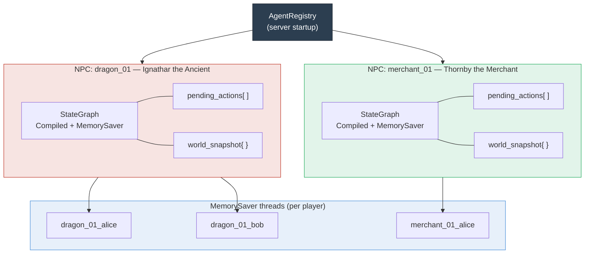

---

## NPC Relationship Model

The `reflect` node updates relationship state with zero LLM cost using keyword token sets:

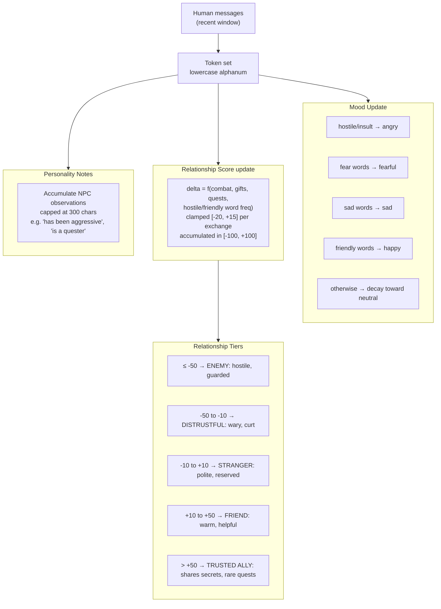

---

## RAG Lore System

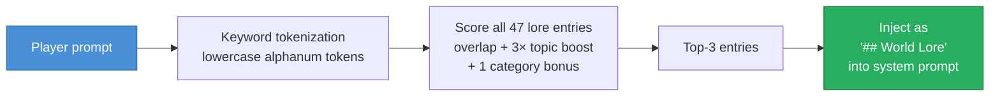

Sub-millisecond keyword retrieval — no vector DB, no embeddings. Covers 47 WoW lore entries spanning races, locations, and characters.

---

## World State

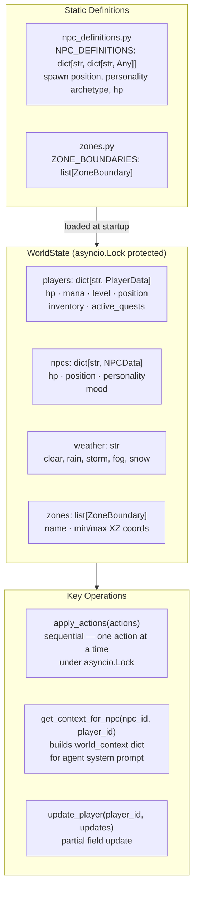

---

## Full Request Flow

End-to-end: player text input → 3D effect.

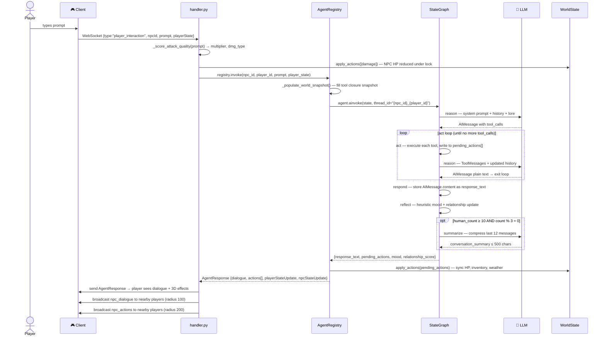

---

## Cost & Latency Strategy

| Decision | Rationale |
|----------|-----------|
| `reflect` is heuristic (no LLM) | Zero cost per turn — mood/relationship from keyword matching |
| `summarize` conditional (≥10 turns, every 3rd) | Minimises LLM calls while keeping memory bounded |
| RAG is keyword-based (no embeddings) | Sub-millisecond — no vector DB dependency |
| Tools synchronous within one turn | Predictable cost; no parallel LLM calls |
| 30s LLM timeout | Prevents runaway agent calls blocking WebSocket connections |

---

## LLM Provider

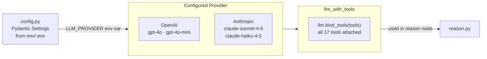

Switch provider by setting `LLM_PROVIDER=openai` or `LLM_PROVIDER=anthropic` in `.env`.

---

## Adding a New Tool

1. Add the function in `server/src/agents/tools/<category>.py` using the closure pattern:
   ```python
   from typing import Any

   def create_my_tools(pending_actions: list[Any], world_state: dict[str, Any]) -> list[Any]:
       @tool
       def my_tool(param: str) -> str:
           """Tool description for the LLM."""
           pending_actions.append({"kind": "my_action", "params": {"param": param}})
           return f"Did {param}"
       return [my_tool]
   ```
   > mypy strict: parameterize all generics — bare `list`/`dict` are `[type-arg]` errors.
2. Register in `get_all_tools()` in `server/src/agents/tools/__init__.py`
3. Add action kind to `client/src/network/MessageProtocol.ts` (discriminated union)
4. Handle in `client/src/systems/ReactionSystem.ts`

## Adding a New NPC Archetype

1. Add personality in `server/src/agents/personalities/templates.py`
2. Add definition in `server/src/world/npc_definitions.py`
3. Agent auto-registers on server start — client spawns from `join_ok.npcs[]`
